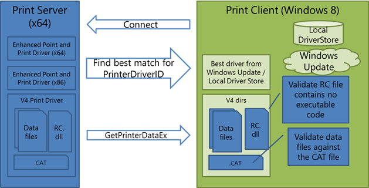
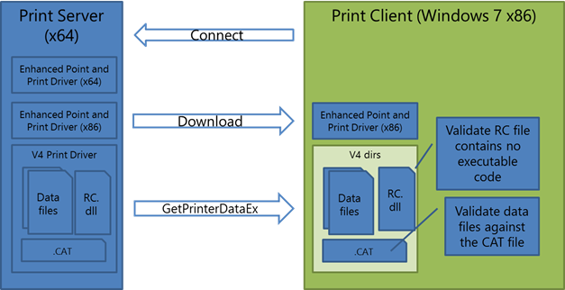

# Working well with enhanced Point and Print

The updated printer sharing mechanism is referred to as enhanced Point and Print, and it allows print clients to print to v4 shares without downloading the manufacturer-provided device driver from the print server.

Because client machines do not download the entire driver package when they connect with a print server that has enhanced Point and Print and v4 printer drivers, it is important to be aware of the following architectures. This information should help you to develop and package your v4 printer driver appropriately.

## Windows 8 Client Connection Behavior

When a Windows 8 client connects to a shared print queue that is using a v4 printer driver, the client will try to obtain a driver that supports client side rendering. The client searches the local DriverStore for a driver with a HardwareID that matches the server driver’s PrinterDriverID. If one is found, that driver will be installed locally. Otherwise, the client will connect using the enhanced Point and Print driver.

In both cases, the client downloads configuration data from the server using GetPrinterDataEx calls. The configuration data includes data files like generic printer description (GPD) files, PostScript printer description (PPD) files, the driver property bag, JavaScript constraints and a resource DLL. The client also downloads the CAT file that was associated with the server’s driver.

The print system then examines the client and validates that the resource DLL contains no executable code. The print system also verifies that the downloaded files are valid and signed by the CAT file downloaded from the server. Any files that are untrusted will be deleted. The following diagram illustrates this configuration-related communication between a Windows 8 client and shared print servers that use the v4 printer driver.

## Windows 7 and Windows Vista Client Connection Behavior

Windows 7 and Windows Vista clients may also connect to shared print queues that use a v4 printer driver. In this case, however, the client will always download the enhanced Point and Print driver from the server. This driver uses server side rendering to ensure that the proper printer description language (PDL) is generated for the printer.

Configuration data is downloaded from the server in the same way for Windows 7 and Windows Vista client connections, using GetPrinterDataEx calls. If any downloaded files fail validation against the server’s CAT file, they are deleted. The following diagram illustrates this configuration-related communication between a Windows 7 or a Windows Vista client and shared print servers that use the v4 printer driver.

Shared printers that are backed by a v3 printer driver will continue to work using the existing Point and Print system.

## Related topics
[V4 Printer Driver Development Best Practices](v4-printer-driver-development-best-practices.md)  

