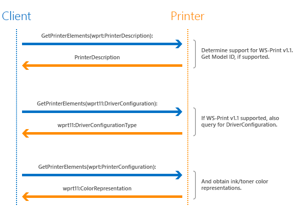
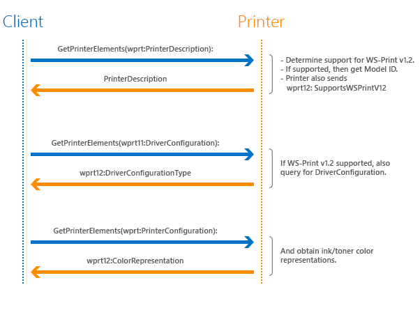

# Web Services on Devices for Printing (WS-Print)


Web services on devices for printing (WS-Print) was introduced in Windows Vista, to provide a connection protocol for printing and scanning peripherals.

## Overview


The Web Services technology provides a common framework for describing and sharing information. As a result, Windows comes with a set of protocols for consuming and controlling services on network-connected devices.

Four Web Services specifications exist for printing and scanning, to help device manufacturers take advantage of the improved customer experience around connecting, installing, and using devices with Windows.

## WS-Print v1.1


For Windows 8, the printing schema for web services on devices (WSD) was updated to v1.1. This version of the schema (called WS-Print v1.1) was updated to support enhanced driver configuration, better color representation for ink/toner, and device model IDs.

## WS-Print v1.2


For Windows 8.1, WS-Print includes all the operations and schema elements used in WS-Print v1.1, but the print service definition for web services on devices has been updated. And the resulting new Web Services on Devices for printing is WS-Print v1.2.

In WS-Print v1.2 support for a new schema element and a new operation have been added. The new schema element “SupportsWSPrintV12” is used to identify support for WS-Print V1.2. The new operation, “SetPrinterElements” enables a client to set the value of a schema element on the printer. For example, the client could set a custom element called “InkHeadAlignmentValue” which the printer would use to realign the inkjet head.

For your convenience, the specifications are provided here in the Downloads section, in complete, stand-alone form, along with their associated Web Services Description Languages (WSDLs) and XML Schema Definitions (XSDs). These four Web Services on devices specifications are covered by the included technical documentation license agreement, which references the Windows driver development kit (WDK).

The following sections provide more detailed information about the various aspects of WS-Print.

## Sequence diagrams


The following sequence diagrams illustrate the interaction between the client and printer in order to determine the version of WS-Print namespace that is supported, and then to retrieve the extended schema elements.

**WS-Print v1.1**. Here is the interaction sequence diagram for a printer that supports WS-Print v1.1:



If the printer supports WS-Print v1.1, then in response to the GetPrinterElements(wprt:PrinterDescription) query from the client, the printer sends back information to indicate that it does.

After the printer confirms that it supports WS-Print v1.1, the client sends a GetPrinterElements(wprt11:DriverConfiguration) query, and the printer responds with the requested driver configuration information.

**WS-Print v1.2**. Here is the interaction sequence diagram for a printer that supports WS-Print v1.2:



If the printer supports WS-Print v1.2, then in response to the GetPrinterElements(wprt:PrinterDescription) query from the client, the printer sends back information to indicate that it does.

Additionally the printer should return wprt12:SupportsWSPrintV12 in response to the GetPrinterElements(wprt:PrinterDescription) call. After that, the client can call the SetPrinterElements operation to set one or more data elements in the schema supported by the WS-Print device.

After the printer confirms that it supports WS-Print v1.2, the client sends a GetPrinterElements(wprt12:DriverConfiguration) query, and the printer responds with the requested driver configuration information.

## Namespaces


**WS-Print v1.1**

**Namespace:** <http://schemas.microsoft.com/windows/2010/06/wdp/printv11>
**XML Namespace Definition:** xmlns:wprt12="<http://schemas.microsoft.com/windows/2012/10/wdp/printV12>"

**WS-Print v1.2**

**Namespace:** <http://schemas.microsoft.com/windows/2012/10/wdp/printV12>
**XML Namespace Definition:** xmlns:wprt11="<http://schemas.microsoft.com/windows/2010/06/wdp/printv11>"
## Specifying WS-Print 1.1 support


Printers that support WS-Print 1.1 elements must update their PrinterDescription to include wprt11:SupportsWSPrintv11. If wprt11:SupportsWSPrintv11 is not specified and set to true, then WSDMon will not request any WS-Print 1.1 elements from the printer.

Print devices that support WS-Print v1.1 must include the following content in their PrinterDescription in order for Windows to query for any other elements in that namespace.

```xml
<soap:Envelope
...
  xmlns:wprt11="http://schemas.microsoft.com/windows/2010/06/wdp/printv11">"
...
  <wprt11:SupportsWSPrintv11>true</wprt11:SupportsWSPrintv11>
...
```

The following XML snippet is derived from the WSD Print Service Specification v1.0, and it shows the proper usage of the content in the preceding section.

```xml
<soap:Envelope
        xmlns:soap="http://www.w3.org/2003/05/soap-envelope"
        xmlns:wsa="http://schemas.xmlsoap.org/ws/2004/08/addressing"
        xmlns:wprt="http://schemas.microsoft.com/windows/2006/08/wdp/print"
        xmlns:wprt11="http://schemas.microsoft.com/windows/2010/06/wdp/printv11">"
  <soap:Header>
    <wsa:To>http://schemas.xmlsoap.org/ws/2004/08/addressing/role/anonymous</wsa:To>
    <wsa:Action>
      http://schemas.microsoft.com/windows/2006/08/wdp/print/GetPrinterElementsResponse
    </wsa:Action>
    <wsa:MessageID>uuid:UniqueMsgId</wsa:MessageID>
    <wsa:RelatesTo>uuid:MsgIdOfTheGetPrinterElementsRequest</wsa:RelatesTo>
  </soap:Header>
  <soap:Body>
    <wprt:GetPrinterElementsResponse>
      <wprt:PrinterElements>
        <wprt:ElementData Name="wprt:PrinterDescription" Valid="true">
          <wprt:PrinterDescription>
            <wprt:ColorSupported>true</wprt:ColorSupported>
            <wprt:DeviceId>MFG:Acme;MDL:PrintMaster 9020</wprt:DeviceId>
            <wprt:MultipleDocumentJobsSupported>true</wprt:MultipleDocumentJobsSupported>
            <wprt:PagesPerMinute>20</wprt:PagesPerMinute>
            <wprt:PagesPerMinuteColor>8</wprt:PagesPerMinuteColor>
            <wprt:PrinterName xml:lang="en-AU, en-CA, en-GB, en-US">
              Accounting Printer in Copy Room 2
            </wprt:PrinterName>
            <wprt:PrinterInfo xml:lang="en-AU, en-CA, en-GB, en-US">
              Printer for use of Accounting only
            </wprt:PrinterInfo>
            <wprt:PrinterLocation xml:lang="en-AU, en-CA, en-GB, en-US">
              LA Campus – Building 3
            </wprt:PrinterLocation>
            <wprt11:SupportsWSPrintv11>true</wprt11:SupportsWSPrintv11>
          </wprt:PrinterDescription>
        </wprt:ElementData>
      </wprt:PrinterElements>
    </wprt:GetPrinterElementsResponse>
  </soap:Body>
</soap:Envelope>
```

The following XML snippet shows the schema for a print device that supports WS-Print v1.1.

```xml
<xs:schema targetNamespace="http://schemas.microsoft.com/windows/2010/06/wdp/printv11"
           xmlns:wprt11="http://schemas.microsoft.com/windows/2010/06/wdp/printv11"
           xmlns:xs="http://www.w3.org/2001/XMLSchema"
           elementFormDefault="qualified">

<xs:annotation>
    <xs:documentation>
        WS-Print Extensions for Driver Configuration and Consumable Definition
        Copyright 2010 Microsoft Corp. All rights reserved
    </xs:documentation>
</xs:annotation>

<xs:annotation>
    <xs:documentation> A Boolean element that denotes support for WS-Print V11 extensions
    </xs:documentation>
</xs:annotation>

<xs:element name="SupportsWSPrintv11" type="xs:boolean"/>
```

## Specifying WS-Print 1.2 support


Printers that support WS-Print 1.2 elements must update their PrinterDescription to include wprtV12:SupportsWSPrintV12. If wprtV12:SupportsWSPrintV12 is not specified and set to true, then WSDMon will not request any WS-Print 1.2 elements from the printer.

Print devices that support WS-Print v1.2 must include the following content in their PrinterDescription in order for Windows to query for any other elements in that namespace.

```xml
<soap:Envelope
…
    xmlns:wprtV12="http://schemas.microsoft.com/windows/2012/10/wdp/printV12">
…
    <wprtV12:SupportsWSPrintV12>true</wprtV12:SupportsWSPrintV12>
…
</soap:Envelope>
```

The following XML snippet is derived from the WSD Print Service Specification v1.2, and it shows the proper usage of the content in the preceding section.

```xml
<soap:Envelope
     xmlns:soap="http://www.w3.org/2003/05/soap-envelope"
     xmlns:wsa="http://schemas.xmlsoap.org/ws/2004/08/addressing"
     xmlns:wprt="http://schemas.microsoft.com/windows/2006/08/wdp/print"
     xmlns:wprtV12="http://schemas.microsoft.com/windows/2012/10/wdp/printV12">
     <soap:Header>
          <wsa:To>http://schemas.xmlsoap.org/ws/2004/08/addressing/role/anonymous</wsa:To>
          <wsa:Action>
               http://schemas.microsoft.com/windows/2006/08/wdp/print/GetPrinterElementsResponse
          </wsa:Action>
          <wsa:MessageID>uuid:UniqueMsgId</wsa:MessageID>
          <wsa:RelatesTo>uuid:MsgIdOfTheGetPrinterElementsRequest</wsa:RelatesTo>
     </soap:Header>
     <soap:Body>
         <wprt:GetPrinterElementsResponse>
            <wprt:PrinterElements>
             <wprt:ElementData Name="wprt:PrinterDescription" Valid="true">
                <wprt:PrinterDescription>
                     <wprt:ColorSupported>true</wprt:ColorSupported>
                         <wprt:DeviceId>MFG:Acme;MDL:PrintMaster 9020</wprt:DeviceId>
                         <wprt:MultipleDocumentJobsSupported>true</wprt:MultipleDocumentJobsSupported>
                     <wprt:PagesPerMinute>20</wprt:PagesPerMinute>
                     <wprt:PagesPerMinuteColor>8</wprt:PagesPerMinuteColor>
                     <wprt:PrinterName xml:lang="en-AU, en-CA, en-GB, en-US">
                             Accounting Printer in Copy Room 2</wprt:PrinterName>
                         <wprt:PrinterInfo xml:lang="en-AU, en-CA, en-GB, en-US">
                             Printer for use of Accounting only</wprt:PrinterInfo>
                         <wprt:PrinterLocation xml:lang="en-AU, en-CA, en-GB, en-US">
                             LA Campus – Building 3</wprt:PrinterLocation>                      
                         <wprtV12:SupportsWSPrintV12>true</wprtV12:SupportsWSPrintV12>
                    </wprt:PrinterDescription>
             </wprt:ElementData>
            </wprt:PrinterElements>
         </wprt:GetPrinterElementsResponse>
      </soap:Body>
</soap:Envelope>
```

The schema examples in the following three sections, show how to use some of the new elements that were introduced with WS-Print V1.1. For more information about all the elements that were introduced with the WS-Print V1.1 namespace, see the supporting files for WS-Print v1.0 – v1.2 listed in the **Downloads** section.

## Enhanced driver configuration


This schema provides device-specific GPD or PPD configuration files for this device.

```xml
   <xs:annotation>
        <xs:documentation>Driver Configuration File definition</xs:documentation>
    </xs:annotation>
    <xs:element name="DriverConfiguration" type="wprt11:DriverConfigurationType"/>
    <xs:complexType name="DriverConfigurationType">
        <xs:sequence>
            <xs:element name="GPDConfigFile" type="xs:string" minOccurs="0" />
            <xs:element name="PPDConfigFile" type="xs:string" minOccurs="0" />
            <xs:any namespace="##other" minOccurs="0" maxOccurs="unbounded"/>
        </xs:sequence>
        <xs:anyAttribute namespace="##other" processContents="lax" />
    </xs:complexType>
```

## Device model ID


The following schema describes a ModelID for the device, and is used for device metadata retrieval. For more information on ModelIDs, see [ModelID element](https://msdn.microsoft.com/library/windows/hardware/ff549295.aspx).

```xml
    <xs:annotation>
        <xs:documentation> Print Device Model Id value for device differentiation</xs:documentation>
        <xs:documentation> Always represented as a GUID</xs:documentation>
    </xs:annotation>
    <xs:element name="DeviceModelId" type="wprt11:DeviceModelIdGuidType"/>
    <xs:simpleType name="DeviceModelIdGuidType">
        <xs:restriction base="xs:string">
            <xs:length value="36"/>
        </xs:restriction>
    </xs:simpleType>
```

## Ink/Toner color representation value


The following schema retrieves an RGB triple that represents the color for a particular ink or toner type. This value should be specified for any ink or toner consumables to enable a better representation of the color to be shown in app UI.

```xml
    <xs:annotation>
        <xs:documentation>
            Ink/Toner Color Representation definition
            A 6-digit hex representation of the RGB color value this Consumable entry represents.
            Examples of these values are:
                Black – 000000
                Red – FF0000 
                White – FFFFFF
                Magenta – FF00FF
                Cyan – 00FFFF
                Yellow – FFFF00
                Blue – 0000FF
        </xs:documentation>    </xs:annotation>
    <xs:element name="ColorRepresentation" type="wprt11:ColorRepType"/>
    <xs:simpleType name="ColorRepType">
        <xs:restriction base="xs:string">
            <xs:length value="6"/>
        </xs:restriction>
    </xs:simpleType>
```

As mentioned earlier in this topic, in the WS-Print v1.2 section, the following new operation has been introduced with WS-Print V1.2 namespace.

## SetPrinterElements


The “SetPrinterElements” operation is a new one, and it enables a client to set the value of a schema element on the printer. The SetPrinterElements operation has eight request elements and four response elements. The request and response elements provide the client with fine control over data insertion and retrieval in connection with the WS-Print device schema.

For example, the ElementPath data element (part of the SetPrinterElements operation), is an XPath string that represents a location within the Printer schema of the Data Element to set.

For more detailed information about the SetPrinterElements operation, see the supporting files for WS-Print v1.0 – v1.2 listed in the Downloads section.

## Downloads


**Specification and supporting files for WS-Print v1.0 – v1.2**

**File:** [Print Device Definition V1.0 for Web Services on Devices](http://download.microsoft.com/download/E/9/7/E974CFCB-4B3B-40CC-AF92-4F7F84477F0B/Printer.zip)
**Description:** 2.64 MB zip file containing Microsoft Word document and supporting files; September 16, 2013

**Specification and supporting files**

**File:** [Print Device Definition V1.0 for Web Services on Devices](http://download.microsoft.com/download/9/c/5/9c5b2167-8017-4bae-9fde-d599bac8184a/PrintDevice.exe)
**Description:** 76 KB self-extracting file containing Microsoft Word document and supporting file; January 29, 2007

**File:** [Scan Service Definition V1.0 for Web Services on Devices](http://download.microsoft.com/download/9/C/5/9C5B2167-8017-4BAE-9FDE-D599BAC8184A/ScanService.zip)
**Description:** (1.5 MB zip file containing Microsoft Word document and supporting files; February 9, 2012)

**File:** [Scan Device Definition V1.0 for Web Services on Devices](http://download.microsoft.com/download/9/c/5/9c5b2167-8017-4bae-9fde-d599bac8184a/ScanDevice.exe)
**Description:** (76 KB self-extracting file containing Microsoft Word document and supporting file; January 29, 2007)
## Related topics
[V4 Printer Driver Connectivity](v4-printer-driver-connectivity.md)  


