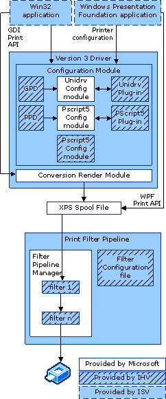

# XPSDrv Configuration Module

The XPSDrv print driver is the component of the XPS print path that consumes an XPS spool file and emits page description language (PDL) data that a printer can consume. The configuration module contains the driver components that communicate printer features and settings to applications. XPSDrv printer drivers support the communications methods that Microsoft Win32-based applications and Windows Presentation Foundation (WPF)-based applications use.

Both Win32-based applications and WPF applications can print to XPSDrv print drivers. Win32 applications use the GDI printing application programming interface (API), and the Microsoft-supplied conversion render module creates an XPS spool file for printing to the print filter pipeline. WPF applications use the WPF printing API to create an XPS spool file directly from the application.

The following diagram shows the XPSDrv configuration architecture.

Note that the three objects in the Configuration Module section are mutually exclusive.

The two main components of an XPSDrv print driver are the [Version 3 print driver modules](version-3-xpsdrv-print-driver-components.md) and the [XPS filter pipeline](filter-pipeline-configuration-file.md). Each of these components requires one or more configuration files and modules.

### XPSDrv Document Events

XPSDrv drivers can receive GDI document events through the [**DrvDocumentEvent**](https://msdn.microsoft.com/library/windows/hardware/ff548544) function when Win32-based applications are printing to them, and the drivers can receive XPS document events through DrvDocumentEvent when WPF applications are printing to them. For more information about XPSDrv document events, see [XPSDrv Driver Document Events](xps-driver-document-events.md).

### XPSDrv Driver Installation

XPSDrv drivers have specific requirements for installation. For more information about XPSDrv driver installation, see [XPSDrv Installation](xpsdrv-installation.md).

 

 

