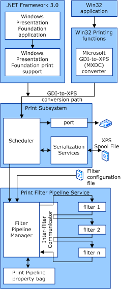

# XPSDrv Render Module

The render module of an XPSDrv printer driver contains the filters that render the contents of the XPS spool file for output to the printer. The set of rendering filters for a driver are instantiated and run in a filter pipeline. The Filter Pipeline Manager (FPM) manages the filters, and the Inter-Filter Communicator (IFC) controls the interaction between filters.

The following diagram shows a filter pipeline.

Microsoft provides the following XPS driver components:

-   Filter Pipeline Manager

-   Inter-Filter Communicator

-   Property bag

The Filter Pipeline Manager must:

1.  Load and initialize filters.

2.  Manage the data between filters.

3.  Unload the filters when a print job is finished.

Inter-Filter Communicators manage the transfer of data between filters, and the Filter Pipeline Manager manages Inter-Filter Communicators.

The following process describes what happens to a set of filters in a pipeline:

1.  The Filter Pipeline Manager reads the filter pipeline configuration (FPC) file.

2.  The filters that the FPC specifies are loaded.

3.  The filter pipeline is initialized, and the Filter Pipeline Manager starts the filter pipeline.

4.  The first filter in the pipeline reads the XPS data through XPS or stream interfaces that the Filter Pipeline Manager offers, and then the filter processes the contents.

5.  The first filter sends the processed XPS data to the second filter by using the interface that the Inter-Filter Communicator provides.

6.  The Inter-Filter Communicator maintains the intermediate processing results until the second filter is ready.

7.  Steps 1-6 are repeated from filter to filter until the results of the last filter are sent to the port that the driver has defined for output.

If a printer uses XPS as a page description language (PDL), and no other processing is desired, you can use an empty ("pass through") pipeline. If XPS is not the PDL for your printer, you will need to write a filter that converts XPS to the PDL of your printer, as well as any other processing that you want.

To develop an XPS driver, you must create the following components:

-   [XPS filters](xps-filters.md)

-   [XPS filter pipeline configuration file](filter-pipeline-configuration-file.md)

You can also add [Print Ticket Support to the XPSDrv Render Module](print-ticket-support-in-the-xpsdrv-render-module.md)

 

 

