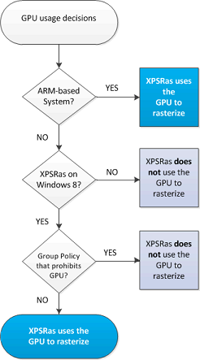

# XPSRas GPU Usage Decision Tree

The following diagram shows the decision tree that Windows uses to determine whether or not to engage GPU hardware acceleration.

For more information about XPS rasterization, see [Using the XPS Rasterization Service](using-the-xps-rasterization-service.md).

## Related topics
[XPS Filters](xps-filters.md)  

