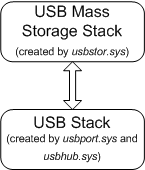
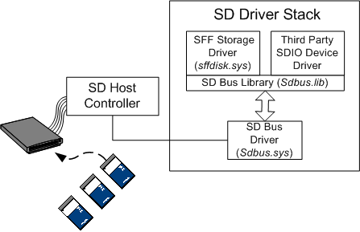

# SD Card Driver Stack

Secure Digital (SD) card technology began with portable, miniature memory cards, but with the release of the Secure Digital I/O (SDIO) specification, the Secure Digital Association (SDA) has broadened the definition of SD technology to include a large variety of card functions, such as Bluetooth devices, video cameras, Wireless LAN devices, and Global Positioning System (GPS) receivers. This document explains how the operating system supports the card function extensions to SD technology.

Card readers for many early SD storage devices were designed to connect to the USB bus. Windows manages these devices with the USB mass storage driver (*usbstor.sys*) and the native storage class driver (*disk.sys*), as depicted in the following diagram:

For a more complete description of the device stack that Windows creates for a memory card that connects to the USB bus, see [Device Object Example for a USB Mass Storage Device](https://msdn.microsoft.com/library/windows/hardware/ff552547).

The operating system provides support for SD host controllers that connect directly to the PCI bus. When the system enumerates an SD host controller, it loads a native SD bus driver (*sdbus.sys*). If a user inserts an SD memory card, Windows loads a native SD storage class driver (*sffdisk.sys*) and storage miniport driver (*sffp\_sd.sys*) on top of the bus driver. If a user inserts an SD card with a different kind of function, such as GPS or wireless LAN, Windows loads a vendor-supplied driver for the device.

All device drivers in the SD stack, whether native or vendor-supplied, must communicate with the SD bus driver by calling routines in the static SD bus library (*sdbus.lib*). SD drivers must link to this library when they compile. The following diagram depicts the SD driver stack that the system creates when it enumerates an SD controller and accompanying cards:

SD device drivers cannot directly access the host-controller register set, nor can they embed pass-through commands for the host controller in I/O request packets (IRPs). SD device drivers issue commands to the host controller by calling the SD bus library routines, and then the library generates the appropriate SD commands for the host controller.

SD device drivers must handle standard PnP and power IRPs, but they do not request or manage hardware resources, such as ports, memory, or interrupt vectors. Consequently, SD device drivers are not required to map any hardware resources when handling an [**IRP\_MN\_START\_DEVICE**](https://msdn.microsoft.com/library/windows/hardware/ff551749) request. However, when an SD device driver receives an [**IRP\_MN\_STOP\_DEVICE**](https://msdn.microsoft.com/library/windows/hardware/ff551755) request, it must stop all I/O operations. Furthermore, the driver must close its interface to the SD bus driver in response to an [**IRP\_MN\_QUERY\_REMOVE\_DEVICE**](https://msdn.microsoft.com/library/windows/hardware/ff551705) request.

When a hardware interrupt occurs, the SD bus library intercepts the interrupt, masks out further interrupts, and notifies the SD device driver by means of a callback routine that a hardware interrupt has occurred. For a description of the callback routine that the bus driver uses to notify an SD device driver of hardware interrupts, see [**PSDBUS\_CALLBACK\_ROUTINE**](https://msdn.microsoft.com/library/windows/hardware/ff537617). For a general explanation of how the SD driver stack and libraries manage hardware interrupts, see [Handling Secure Digital (SD) Hardware Interrupts](https://msdn.microsoft.com/library/windows/hardware/ff537177).

The *ntddsd.h* header file, which is provided in the Windows Driver Kit (WDK), declares the prototypes for the routines exposed by the SD bus library.

 

 

