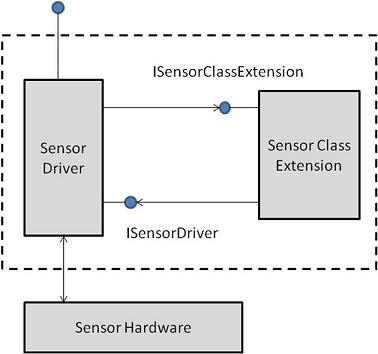

# Architecture Overview for Sensor Drivers

Sensor device drivers are COM objects that are implemented by using the Windows User Mode Driver Framework (UMDF). Sensor drivers use Windows Portable Devices (WPD) interfaces and other types as helper objects. Both UMDF and WPD are documented in the Windows Driver Kit documentation. For more information about UMDF drivers, see [User-Mode Driver Framework](https://msdn.microsoft.com/library/windows/hardware/ff561365). For more information about WPD types, see [Portable Devices](https://msdn.microsoft.com/library/windows/hardware/ff597901).

A sensor driver uses a special **class extension** object. The sensor class extension, a standard COM object, provides a standard implementation for handling I/O requests for sensor device drivers. Sensor drivers create the class extension object in the driver's process and then use the device driver interface (DDI) to forward I/O requests to and receive events from the class extension. The following diagram shows the relationship between a sensor, its driver, and the sensor class extension. (The sensor driver creates a new instance of the class extension for each sensor device.)

For more information about the class extension object, see [About the Sensor Class Extension](about-the-sensor-class-extension.md).

>[!IMPORTANT]
> Sensor drivers must be free threaded and thread safe.

