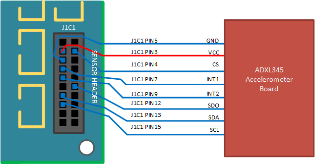
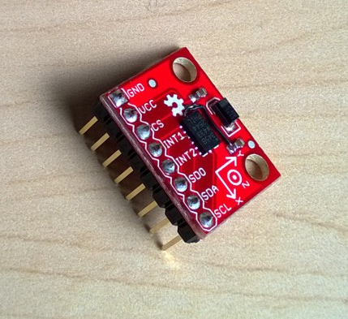
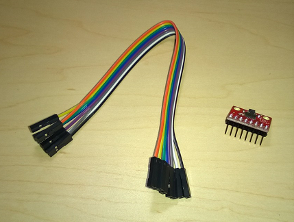

# Connect your sensor to the Sharks Cove board

This topic provides guidance on how to connect your sensor test board to the Sharks Cove board.

In the ADXL345 accelerometer scenario, and after making any necessary modifications, you would end up with the accelerometer test board connected to Sharks Cove as shown in the following diagram.

To achieve a stable and reliable connection between the sensor breakout board and the Sharks Cove, you could start by soldering an 8-pin single-row male header to the breakout board, as shown in the following image.

Then use a ribbon of eight female-to-female jumper wires (shown below), to connect the sensor breakout board to the Sharks Cove, based on the preceding connection diagram.

Here are some examples of how information from the ADXL345 data sheet, and the Sharks Cove Technical Specifications Rev. 1.0, helped us to arrive at the connection strategy shown in the preceding diagram:

**J1C1 PIN4** connected to **VDD** and **CS** on the accelerometer board.

-   **VDD** is the supply voltage line for the Digital Interface. We decided to use the accelerometer in dual-voltage configuration, and also keep the power consumption low. So out of the four available voltages (**J1C1 PIN1 - PIN4**) we targeted the two lowest ones. These are 2.8V on **J1C1 PIN3** and 1.8V on **J1C1 PIN4**. In dual-voltage configuration, **VDD** must be connected to a lower voltage than **VS**. So we’ve connected **VDD** to **J1C1 PIN4**, the 1.8V line on Sharks Cove.
-   **CS** is the communication mode selection pin for the accelerometer. To enable the I2C communication mode, you must tie **CS** high, in this case to **VDD**, which is taken care of by the modification with the blue wire in [Prepare your sensor test board](prepare-your-sensor-test-board.md). The modification ties both **VDD** and **CS** from the accelerometer board to **J1C1 PIN4**, the 1.8V line.

**J1C1 PIN12** connected to **SDO** on the accelerometer board.

-   When the **SDO** line is high, the 7-bit I2C address for the accelerometer board is 0x1D, followed by the R/W bit. When the **SDO** line is low (i.e. connected to Ground), the I2C address for the accelerometer board is 0x53, followed by the R/W bit. In the Microsoft SPBAccelerometer sample, it was decided that the address of 0x53 would be used. And that’s why the **SDO** line is connected to a Ground pin (**J1C1 PIN12**) on Sharks Cove.

The connection decisions outlined in the preceding bullets were based on information from the *Theory of Operation* section (page 6) and the *Serial Communications* section (page 8) of the ADXL345 data sheet.

For more detailed technical information about the Sharks Cove board, see [Sharks Cove Schematic](http://firmware.intel.com/sites/default/files/Sharks_Cove_Schematic.pdf).

After successfully connecting your sensor test board to Sharks Cove, read the next topic for guidance on how to [write and deploy your universal sensor driver](write-and-deploy-your-universal-sensor-driver.md).

 

 

