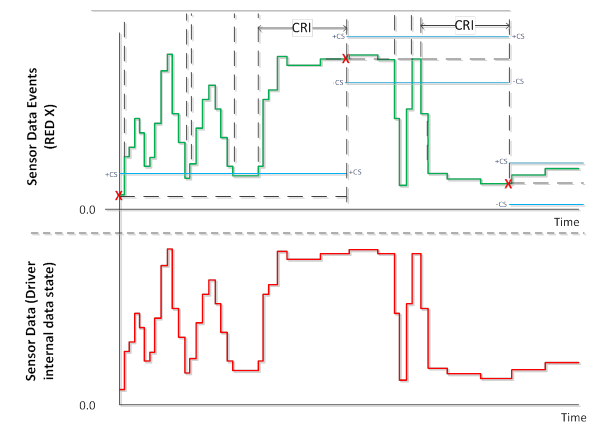

# Filtering data

In order to optimize data throughput, your sensor device must apply filter criteria to the data-update events so that they are only raised when needed. This filtering results in lower CPU utilization (due to reduced sensor throughput) and less power consumption (both for the sensor and the CPU).

There are two values (or properties) that support a sensor device’s filter criteria. The first is the current report interval (CRI) and the second is the change sensitivity (CS, also known as thresholds). Both of these properties can be set by a sensor Win32 application.

The current report interval is the minimum period, in milliseconds, between data updates which a client wishes to receive when meaningful change has occurred. The change sensitivity is the value (or percentage) used to specify meaningful change.

So, a weather-station application may specify a current report interval (CRI) for a temperature sensor of 60,000 (or one minute). And, the temperature sensor would require a change-sensitivity value (as opposed to a percentage). For example, if this temperature sensor returns degrees Celsius and the change sensitivity value temperature was 2.0, this particular sensor would only raise the data-updated event when the temperature increased, or decreased, by 2.0 degrees Celsius over the requested report interval (in this case, one minute).

An ambient light sensor (ALS) is an example of a sensor that would require change-sensitivity to be specified as a percentage. For example, if the change sensitivity value for Illuminance was 2.0, this sensor would interpret the value as a percentage and only raise the data-updated event when the LUX value had either dropped or increased by 2%.

## Terminologies Related To Filtering Criteria

| Term | Meaning |
|------|---------|
| Current Report Interval (CRI) | The rate expressed as the period (not frequency) in milliseconds at which a client wishes to receive data updates when meaningful change in magnitude is occurring.  This field is expressed as the minimum period between events if meaningful change has occurred (in measured sensor phenomenon). The period will vary but never be shorter than this, based on the occurrence of meaningful change.  This value is per sensor.|
| Change Sensitivity (CS) | The change in measured phenomenon that constitutes a meaningful change. This can be expressed as linear magnitude (for example, .05 G for an accelerometer reading) or as a non-linear magnitude (5% for an ambient light sensor reading).  This value is per sensor data field.|
| Effective Current Report Interval (E-CRI) | The RI value calculated at any given point in time and used by the device driver to filter data update event delivery based on:<ul><li>RI values set by clients (if any)</li><li>The default RI for the device (as implemented by driver as default behavior)</li><li>The ability of the hardware to respect the requested RI</li></ul> This value is per sensor.|
| Effective Change Sensitivity (E-CS) | The CS value calculated at any given point in time and used by the device driver to filter data update event delivery based on:<ul><li>CS values set by clients (if any)</li><li>The default CS for the device (as implemented by driver as default behavior)</li><li>The ability of the hardware to respect the requested CS</li></ul> This value is per sensor data field.|

## Change sensitivity
A complete list of possible change sensitivity values for each sensor is covered in the [Sensor thresholds](sensor-thresholds-v2.md) section of this documentation.

## Current report interval recommended defaults
The following table lists the recommended Current Report Interval (CRI) defaults.

| Sensor Type               | Recommended default report interval  |
|---------------------------|--------------------------------------|
| Accelerometer             | 100                                  |
| Activity detection        | 5000                                 |
| Ambient Light Sensor      | 1000                                 |
| Barometer                 | 1000                                 |
| Custom sensor             | N/A                                  |
| Geomagnetic orientation   | 100                                  |
| Gravity vector            | 100                                  |
| Gyrometer                 | 100                                  |
| Linear accelerometer      | 100                                  |
| Magnetometer              | 100                                  |
| Orientation               | 50                                   |
| Pedometer                 | 1000                                 |
| Proximity                 | 100*                                 |
| Relative orientation      | 100                                  |
| Simple device orientation | 200*                                 |

(*) Proximity and simple device orientation sensors must not report sample readings at regular interval. Instead, these sensors should report data to the class extension when the reading has changed. The report interval value for these sensors represent the maximum amount of time the sensor can take to report a sample reading.

## Change sensitivity recommended defaults
The following table lists the recommended Change Sensitivity (CS) defaults.

|  Sensor Type              | Recommended default change sensitivity |
|---------------------------|----------------------------------------|
| Accelerometer             | 0.02 G                                 |
| Activity detection        | 0 (no activity subscribed)             |
| Ambient Light Sensor      | 25% lux change                         |
| Barometer                 | 0.001 bar                              |
| Custom sensor             | N/A                                    |
| Geomagnetic orientation   | 10.0 degrees                           |
| Gravity vector            | 10.0 degrees                           |
| Gyrometer                 | 0.50 degrees per second                |
| Linear accelerometer      | 0.02 G                                 |
| Magnetometer              | 5.0 microtesla                         |
| Orientation               | 10.0 degrees                           |
| Pedometer                 | 10000 steps                            |
| Proximity                 | on proximity change                    |
| Relative orientation      | 10.0 degrees                           |
| Simple device orientation | on orientation change                  |

## Effective Current Report Interval (CRI) and Change Sensitivity (CS)

Multiple applications can set both the Current Report Interval (CRI) and the Change Sensitivity (CS) properties for a given sensor. When application configurations are conflicting (such as two applications requesting different change sensitivity values or different report intervals), the sensors class extension determines the most relevant CS and CRI to send to the driver. The CS and CRI values the sensor class extension provides to the driver are referred to as the Effective Current Report-Interval (E-CRI) and the Effective Change-Sensitivity (E-CS).

The following functions are called by the sensor class extension to, start/stop the sensor, report a sample reading, or set the E-CRI and E-CS.

| Event of Interest          | Event Handler Activities                                           |
|----------------------------|--------------------------------------------------------------------|
| EvtSensorStart             | Starts the sensor                                                  |
| EvtSensorStop              | Stops the sensor                                                   |
| EvtSensorSetDataInterval   | Set the current report interval                                    |
| EvtSensorGetDataInterval   | Get the current report interval                                    |
| EvtSensorSetDataThresholds | Set the current change sensitivity (threshold) values              |
| EvtSensorGetDataThresholds | Get the current change sensitivity (threshold) values              |
| SensorsCxSensorDataReady   | The driver reports a sample reading to the sensors class extension |

## Filtering data update events by evaluating the effective CRI and CS values (E-CRI, E-CS)

Once the current E-CRI and E-CS values are set, your sensor device will use these values to filter events that are raised to connected client applications. These values are compared against the difference between the “current” data value(s) and the previous data value(s). If the E-CS values have been exceeded for a time period equal to or greater than the E-CRI, then, and only then, should a data event be raised. The only exception to this is the initial sample reading which is described in a later section of this documentation.

There is a basic principle for filtering events using both the current E-CRI and current E-CS values as filtering criteria for events that will be raised. These filtering values are compared against the difference between the current data values and the previous data values in order to determine when events should be raised by calling SensorsCxSensorDataReady. If the magnitude thresholds (E-CS) have been exceeded for a time period equal to or greater than the time threshold (E-CRI), then and only then should a data event be raised. It is recommended to raise a data event on driver startup when the initial values have been obtained so that clients can receive the proper notification. In addition this implementation should not wake up the CPU more often than the requested report interval, to conserve power.

The following illustration demonstrates how time filtering of raw sensor data is evaluated in order to determine when data events should be raised.

In the previous illustration, the red data in the lower portion of the diagram represents the raw sensor data. The green line represents data that would be returned to clients that poll for data (one of many ways to implement this behavior) and the “__X__” values represent when data events are fired. Blue lines are the thresholds for the E-CS boundaries (+/- E-CS relative to last data event value).

By implementing this event filtering logic, the number of data updated events can be greatly reduced, and applications can still get notified when meaningful changes in sensor data occur.

## Streaming

Streaming is a mode that allows the sensor driver to report sample readings at regular intervals. This mode may be used by application to receive a constant flow of data.

### General case

Sensors, with the exception of the sensors mentioned below, must report one sample reading at every E-CRI if the class extension sets all the sensor CS values to 0.

### Exceptions

* Activity detection sensors must not report any activity changes if PKEY_SensorData_SubscribedActivityStates is set to 0. Instead, the sensor class extension will set PKEY_SensorData_ActivityStream to TRUE when it requires the sensor to stream.
* Proximity sensors and simple device orientation must not support streaming.
* Proximity sensors must only report a sample reading when the proximity detection state has changed (between detected and not detected or vice versa) with the exception of the initial sample reading that must be respected.
* Simple device orientation sensors must only report a sample reading when the orientation of the device has changed quadrant with the exception of the initial sample reading that must be respected.

## Initial sample reading

When a sensor driver is started through a call to EvtSensorStart, the driver must report one sensor sample through a call to SensorsCxSensorDataReady as soon as the sensor hardware is ready to send valid data. The initial sample reading must be sent to the class extension irrespective of the report interval or change sensitivity settings. Application use the initial sample as basis for sample reading comparison.
This rule applies to all the sensors.

## Device runtime optimizations for data filtering

This section describes several runtime optimizations you should consider as you develop a sensor driver.

### Support interrupts

Your driver should rely on interrupts instead of polling the device. This will result in performance and power-management improvements. These improvements include the following.

1.  Your device can enter a lower power state based on the current change sensitivity and report interval.
2.  Using interrupts will reduce unnecessary code execution in both the driver and the sensor firmware.
3.  Using interrupts will reduce bus activity.

**Note**:  If a driver relies on interrupts but the current report interval and change-sensitivity logic exists in the driver, the driver will potentially receive a significant number of interrupts between data updates. As a result, the driver may need to disable (or mask) interrupts until the current-report interval expires.

### Move change-sensitivity support to the device

If your sensor hardware, or firmware, supports threshold detection you should use this feature to support change sensitivity. By moving the support to the device, and then responding to the corresponding interrupt, you reduce processing overhead in your driver.

### Move report-interval support to the devices

If your sensor hardware, or firmware, supports the notion of a report interval you should use this feature.

If your sensor does not provide native report-interval support, consider disabling interrupts for a subset of the current report interval. Then, once this time elapses, retrieve the current device data.

## Related topics
[The Sensors Geolocation Driver Sample](https://docs.microsoft.com/windows-hardware/drivers/gnss/sensors-geolocation-driver-sample)

--------------------
[Send comments about this topic to Microsoft](mailto:wsddocfb@microsoft.com?subject=Documentation%20feedback%20%5Bsensors/sensors%5D:%20Filtering%20data%20v2%20%20RELEASE:%20%281/12/2017%29&body=%0A%0APRIVACY%20STATEMENT%0A%0AWe%20use%20your%20feedback%20to%20improve%20the%20documentation.%20We%20don't%20use%20your%20email%20address%20for%20any%20other%20purpose,%20and%20we'll%20remove%20your%20email%20address%20from%20our%20system%20after%20the%20issue%20that%20you're%20reporting%20is%20fixed.%20While%20we're%20working%20to%20fix%20this%20issue,%20we%20might%20send%20you%20an%20email%20message%20to%20ask%20for%20more%20info.%20Later,%20we%20might%20also%20send%20you%20an%20email%20message%20to%20let%20you%20know%20that%20we've%20addressed%20your%20feedback.%0A%0AFor%20more%20info%20about%20Microsoft's%20privacy%20policy,%20see%20http://privacy.microsoft.com/default.aspx. "Send comments about this topic to Microsoft")

