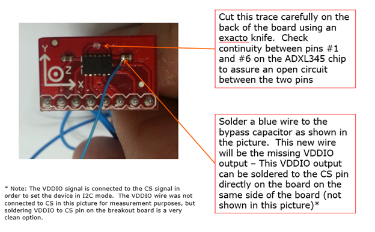
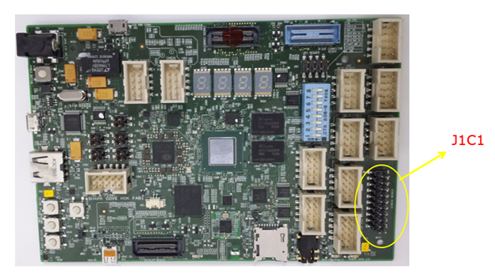
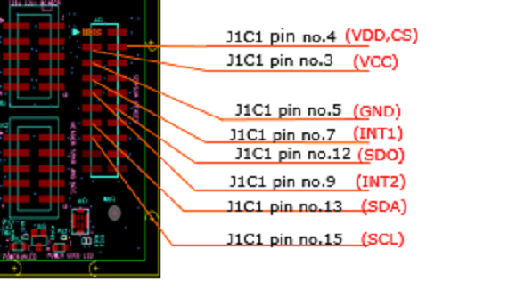

# Install the sample device and driver on your Sharks Cove board


Follow these steps to install the sample driver and attach an ADXL345 accelerometer to the J1C1 header on your Sharks Cove board.

## Install Windows on the Sharks Cove board


For information about how to get a Sharks Cove board and how to install Windows on the board, see [Sharks Cove hardware development board](https://msdn.microsoft.com/library/windows/hardware/dn745910) and [SharksCove.org](http://go.microsoft.com/fwlink/p/?linkid=403167).

## Modify the ADXL345 to work with the Sharks Cove


To set the ADXL345 in I2C mode, connect the VDD output to the CS signal, as shown here:



## Attach the modified ADXL345 to the Sharks Cove


When the ADXL345 is operating in I2C mode, attach it to the J1C1 header on your Sharks Cove board. If the power-connector appears in the upper-left corner, you'll see this header in the lower-right corner:



Attach the ADXL345 pins to the J1C1 header pins as shown here:



## Install kits and tools


A driver development environment has two computers: the *host computer* and the *target computer*. The target computer is also called the *test computer*. You develop and build your driver in Microsoft Visual Studio on the host computer. The debugger runs on the host computer and is available in the Visual Studio user interface. When you test and debug a driver, the driver runs on the target computer. In this case, the Sharks Cove board is the target computer.

On your host computer, install kits and tools as described in [Sharks Cove hardware development board](https://msdn.microsoft.com/library/windows/hardware/dn745910).

## Download and extract the SpbAccelerometer sample


On the host computer go to [this page](http://go.microsoft.com/fwlink/p?linkid=506965) and click the download button. Click **Save**, and then click **Open Folder**. Right click SpbAccelerometer Sample Driver (UMDF Version 1).zip, and choose **Extract All**. Specify or browse to a folder for the extracted files. For example, you could extract to c:\\SpbAccelerometer.

## Open the driver solution in Visual Studio


On the host computer, go to the folder that has the extracted sample. Double click the solution file, SpbAccelerometer.sln. In Visual Studio, locate Solution Explorer. (If this is not already open, choose **Solution Explorer** from the **View** menu.) In Solution Explorer, you can see one solution that has two projects. There is a driver project named **SpbAccelerometer** and a package project named **package** (lower case).

## Set the configuration and platform in Visual Studio


In Visual Studio, in Solution Explorer, right click **Solution ‘SpbAccelerometer’ (2 projects)**, and choose **Configuration Manager**. Set the configuration and the platform. Make sure that the configuration **Win8.1 Debug**, and set the platform to **Win32**. Do this for both the driver project and the package project. Do not check the **Deploy** boxes.

## Build the sample using Visual Studio


In Visual Studio, on the **Build** menu, choose **Build Solution**.

## Locate the built driver package


In File Explorer, navigate to the folder that contains your built driver package. For example, C:\\SpbAccelerometer\\Win8.1Debug\\Packge.

The package contains these files:

| File                  | Description                                                                       |
|-----------------------|-----------------------------------------------------------------------------------|
| SpbSamples.cat        | A signed catalog file, which serves as the signature for the entire package.      |
| SpbAccelerometer.inf  | An information (INF) file that contains information needed to install the driver. |
| WudfUpdate\_01011.dll | The coinstaller for WDF.                                                          |
| SpbAccelerometer.dll  | The driver file.                                                                  |


## Alter the Secondary System Description Table (SSDT)


1.  Copy the x86 version of ASL.exe to the Sharks Cove board. ASL.exe is included in the Windows Driver Kit (WDK).

    Example: C:\\Program Files (x86)\\Windows Kits\\8.1\\Tools\\x86\\ACPIVerify\\ASL.exe

2.  On the Sharks Cove board, open a Command Prompt windows as Administrator. Decompile the SSDT by entering this command:

    **asl /tab=ssdt**

    This creates the file Ssdt.asl.

3.  Open Ssdt.asl (for example, in Notepad).

    ``` syntax
    DefinitionBlock("SSDT.AML", "SSDT", 0x01, "Intel_", "ADebTabl", 0x00001000)
    {
        Scope()
        {
            Name(DPTR, 0x3bf2d000)
            Name(EPTR, 0x3bf3d000)
            Name(CPTR, 0x3bf2d010)
            Mutex(MMUT, 0x0)
            Method(MDBG, 0x1, Serialized)
            {
                Store(Acquire(MMUT, 0x3e8), Local0)
                If(LEqual(Local0, Zero))
                {
                    OperationRegion(ABLK, SystemMemory, CPTR, 0x10)
                    Field(ABLK, ByteAcc, NoLock, Preserve)
                    {
                        AAAA, 128
                    }
                    Store(Arg0, AAAA)
                    Add(CPTR, 0x10, CPTR)
                    If(LNot(LLess(CPTR, EPTR)))
                    {
                        Add(DPTR, 0x10, CPTR)
                    }
                    Release(MMUT)
                }
                Return(Local0)
            }
        }

        // Insert a Scope(_SB_) and a Device entry here.

    }
    ```

4.  Insert a Scope(\_SB\_) entry. Inside your scope entry, insert your own Device entry. Here's a scope(\_SB\_) entry and a Device entry for the ADXL345 accelerometer.

    ``` syntax
    Scope(_SB_)
    {
        Device(SPBA)
        {
            Name(_HID, "SpbAccelerometer")
            Name(_UID, 1)


        Method(_CRS, 0x0, NotSerialized)
        {
            Name(RBUF, ResourceTemplate()
            {          
                I2CSerialBus(0x53, ControllerInitiated, 400000, AddressingMode7Bit, "\\_SB.I2C3", 0, ResourceConsumer) 
                GpioInt(Edge, ActiveHigh, Exclusive, PullDown, 0, "\\_SB.GPO2") {0x17}
            })

            Return(RBUF)
        }


        Method(_DSM, 0x4, NotSerialized)
        {
            If(LEqual(Arg0, Buffer(0x10)
            {
                0x1e, 0x54, 0x81, 0x76, 0x27, 0x88, 0x39, 0x42, 0x8d, 0x9d, 0x36, 0xbe, 0x7f, 0xe1, 0x25, 0x42
            }))
            {
                If(LEqual(Arg2, Zero))
                {
                    Return(Buffer(One)
                    {
                        0x03
                    })
                }

                If(LEqual(Arg2, One))
                {
                    Return(Buffer(0x4)
                    {
                        0x00, 0x01, 0x02, 0x03
                    })
                }
            }
            Else
            {
                Return(Buffer(One)
                {
                    0x00
                })
            }
        } // Method(_DSM ...)

    } // Device(SPBA)

} // Scope(_SB_)
```

In this example, the entries under `ResourceTemplate()` specify that the accelerometer needs two hardware resources: a connection ID to a particular I2C bus controller (I2C3) and a GPIO interrupt. The interrupt uses pin 0x17 on the GPIO controller named GPO2.


5.  After you have added your own Device entry to Ssdt.asl, compile Ssdt.asl by entering this command:

    **asl ssdt.asl**

    This puts the compiled output in a file named Ssdt.aml.

6.  Verify that test signing is turned on for the Sharks Cove board.

    **Note**  Test signing is turned on automatically during provisioning.


On the Sharks Cove board, open a Command Prompt window as Administrator. Enter this command.

**bcdedit /enum {current}**

Verify that you see `testsigning Yes` in the output.

``` syntax
Windows Boot Loader
-------------------
identifier              {current}
...
testsigning             Yes
...
```

If you need to turn on test signing manually, here are the steps:

1.  Open a Command Prompt window as Administrator, and enter this command.

    **bcdedit /set TESTSIGNING ON**

2.  Restart the Sharks Cove board. As the board restarts, hold the Volume-up button. Go to **Device Manager &gt; System Setup &gt; Boot**. Set **UEFI Security Boot** to **Disabled**.
3.  Save your changes and continue booting to Windows.


7.  To load your updated SSDT, open a Command Prompt window as Administrator, and enter this command:

    **asl /loadtable ssdt.aml**

    Restart the Sharks Cove board.

## Install and run the sample driver


1.  On the host computer, open the SpbAccelerometer solution in Visual Studio.
2.  In Solution Explorer, double click **package** (lower case), and choose **Properties**. Go to **Driver Install &gt; Deployment**. Check **Enable Deployment**. Check **Remove previous driver versions before deployment**. For **Target computer name**, enter the name of your Sharks Cove board that you provisioned previously. Select **Install and Verify**. Click **OK**.
3.  On the **Debug** menu, choose **Start Debugging**. Your driver package is automatically copied to the Sharks Cove board. Your driver is automatically installed and loaded. The Windows user-mode debugger (running on the host computer in Visual Studio) automatically attaches to the instance of Wudfhost.exe (running on the Sharks Cove board) that is hosting your driver.


