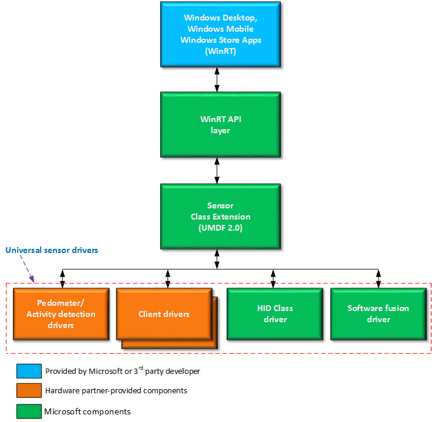

# Overview of the universal sensor driver model

In Windows 10, the sensor driver stacks for Desktop and Mobile devices have been merged to create a universal sensor driver model.

Hardware partners can now build a single driver, along with its associated App, that can run on all Windows device platforms.

>[!NOTE]
> V1.0 UMDF sensor drivers are supported in Windows 10 for desktop editions (Home, Pro, Enterprise, and Education), and KMDF sensor drivers are supported in Windows 10 Mobile.

 

Sensor device drivers that are developed based on the Universal Windows driver model, and they're implemented by using the latest version of the User Mode Driver Framework - UMDF 2.0.

The universal sensor driver model has the following features:

-   Allows multiple sensors per driver, to reduce the number of drivers needed to support more sensors.
-   Uses change sensitivity (CS) and current reporting interval (CRI), to provide data throttling to improve power usage and reduce data noise.
-   Provides extensibility using a unified PROPERTYKEY/PROPVARIANT-based system.
-   Provides backward compatibility with WinRT APIs.
-   Supports the class extension (CX) model. And this provides functionality that includes managing connections and subscriptions, notifying the driver when a sensor can power down, and managing the I/O queues and I/O request lifetimes.
-   Support for new sensor types in Windows 10, like for example, 6-axis fusion sensors (Accelerometer + Gyro).
-   Support for a Universal HID sensor class driver for SKUs that are based on the Windows core architecture. These SKUs include Windows 10 Mobile. (Previously, the HID sensor class driver was only supported on desktop SKUs of Windows).
-   Support for custom sensors, via WinRT.

There is work currently underway for the next version of Windows, that will allow the HID sensor class driver to support even more sensor types. These sensor types include a Pedometer, and sensors for Activity Detection, Linear Acceleration, Gravity Vectors, Geomagnetic Orientation, etc.

Additionally, the universal sensor driver model provides the following benefits to our partners:

-   All sensors are now optional. Partners can now choose to include only the sensors that they want when they develop low-cost devices. This gives them more flexibility in minimizing BOM costs.
-   There is now an OEM-replaceable device orientation algorithm, which the OEM has the option of not using.
-   The “minimum report interval” requirements for the accelerometer, ambient light sensor, gyroscope, magnetometer, orientation, and proximity sensors have been removed from Windows. This was the result of creating converged chassis specifications.

The following diagram shows the components that make up the universal sensor driver model:

Note that the Microsoft Store Apps component can consist of apps developed by Microsoft, or by the 3rd party developer to accompany the sensor.

 

 

