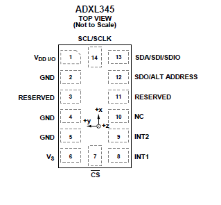

# Prepare your sensor test board

This topic shows you how to prepare your sensor test board for connection to the Sharks Cove board.

**Note**  This topic assumes that you’re using a sensor test board (sometimes referred to as a sensor *breakout* board) that you purchased from an IHV, and that the sensor test board was not developed specifically for use with Sharks Cove.

 

If you purchased your sensor test board from an IHV, and it was not developed specifically for use with Sharks Cove, it might be necessary to make some modifications to the test board. This topic shows you the kind of information that you must read to find out if you need to make modifications to your sensor test board. If you need to modify the sensor test board, then follow the guidance in this topic to prepare the test board for connection to Sharks Cove.

After you have chosen the sensor for which you would like to build a universal sensor driver, you must then obtain the manufacturer’s data sheets for the sensor, and the technical specifications for the Sharks Cove.

The Sharks Cove board has a variety of headers to allow connections to external devices. A 20-pin male header, labeled J1C1 SENSOR HEADER, allows you to connect sensors to Sharks Cove. Sensors connected to J1C1, communicate with Sharks Cove using the I2C simple peripheral bus (SPB).

Study the data sheets and technical specifications to figure out how you’re going to connect the pins (or other connections points) of the sensor test board to J1C1.

Here’s a table from the *Sharks Cove Technical Specifications Rev. 1.0*, showing the pin allocations for J1C1.

| J1C1 pin\# | Signal name            | Comments                                                                                            |
|------------|------------------------|-----------------------------------------------------------------------------------------------------|
| 1          | +V3P3A\_PLT            | 3.3V Power Rail                                                                                     |
| 2          | +VSYS (4.2)            | 4.2 V Power Rail                                                                                    |
| 3          | +V2P8\_ALDO1           | 2.8V Analog Power Rail                                                                              |
| 4          | +V1P8A                 | 1.8 V Power Rail                                                                                    |
| 5          | GROUND                 | Ground                                                                                              |
| 6          | GROUND                 | Ground                                                                                              |
| 7          | ACCEL\_INT\_N          | Accelerometer Interrupt Signal                                                                      |
| 8          | HDR\_GYRO\_INT1        | Gyroscope Interrupt Signal                                                                          |
| 9          | HDR\_COMPASS\_DRDY     | Ready Signal                                                                                        |
| 10         | HDR\_GYRO\_INT2        | Gyroscope Interrupt Signal                                                                          |
| 11         | GROUND                 | Ground                                                                                              |
| 12         | GROUND                 | Ground                                                                                              |
| 13         | HDR\_I2C\_2\_SDA       | I2C Data line for I2C controller 2                                                                  |
| 14         | HDR\_PROX\_ALS\_INT\_N | Ambient Light Sensor Interrupt Signal                                                               |
| 15         | HDR\_I2C\_2\_SCL       | I2C Clock line for I2C controller 2                                                                 |
| 16         | SAR\_PROX\_INT         | If this signal needs to be used for SAR\_PROX\_INT, it must be configured as an Interrupt signal\*. |
| 17         | Not connected          | None                                                                                                |
| 18         | SAR\_PROX\_RST         | Proximity Sensor Reset signal                                                                       |
| 19         | Not connected          | None                                                                                                |
| 20         | Not connected          | None                                                                                                |

 

For more detailed technical information about the Sharks Cove board, see [Sharks Cove Schematic](http://firmware.intel.com/sites/default/files/Sharks_Cove_Schematic.pdf).

And if, for example, you had chosen to build a universal sensor driver for the ADXL345 accelerometer, then the following diagram from page 5 of the ADXL345 Digital Accelerometer data sheet (along with Table 4 on the same page) shows you the pins available for connecting the accelerometer board to Sharks Cove.

This accelerometer is available from [SparkFun](https://www.sparkfun.com/products/9836), mounted on a breakout board with the following schematic.

Notice in the diagram, that the VDD/IO line (pin 1) is connected to the VS line (pin 6). And notice also, that the VDD/IO line is not exposed directly to the 8-pin header.

However, on page 19 of the ADXL345 datasheet, it is recommended that VDD/IO and VS should be connected to different supply voltage lines, to reduce digital clocking noise on the VS line. And as indicated on page 10 of the datasheet, we have to tie the CS line high to VDD/IO, to select the I2C communication mode.

So the following diagram shows the modifications that you must make to the ADXL345 breakout board, for it to work with the sample sensor driver.

In other words, modify the ADXL345 breakout board as follows:

-   Cut the track that connects the VDD/IO line to the VS line. Then check by measuring between pin 1 and pin 6 with a multimeter, to make sure that you have an open circuit.
-   Solder a wire to connect the VDD/IO line to the CS line (pin 7). Then measure with a multimeter, to make sure that you have a short circuit between pin 1 and pin 7.

Here’s an image showing a modified ADXL345 accelerometer breakout board.

A yellow dot has been added to the preceding image, and placed on the ADXL345 chip to indicate the location of pin 1.

So preparing your sensor test board for connection to Sharks Cove, could involve any or all of the following:

-   Cutting a printed circuit board (PCB) track to break an unwanted connection between components on the sensor test board.
-   Cutting a PCB track and rerouting the connection to a new destination on the sensor test board.
-   Soldering a ribbon cable with a female insulation displacement connector (IDC) header to the sensor test board. This makes it easy and convenient to connect the two boards.
-   As an alternative to the preceding bullet, you can find a way to mount the sensor test board on a breadboard, then find a convenient way to connect the relevant rows of the breadboard to the matching pins of J1C1.

After you’ve made all the necessary modifications to your sensor test board, follow the guidance in the next topic to [connect your sensor to the Sharks Cove board](connect-your-sensor-to-the-sharks-cove-board.md).

 

 

