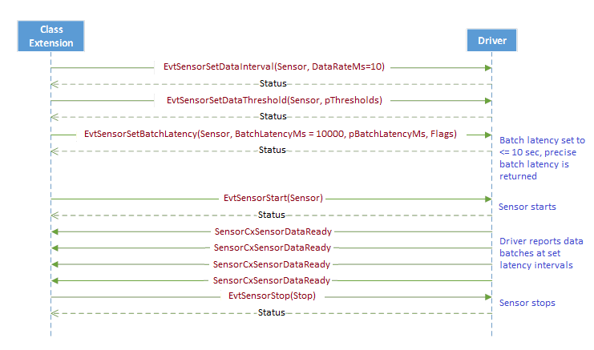

# Sensor data batching for power savings

This topic covers the interfaces that are required between the sensor class extension and the sensor driver, to implement sensor data batching in Windows 10.

## Introduction

A sensor driver that implements data batching allows the application processor to save power, since the processor receives and processes sensor data less frequently. The sensor driver in this case, buffers the sensor data samples in the sensor hardware, and then transfers them together in a batch to the sensor class extension. To support batching you must provide a UMDF 2.0 universal sensor driver, which implements the required interfaces.

**Batch latency**

The Batch latency is defined as the maximum amount of time for which a sensor can buffer a data sample after it is collected, before delivering it to the sensor class extension. The sensor data batching "schedule" kicks in when the sensor events are delivered by the driver, based on the batch latency value as shown in the following diagrams.

In the case of a driver that does not implement data batching, the driver simply collects and sends the sensor data as it becomes available. So for example, to send N data samples, the driver would initiate the collection and sending of the data samples, N times.

In the case of a driver that implements data batching, the data collection and delivery sequence is carried out in batches, as shown in the immediately preceding diagram. The batch latency value is specified by the sensor class extension. So when the sensor hardware has to collect and transfer N data samples, for example, the sensor driver could split the process into two batches. The first half of the N data samples would be sent after a time interval that is equal to the batch latency period. Then after another batch latency time interval, the second half of the data samples would be sent, making a total of two transfers, compared to the N transfers required by the normal delivery method.

## Sensor properties

In addition to the required common sensor properties and enumeration properties, a driver that supports data batching must also report the following properties:

-   PKEY\_Sensor\_FifoReservedSize\_Samples

-   PKEY\_Sensor\_FifoMaxSize\_Samples

-   PKEY\_Sensor\_WakeCapable

For more information, see [Common sensor properties](common-sensor-properties.md) and [Enumeration properties](enumeration-properties.md).

If the sensor hardware subsystem is wake-capable, then it should make sure that it initiates wake up early enough to avoid buffer overruns.

## Optional DDSI functions for data batching

The device driver software interface (DDSI) functions are the interface between the driver and the class extension. To support data batching, a driver must implement the following DDSI function, so that the sensor class extension can set the batch latency.

-   [EvtSensorSetBatchLatency](https://docs.microsoft.com/windows-hardware/drivers/ddi/content/sensorscx/ns-sensorscx-_sensor_controller_config)
    This is a callback function that sets the batch latency for a specified sensor. The driver should set the Batch Latency to a value that is less than or equal to the *BatchLatencyMs* parameter, depending on buffer availability.

The driver must also implement all the required DDSI functions. For more information, see [Sensor DDSI functions](sensor-ddsi-functions.md).

It is optional for the sensor class extension to specify batch latency. The default batch latency for all sensors is zero (0), which is used to indicate that samples will not be batched. Sensor samples will be delivered in batches, only if the class extension calls **EvtSensorSetBatchLatency** to set a batch latency value. Otherwise, the samples will be delivered normally at the periodic data interval rate.

The sensor class extension can call **EvtSensorSetBatchLatency** to change the batch latency value at any time. In particular, this function can be called while the specified sensor is already active and running, and this should not result in the loss of events. The sensor driver is expected to collect and start delivering samples of the latest batch immediately (on a best effort basis). The driver should not exceed the batch latency specified by class extension.

It is important to note that there is no change implied to sensor data delivery methods and events due to data batching. When batch latency expires, the driver calls SensorsCxSensorDataReady repeatedly to deliver all the buffered data samples one at a time. The data samples are accompanied by their time stamps (contained in their associated PKEY\_SensorData\_Timestamp data fields) indicating when each sampled was taken. For more information about PKEY\_SensorData\_Timestamp, see [Common data fields](common-data-fields.md).

## Batch latency and data rate relationship

Batch latency and data rate are related as follows:

Where *SensorBatching\_MaxSize\_Bytes* is the maximum size of the buffer for the batched sensor data. If your sensor is an accelerometer, then we recommend a hardware buffer that is large enough to hold 250 or more samples. The data rate is expressed in milliseconds, and it's the length of time it takes to transfer one data sample. The number of samples the sensor hardware must store in a batch is inversely proportional to the data rate. The smaller the data rate, the bigger the sample buffer that is needed to store the batched samples for a given batch latency value. In the preceding formula, batch latency is represented by *BatchLatencyMs* and data rate is represented by *DataRateMs*. And If the combination of *BatchLatencyMs* and *DataRateMs* result in a buffer size that’s larger than *SensorBatching\_MaxSize\_Bytes*, then **EvtSensorSetBatchLatency** and [EvtSensorSetDataInterval](https://docs.microsoft.com/windows-hardware/drivers/ddi/content/sensorscx/ns-sensorscx-_sensor_controller_config) will set the batch latency to the value shown by the preceding formula.

If the caller specifies a *BatchLatencyMs* value that is less than *DataRateMs*, then the data is delivered without buffering.

## Batching with data thresholds

A sensor driver that implements data batching can use [EvtSensorSetDataThresholds](https://docs.microsoft.com/windows-hardware/drivers/ddi/content/sensorscx/ns-sensorscx-_sensor_controller_config) to set a non-zero data threshold. In this case, when the difference in data values between the current readings and the last readings, exceeds the data threshold that was set using **EvtSensorSetDataThresholds**, then the data collection, batching and delivery process is invoked. So using data batching together with data thresholds, allows the sensor driver to save even more power.

When non-zero data thresholds are set by the sensor class extension, along with data batching, the driver is expected to deliver batched samples with accurate timestamps, and to honor the data thresholds as well. If the sensor hardware itself isn’t capable of keeping accurate timestamps while enforcing data thresholds it can collect samples without enforcing data thresholds. However, in such a case the driver should filter out samples that don’t meet the current data threshold settings, before delivering them to the sensor class extension.

## Sequence diagram examples

Here are sequence diagrams that show the usage of the optional data batching DDSI functions that were mentioned in [Optional DDSI functions for data Batching](#optional-ddsi-functions-for-data-batching). We may add more sequence diagrams as needed, to clarify scenarios based on partner feedback.

**Scenario 1**

In this scenario, the sensor class extension sets the batch latency and the data interval, before starting the sensor. Once the sensor starts, it delivers batches periodically while respecting the set properties.

**Scenario 2**

In this scenario, the sensor class extension sets the batch latency, data interval and the data thresholds, before starting the sensor. Once the sensor starts, it delivers batches periodically while respecting the set properties. Note that the driver should not deliver a batch unless there is a sample that meets data threshold values, that needs to be sent within the specified batch latency.

**Scenario 3**

In this scenario, the sensor class extension sets the batch latency and data interval before starting the sensor. Once the sensor starts, it delivers batches periodically, while respecting the set properties. The sensor class extension changes the batch latency and data interval while the sensor is running, and the driver immediately starts delivering samples in accordance with the new values without losing any data samples while running.

## Data batching hardware configurations

Sensor data must be batched in the sensor hardware, without the involvement of the application processor. That will allow the processor to sleep while the data is being batched to conserve power. The following diagram shows the possible configurations for sensor hardware-based data batching.

-   **Configuration 1**: The FIFO buffer is implemented in the Sensor component, which is directly connected to the application processor.

-   **Configuration 2**: The FIFO buffer is implemented in the low power sensor hardware core, to which the sensor component is connected. In this case, the FIFO buffer may be shared across multiple sensors, or even shared with non-sensor components, depending on sensor core design. The low power sensor core is in turn, connected to the application processor, and may be integrated into the SoC. Or, it may be an external component.

-   **Configuration 3**: The FIFO buffer is implemented on the sensor component. The sensor component is connected to a low power sensor core, which is connected to the application processor. The sensor component may be integrated into the SoC or it may be an external component.

-   **Configuration 4**: The FIFO buffer is implemented on the sensor component and low power sensor core. The sensor component is connected to a low power sensor core which in turn, is connected to the application processor. The sensor component may be integrated into the SoC, or it may be an external component. It is worth noting that the sensor core can be used to extend a FIFO that is too shallow.

The key thing to note is that the FIFO can be implemented on the sensor core hardware or sensor hardware or on both. The driver abstracts this for the operating system, and presents a uniform interface via the DDSI.

The following diagram illustrates the different configurations described in the preceding list.

**Buffer-full behavior in hardware**

Under normal circumstances the driver is supposed to read the hardware buffer at least once every time interval equal to *BatchLatencyMs*, to ensure that no data is dropped or lost. When the hardware FIFO buffer fills up, it should wrap around and behave like a circular buffer, overwriting older events.

 

 

