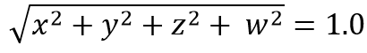

# SENSOR\_CATEGORY\_ORIENTATION

The SENSOR\_CATEGORY\_ORIENTATION category contains sensors that provide information about physical orientation. Compasses provide navigational orientation, such as those based on magnetic north. Inclinometers measure slope or elevation. Distance sensors measure the proximity of some object to the sensor.

**Platform-Defined Sensor Types**

This category includes the following platform-defined sensor types.

<table>
<colgroup>
<col width="50%" />
<col width="50%" />
</colgroup>
<thead>
<tr class="header">
<th>Sensor type</th>
<th>Description</th>
</tr>
</thead>
<tbody>
<tr class="odd">
<td>
<strong>SENSOR_TYPE_AGGREGATED_DEVICE_ORIENTATION</strong></td>
<td>
Specifies the current device orientation by returning a Quaternion and, in some cases, a rotation matrix. (The rotation matrix is optional.)
</td>
</tr>
<tr class="even">
<td>
<strong>SENSOR_TYPE_AGGREGATED_QUADRANT_ORIENTATION</strong></td>
<td>
Specifies the current device orientation in degrees.
</td>
</tr>
<tr class="odd">
<td>
<strong>SENSOR_TYPE_AGGREGATED_SIMPLE_DEVICE_ORIENTATION</strong></td>
<td>
Specifies the device orientation as an enumeration. (This type specifies the device orientation using one of four general quadrants: 0 degrees, 90-degrees counter clockwise, 180-counter clockwise, and 270-degrees counter clockwise.)
</td>
</tr>
<tr class="even">
<td>
<strong>SENSOR_TYPE_COMPASS_1D</strong>
{A415F6C5-CB50-49D0-8E62-A8270BD7A26C}</td>
<td>
One-axis compasses.
</td>
</tr>
<tr class="odd">
<td>
<strong>SENSOR_TYPE_COMPASS_2D</strong>
{15655CC0-997A-4D30-84DB-57CABA3648BB}</td>
<td>
Two-axis compasses.
</td>
</tr>
<tr class="even">
<td>
<strong>SENSOR_TYPE_COMPASS_3D</strong>
{76B5CE0D-17DD-414D-93A1-E127F40BDF6E}</td>
<td>
Three-axis compasses.
</td>
</tr>
<tr class="odd">
<td>
<strong>SENSOR_TYPE_DISTANCE_1D</strong>
{5F14AB2F-1407-4306-A93F-B1DBABE4F9C0}</td>
<td>
One-axis distance sensors.
</td>
</tr>
<tr class="even">
<td>
<strong>SENSOR_TYPE_DISTANCE_2D</strong>
{5CF9A46C-A9A2-4E55-B6A1-A04AAFA95A92}</td>
<td>
Two-axis distance sensors.
</td>
</tr>
<tr class="odd">
<td>
<strong>SENSOR_TYPE_DISTANCE_3D</strong>
{A20CAE31-0E25-4772-9FE5-96608A1354B2}</td>
<td>
Three-axis distance sensors.
</td>
</tr>
<tr class="even">
<td>
<strong>SENSOR_TYPE_INCLINOMETER_1D</strong>
{B96F98C5-7A75-4BA7-94E9-AC868C966DD8}</td>
<td>
One-axis inclinometers.
</td>
</tr>
<tr class="odd">
<td>
<strong>SENSOR_TYPE_INCLINOMETER_2D</strong>
{AB140F6D-83EB-4264-B70B-B16A5B256A01}</td>
<td>
Two-axis inclinometers.
</td>
</tr>
<tr class="even">
<td>
<strong>SENSOR_TYPE_INCLINOMETER_3D</strong>
{B84919FB-EA85-4976-8444-6F6F5C6D31DB}</td>
<td>
Three-axis inclinometers.
</td>
</tr>
</tbody>
</table>

**Platform-Defined Data Fields**

Platform-defined property keys for this category are based on SENSOR\_DATA\_TYPE\_ORIENTATION\_GUID:

{1637D8A2-4248-4275-865D-558DE84AEDFD}

This category includes the following platform-defined data fields.

<table>
<colgroup>
<col width="50%" />
<col width="50%" />
</colgroup>
<thead>
<tr class="header">
<th>Data field name and PID</th>
<th>Description</th>
</tr>
</thead>
<tbody>
<tr class="odd">
<td>
<strong>SENSOR_DATA_TYPE_ANGULAR_VELOCITY_X_DEGREES_PER_SECOND</strong>
(PID = 10)</td>
<td>
<strong>VT_R8</strong>

Gyrometer x-axis velocity, in degrees per second.
</td>
</tr>
<tr class="even">
<td>
<strong>SENSOR_DATA_TYPE_ANGULAR_VELOCITY_Y_DEGREES_PER_SECOND</strong>
(PID = 11)</td>
<td>
<strong>VT_R8</strong>

Gyrometer y-axis velocity, in degrees per second.
</td>
</tr>
<tr class="odd">
<td>
<strong>SENSOR_DATA_TYPE_ANGULAR_VELOCITY_Z_DEGREES_PER_SECOND</strong>
(PID = 12)</td>
<td>
<strong>VT_R8</strong>

Gyrometer z-axis velocity, in degrees per second.
</td>
</tr>
<tr class="even">
<td>
<strong>SENSOR_DATA_TYPE_TILT_X_DEGREES</strong>
(PID = 2)</td>
<td>
<strong>VT_R4</strong>

Inclinometer x-axis angle, in degrees.
</td>
</tr>
<tr class="odd">
<td>
<strong>SENSOR_DATA_TYPE_TILT_Y_DEGREES</strong>
(PID = 3)</td>
<td>
<strong>VT_R4</strong>

Inclinometer y-axis angle, in degrees.
</td>
</tr>
<tr class="even">
<td>
<strong>SENSOR_DATA_TYPE_TILT_Z_DEGREES</strong>
(PID = 4)</td>
<td>
<strong>VT_R4</strong>

Inclinometer z-axis angle, in degrees.
</td>
</tr>
<tr class="odd">
<td>
<strong>SENSOR_DATA_TYPE_DISTANCE_X_METERS</strong>
(PID = 8)</td>
<td>
<strong>VT_R4</strong>

X-axis distance, in meters.
</td>
</tr>
<tr class="even">
<td>
<strong>SENSOR_DATA_TYPE_DISTANCE_Y_METERS</strong>
(PID = 9)</td>
<td>
<strong>VT_R4</strong>

Y-axis distance, in meters.
</td>
</tr>
<tr class="odd">
<td>
<strong>SENSOR_DATA_TYPE_DISTANCE_Z_METERS</strong>
(PID = 10)</td>
<td>
<strong>VT_R4</strong>

Z-axis distance, in meters.
</td>
</tr>
<tr class="even">
<td>
<strong>SENSOR_DATA_TYPE_MAGNETIC_FIELD_STRENGTH_X_MILLIGAUSS</strong>
(PID = 19)</td>
<td>
<strong>VT_R8</strong>

Magnetometer x-axis field strength, in milligauss.
</td>
</tr>
<tr class="odd">
<td>
<strong>SENSOR_DATA_TYPE_MAGNETIC_FIELD_STRENGTH_Y_MILLIGAUSS</strong>
(PID = 20)</td>
<td>
<strong>VT_R8</strong>

Magnetometer y-axis field strength, in milligauss.
</td>
</tr>
<tr class="even">
<td>
<strong>SENSOR_DATA_TYPE_MAGNETIC_FIELD_STRENGTH_Z_MILLIGAUSS</strong>
(PID = 21)</td>
<td>
<strong>VT_R8</strong>

Magnetometer z-axis field strength, in milligauss.
</td>
</tr>
<tr class="odd">
<td>
<strong>SENSOR_DATA_TYPE_MAGNETIC_HEADING_X_DEGREES</strong>
(PID = 5)</td>
<td>
<strong>VT_R4</strong>

Compass x-axis heading, in degrees.
</td>
</tr>
<tr class="even">
<td>
<strong>SENSOR_DATA_TYPE_MAGNETIC_HEADING_Y_DEGREES</strong>
(PID = 6)</td>
<td>
<strong>VT_R4</strong>

Compass y-axis heading, in degrees.
</td>
</tr>
<tr class="odd">
<td>
<strong>SENSOR_DATA_TYPE_MAGNETIC_HEADING_Z_DEGREES</strong>
(PID = 7)</td>
<td>
<strong>VT_R4</strong>

Compass z-axis heading, in degrees.
</td>
</tr>
<tr class="even">
<td>
<strong>SENSOR_DATA_TYPE_MAGNETIC_HEADING_COMPENSATED_MAGNETIC_NORTH_DEGREES</strong>
(PID = 11)</td>
<td>
<strong>VT_R8</strong>

Compensated compass heading relative to magnetic North in degrees. This compensation causes the measurement of the heading angle to be represented as if a compass device is laying flat on level ground where the PC is located.
</td>
</tr>
<tr class="odd">
<td>
<strong>SENSOR_DATA_TYPE_MAGNETIC_HEADING_COMPENSATED_TRUE_NORTH_DEGREES</strong>
(PID = 12)</td>
<td>
<strong>VT_R8</strong>

Compensated compass heading relative to true North in degrees. This compensation causes the measurement of the heading angle to be represented as if a compass device is laying flat on level ground where the PC is located.
</td>
</tr>
<tr class="even">
<td>
<strong>SENSOR_DATA_TYPE_MAGNETIC_HEADING_MAGNETIC_NORTH_DEGREES</strong>
(PID = 13)</td>
<td>
<strong>VT_R8</strong>

Uncompensated compass heading relative to magnetic North in degrees. The measurement of the heading angle is represented as measured on the plane that the compass device is installed relative to.
</td>
</tr>
<tr class="odd">
<td>
<strong>SENSOR_DATA_TYPE_MAGNETIC_HEADING_TRUE_NORTH_DEGREES</strong>
(PID = 14)</td>
<td>
<strong>VT_R8</strong>

Uncompensated compass heading relative to true North in degrees. The measurement of the heading angle is represented as measured on the plane that the compass device is installed relative to.
</td>
</tr>
<tr class="even">
<td>
<strong>SENSOR_DATA_TYPE_QUADRANT_ANGLE_DEGREES</strong>
(PID = 15)</td>
<td>
<strong>VT_R8</strong>

Aggregated quadrant-orientation, in degrees.
</td>
</tr>
<tr class="odd">
<td>
<strong>SENSOR_DATA_TYPE_ROTATION_MATRIX</strong>
(PID = 16)</td>
<td>
<strong>VT_VECTOR|VT_UI1</strong>

Counted array representing the orientation of the device in 3D space as a 3x3 rotation matrix (VT_VECTOR|VT_UI1).

Data for vector types is always serialized as VT_UI1 (an array of unsigned, 1-byte characters). This data field must contain each value as a single-precision float (VT_R4).

This array is expressed as a matrix:

These values are ordered in the rotation matrix data field array as follows: M11,M12,M13,M21,M22,M23,M31,M32,M33

Note that for devices implementing support for the in-box Windows 8 HID sensor class driver, this data field is optional. If only <strong>SENSOR_DATA_TYPE_QUATERNION</strong> is implemented, <strong>SENSOR_DATA_TYPE_ROTATION_MATRIX</strong> will be calculated and populated for each data report sent. Devices not using the in-box HID sensor class driver need to calculate and expose both <strong>SENSOR_DATA_TYPE_QUATERNION</strong> and <strong>SENSOR_DATA_TYPE_ROTATION_MATRIX</strong> sensor data fields.
</td>
</tr>
<tr class="even">
<td>
<strong>SENSOR_DATA_TYPE_QUATERNION</strong>
(PID = 17)</td>
<td>
<strong>VT_VECTOR|VT_UI1</strong>

The x, y, z, w values of a quaternion representing the orientation of the device in 3D space. (VT_VECTOR|VT_UI1).

Data for vector types is always serialized as VT_UI1 (an array of unsigned, 1-byte characters).

This data field must contain each value as a single-precision float (VT_R4).

The order of the values in this array is as follows: [x,y,z,w]

The W value of a quaternion is limited to [0,1] instead of the full [-1, 1].

All rotations must be stated in the forward direction (and not the reverse).

Note: The output of quaternion should be in normalized format. When quaternions are expressed in normalized format, the values will satisfy the following:

</td>
</tr>
<tr class="odd">
<td>
<strong>SENSOR_DATA_TYPE_SIMPLE_DEVICE_ORIENTATION</strong>
(PID = 18)</td>
<td>
<strong>VT_UI4</strong>

Aggregated device-orientation, specified as an enumeration. (The enumeration values correspond to one of four quadrants.)
</td>
</tr>
<tr class="even">
<td>
<strong>SENSOR_DATA_TYPE_MAGNETOMETER_ACCURACY</strong>
(PID = 22)</td>
<td>
<strong>VT_I4</strong>

Magnetometer accuracy reading, specified as an enumeration.
</td>
</tr>
</tbody>
</table>

Requirements
------------

<table>
<colgroup>
<col width="50%" />
<col width="50%" />
</colgroup>
<tbody>
<tr class="odd">
<td>
Minimum supported client
</td>
<td>
Windows 7
</td>
</tr>
<tr class="even">
<td>
Minimum supported server
</td>
<td>
None supported
</td>
</tr>
<tr class="odd">
<td>
Header
</td>
<td>Sensors.h</td>
</tr>
</tbody>
</table>

 

 

