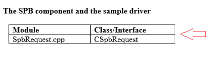

# SpbAccelerometer driver cookbook

## Get started

This guide shows you how to get started using a sample diver that was developed for Windows 8.1 and earlier operating systems (the SpbAccelerometer sample driver).

>[!NOTE]
> To evaluate the sensor driver sample for Windows 10 and later operating systems, see [Sensors sample driver](https://github.com/Microsoft/Windows-driver-samples/tree/master/sensors). For information about how to develop and build a sensor driver for Windows 10 and later operating systems, see [Write and deploy your universal sensor driver](write-and-deploy-your-universal-sensor-driver.md).

 

You’ll start by installing Windows on your Sharks Cove board. They you'll configure the accelerometer and attach it to the Sharks Cove board. Next, you'll install Microsoft Visual Studio Express and the Windows Driver Kit (WDK). Then, you’ll install the sample driver. Once you’ve completed these tasks, you can start exploring the sample driver.

For information about the Sharks Cove board, see [SharksCove.org](http://go.microsoft.com/fwlink/p/?linkid=403167).

### Required hardware

Before you get started, make sure you have the following hardware:

-   Sharks Cove board with included power cord and adapter.
-   [ADXL345](http://go.microsoft.com/fwlink/p/?linkid=401463) accelerometer/breakout board
-   USB hub
-   USB keyboard
-   USB mouse
-   USB network adapter
-   Monitor and HDMI cable (and possibly adapters)

### Document conventions

In the sections that describe the sample driver, you’ll see short tables after each section heading:

These tables identify the source modules and classes discussed in that section. Use this information to open the module and view its corresponding code in Visual Studio.

 

 

