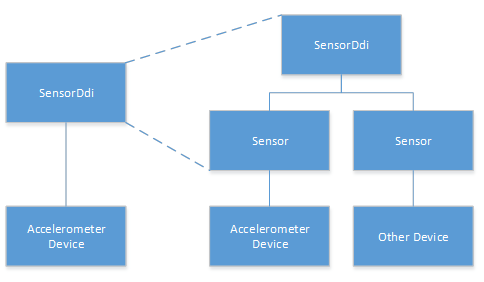

# Supporting multiple sensors

The SpbAccelerometer sample demonstrates how to write a driver for a single sensor device. However, the sensor class extension and sensor DDI accommodate multiple sensor devices. Consider the following modifications to the sample driver to support multiple sensors.

Separate SensorDdi into two classes:

1.  SensorDdi
2.  Sensor

The SensorDdi class will continue to facilitate communication with the sensor class extension by implementing the **ISensorDriver** interface and making calls via the **ISensorClassExtension** interface. This class should also maintain a list of current sensors, indexed by the sensor ID string.

For each sensor, create a new Sensor class instance. This class will maintain: state, properties, and data fields. Each Sensor instance will also have its own ClientManager and ReportManager.

When receiving one of the sensor DDI callbacks, the SensorDDI class will match the sensor ID and invoke the corresponding method in the appropriate Sensor instance.

The left side of the following illustration depicts the sample driver as it exists upon download. The right side of the illustration depicts the this driver after the modifications in this topic were applied and support was added for a second device.

 

 

