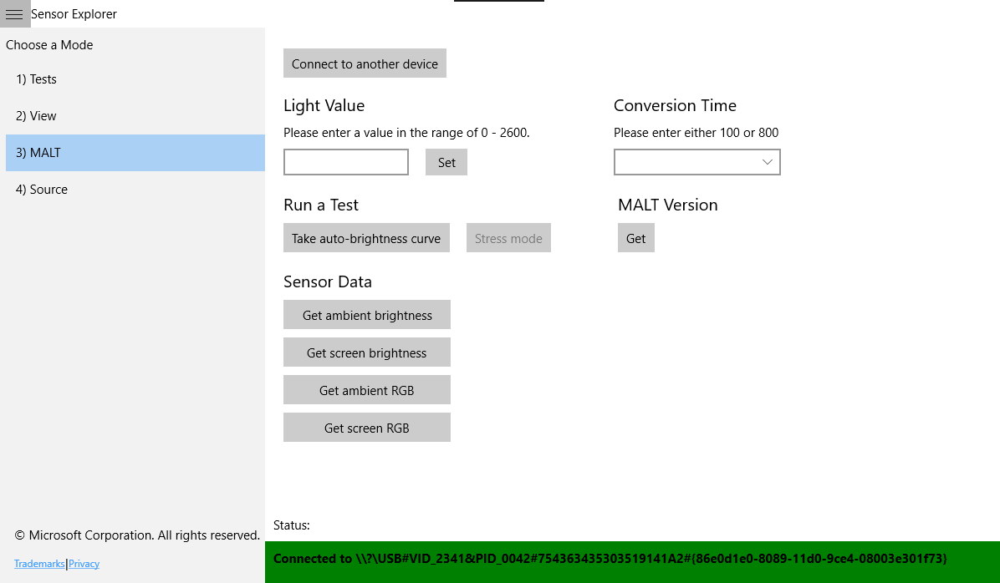
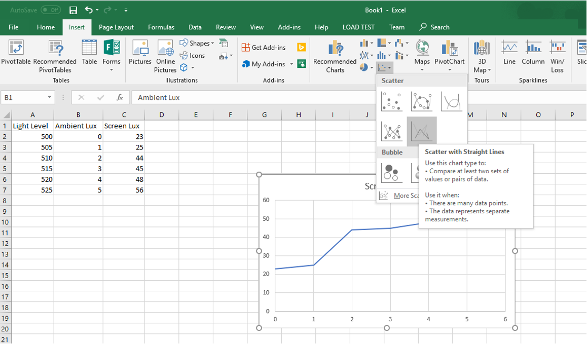

# Testing Auto Brightness

This topic describes how to test auto brightness by using the MALT (Microsoft Ambient Light Tool) tool. Automatic or Adaptive Brightness refers to screen brightness set automatically by the system in response to the Ambient Light Sensor reading.

## Set up

Read through the topic [Building a Light Testing Tool (MALT)](testing-MALT-building-a-light-testing-tool.md) to ensure that you have met the requirements for the tests.

### Configuring the SUT manually

We highly recommended that you use **MALT_SUT_Setup.bat** to setup MALT and the system under test (SUT). The following instructions for manual set up of MALT and SUT are provided for transparency and legacy purposes only.

1. Ensure the SUT has an ambient light sensor (ALS). To find out if your PC has an ALS, in **Display** settings, under **Brightness and color**, look for the **"Change brightness automatically when lighting changes"** check box, and then select it to use this feature.
2. Make sure the screen will not turn off during the test. To adjust sleep settings in Windows 10, go to **Start** and select **Settings**  > **System** > **Power & sleep**. Under **Screen**, change **On battery power, turn off after** to **Never** and **When plugged in, turn off after** to **Never**.
3. Make sure your device will not go to sleep during the test. To adjust sleep settings in Windows 10, go to **Start** and select **Settings**  > **System** > **Power & sleep**. Under **Sleep**, change **On battery power, PC goes to sleep after** to **Never** and **When plugged in, PC goes to sleep after** to **Never**.
4. To reduce test variability, set the screen background of the SUT to solid white before testing. Select **Settings > Personalization > Background**, and then change the Background dropdown to **"Solid color"**. Click **Custom color > More** and change the color hex value to `FFFFFF`. This will change your desktop background to solid white.
5. Make sure the volume is turned up on the SUT. The application will play a sound when long-running tests complete to notify you that it has completed.

## Automatic brightness test procedures

### Get ambient light response curve

**Using the [SensorExplorer](testing-sensor-explorer.md) app (Recommended)**

1. Open SensorExplorer and click **MALT** on the left-hand side menu bar.

    

2. Verify the connection by clicking **Sensor Data** > **Get ambient brightness**. If MALT is properly set up, the correct lux value will be displayed; otherwise close the app, try re-uploading the Arduino program and checking the Serial Monitor.
3. Under **Run a Test**, click **Take auto-brightness curve**.
4. Choose a location to save the .csv file.
5. Specify the wait time before the test starts. This is meant to give you time to place the sensor on the system.
6. Wait. This test will take approximately 5-10 minutes. The test is adjusting the brightness of the light from 0 to its maximum brightness, a range of approximately 0 to 2600 ambient lux.
7. After the test completes, the output will be saved automatically to `autoBrightness.csv` and a sound will be played to notify you that the test has completed.

### Using MALTUtil.exe

1. Verify the connection by running `MALTUtil.exe /screenLux` from cmd. If MALT is properly setup, the correct lux value will be displayed, otherwise cmd will hang or display `No Arduino devices connected to the system`.
2. On the SUT, run `MALTUtil.exe /autoCurve 30` in cmd. 30 refers to a 30 second wait before the test starts - this is meant to give you time to place the sensor on the system. If you need longer (or shorter) than 30 seconds to move anything in your setup around before the test begins, adjust the number accordingly.
3. Wait. This test will take approximately 5-10 minutes. The test is adjusting the brightness of the light from 0 to its maximum brightness, a range of approximately 0 to 2600 ambient lux.
4. After the test completes, the output will be saved automatically to `autoBrightness.csv` and a sound will be played to notify you that the test has completed.

### Open the results in Microsoft Excel

1. Open `autoBrightness.csv` in Microsoft Excel. This guide assumes you are using Microsoft Excel 2016. If you are using a different version, you may need to adjust these steps.
2. Click **File** > **Export** > **Change file type**. Change the file type to .xlsx. This will allow you to create and save visualizations of your data.
3. In your document, you will see three columns:

| Light Level | Ambient Lux  | Screen Lux |
|-----|----|----|
| min light level set by the MALT program | min ambient lux value measured by the MALT ambient light sensor | corresponding screen lux value measured by the MALT screen light sensor |
| max light level set by the MALT program | max ambient lux value measured by the MALT ambient light sensor | corresponding screen lux value measured by the MALT screen light sensor |

### Visualize the results

These steps may vary if you are using a program other than Microsoft Excel 2016.

1. In your Microsoft Excel .xlsx file, select the two columns with data: "Ambient Lux" and "Screen Lux".
2. Click **Insert** > **Insert Scatter (X, Y) or Bubble Chart** > **Scatter with straight lines**

Now you have a visual representation of the auto brightness response curve measured by the MALT.

### Interpret the results

You must manually inspect the results yourself or with your engineering team in charge of the auto brightness curve. Here are some things to consider:

1. Does the result measured by the MALT match the expected definition of the ambient light response curve in the BIOS?
2. Are there enough steps in the ambient light response curve? A curve with few points will be noticeable to a user as they adjust the brightness.
3. Are the steps at the lower end of the curve smaller than at the higher end of the curve? Brightness changes are more perceptible at lower brightness. Consider adding more frequent curve points with smaller steps at lower brightness percentages.

Refer to [this white paper](/windows-hardware/design/whitepapers/integrating-ambient-light-sensors-with-computers-running-windows-10-creators-update) for Microsoft's full guidance on integrating light sensors and ambient light response curves.
