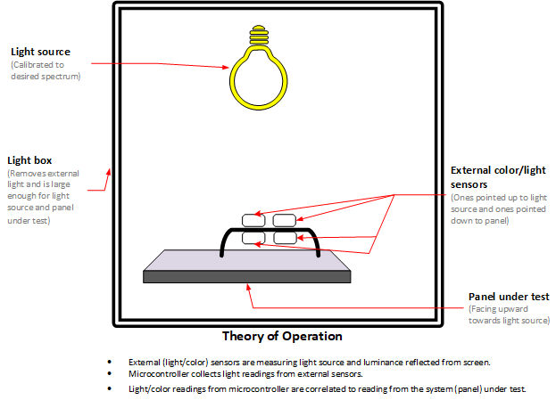
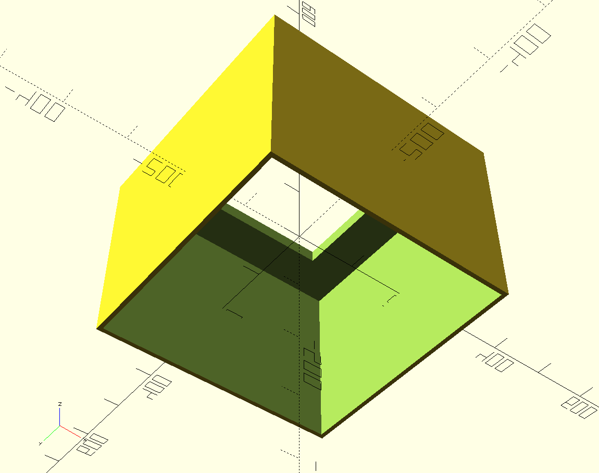
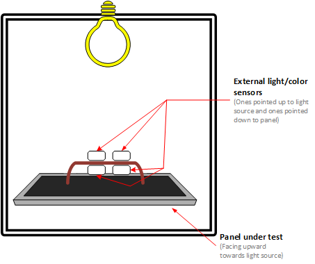
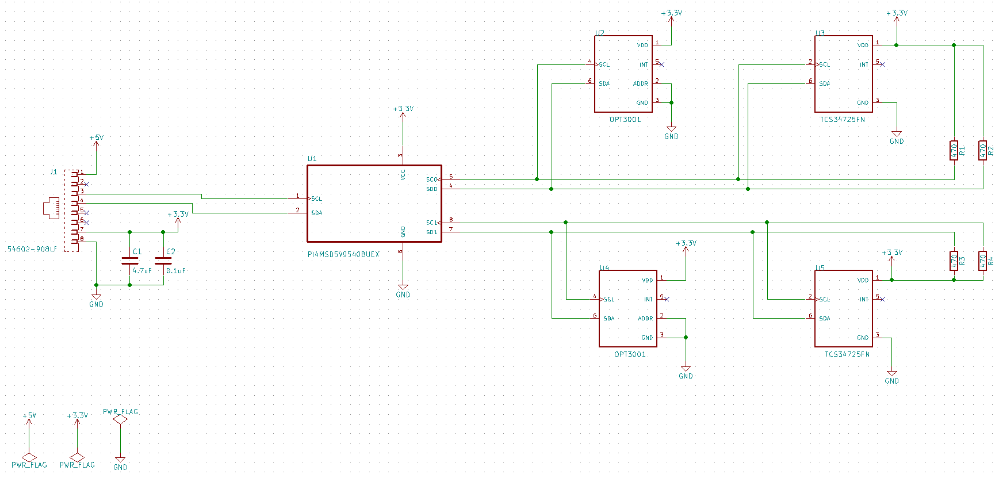
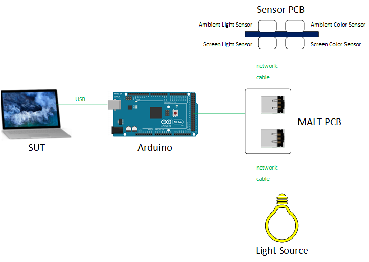

---

title: Building a Light and Color Testing Tool (MALT)
author: windows-driver-content
description: This topic provides instructions on how to use the MALT (Microsoft Ambient Light Tool) as a light and color testing solution.
ms.assetid: d045b771-b536-457c-897b-ecb6517bf0a8

ms.date: 12/13/2018
ms.localizationpriority: medium
---

# Building a Light and Color Testing Tool (MALT)

This topic provides instructions and requirements on how to use (and build if neccessary) a tool for testing and calibrating screen brightness and color. The MALT (**M**icrosoft **A**mbient **L**ight **T**ool) is provided for reference. 

Please use these instructions for leveraging ideas and concepts into your testing solution. The microcontroller API is published for you to further leverage tests published in the HLK and elsewhere. Your feedback will help improve this guide.

## Prerequsites

This guide assumes that you have basic knowledge in electronics, programming, and soldering.

## Components

You will need the following components.

* [Microcontroller](https://store.arduino.cc/mega-2560-r3)
* [Calibrated light source of sufficient range / spectrum](https://www.superbrightleds.com/moreinfo/led-panel-light/square-12v-led-panel-light-fixture-1ft-x-1ft-35w/2184/)
* [Power supply for light source](https://www.superbrightleds.com/moreinfo/led-panel-light/square-12v-led-panel-light-fixture-1ft-x-1ft-35w/2184/#tab/PowerSupplies/subtab/powersupply)
* [Digital to analog converter (DAC)](https://www.microchip.com/wwwproducts/en/MCP4821)
* 2 [Ambient light sensors (ex TI OPT3001 or better)](https://www.ti.com/product/OPT3001)
* 2 [Color sensors](https://www.digikey.com/product-detail/en/ams/AS73211-AQFT/AS73211-AQFT-ND/7802175)
* [Light enclosure](#step-1---assemble-light-enclosure)

## Instructions

### Step 1 - Assemble light enclosure

Controlling light exposed to the system under test (SUT) is key to accurate testing. The enclosure needs to be matched to the light panel being used and the SUT. This will consist of a box with an aperture on top for the controllable light source and room for the SUT underneath.

The enclosure we used for laptops was 16"x16"x12", with a 10"x10" aperture at the top of the enclosure.  The [model](https://github.com/Microsoft/busiotools/tree/master/sensors/Tools/MALT/Schematics/enclosure) can be 3D printed.

#### Light enclosure tips

An effective light enclosure will provide a sterile light environment where light cast on the panel (or device) under test will be from the controlled light source and not environmental. The following are examples of light boxes.

* [Custom 3D printed case](https://github.com/Microsoft/busiotools/tree/master/sensors/Tools/MALT/Schematics/enclosure)
* [Storage Tote](https://www.sterilite.com/SelectProduct.html?id=955&ProductCategory=182&section=1)
* Cardboard box

The enclosure needs to be large enough for the SUT and remove it from external light influence The light fixture can be placed on top or mounted inside the enclosure.

If the light fixture is mounted outside the box (on top), ensure the aperture will accommodate the fixture and provide sufficient light to the light sensors in the SUT.

#### Assembly tips

* If glue or tape is needed for box assembly, we recommend using glue or [matte black gaffer tape](https://en.wikipedia.org/wiki/Gaffer_tape).
* Check that the enclosure is flush with the work surface the enclosure is placed on. There should be no external light leakage.
* Use the sensors from the MALT (and no SUT in the light enclosure) to determine if there is external environmental light leakage into the enclosure.
* If the light source requires an aperture, use an appropriately sized hole so that your light can rest on top of the box without falling through or leaking light.

### Step 2 - Assemble sensors

The MALT uses two light sensors (one to measure the screen brightness and one to measure the ambient brightness), and two color sensors (one to measure the screen color and one to measure the ambient color). To achieve these simultaneously, wire them such that one light sensor and one color sensor are facing away from the other two sensors. When the screen sensors are facing downwards (sitting on the screen), the other sensors are facing upwards to measure the ambient light.

Connect the LED light panel to the power supply and connect it to the DAC. The microcontroller must be able to control the voltage sent to the light panel in order to control its intensity, which is achieved using the DAC. The schematic below shows how connections were made for the tool we use. More details can be found in the Sensor PCB KiCad project.

### Step 3 - Connect the microcontroller

Connect the sensors to the microcontroller and the microcontroller to the PC. For our purposes, we have the PC controlling the tests be the same as the system under test (SUT).

The following diagram shows how various parts of MALT are connected.

Through the MALT PCB, we are able to connect the Arduino board to the sensor PCB and the light source. More details can be found in the MALT PCB KiCad project.

### Step 4- Start testing

Refer to [Testing System Brightness Response](testing-MALT-system-brightness-response.md) for details on setting up and using the MALT you just assembled.

#### Test scenarios to cover

* [Testing Auto Brightness](testing-MALT-auto-brightness.md)

* [Testing Manual Brightness](testing-MALT-manual-brightness.md)

* [Testing System Scenarios](testing-MALT-system-scenarios.md)

Refer to the  
[microcontroller commands](testing-MALT-microcontroller-commands.md) api for using the MALT for creating custom tests.
