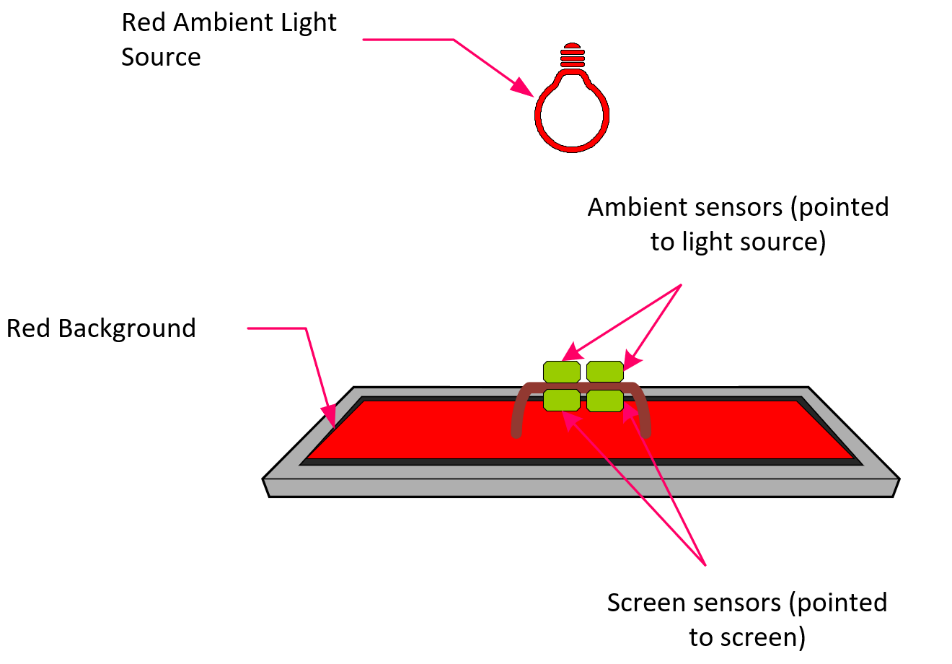
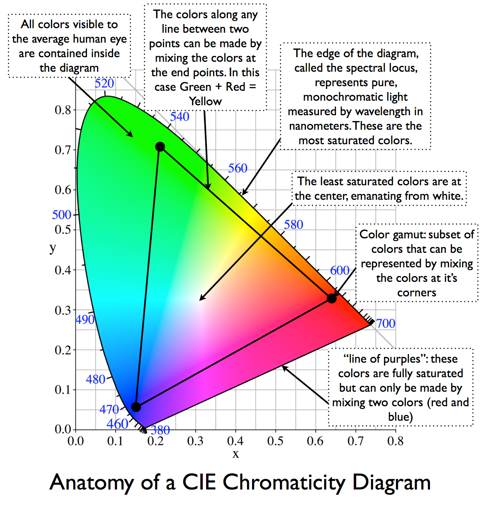

# Calibrating a Light Testing Tool (MALT)

It is typical for color sensors to require calibration. Calibration is a process of aligning what values your sensor is reading to what is being observed in the environment. This document will walk you through the matrix math needed to calibrate the MALT using known values from a color meter/display reader to create the appropriate calibration matrix. Calibration for the MALT must be done for the ambient color sensor AND the screen color sensor.

## Step 1: Acquire Known Values

Known color values are the key to any calibration process and come from a sensor that has already been calibrated and has correct values. Having known values for the three main color points of the triangle in Figure 1, at the end of this document, allows us to create a matrix that we want our raw values to conform to.

There are several possible ways to calibrate your device. In this document we will gather these values by using a hand-held externally calibrated device like the [i1Display Pro](https://www.xrite.com/categories/calibration-profiling/i1display-pro) to capture XYZ values and three colored light sources representing red, green, and blue. Any device with verifiably correct values (such as an existing calibrated PC) can be used to find these numbers. These XYZ values should be around the 0-100 range to be the most effective. Do this for a red display, a blue display, and a green display. 



Put the observed values into a 3x3 matrix as shown below. Next, the raw values must be gathered by pointing the MALT at the same display colors you gathered your known values.


## Step 2: Acquire Raw Values using MALTUtil.exe

Raw or uncalibrated values are the values that come out of the currently uncalibrated MALT color sensor before any math or calibration is applied. 

Gather these values by pointing the MALT at the same display colors you gathered your known values. This step is important and makes the equation reliable. Read the uncalibrated values by sending the command ```/readRawAmbient``` or ```/readRawScreen``` to MALTUtil.exe. Do this for a red display, a blue display, and a green display. The XYZ values should be around the 0-1 range to be the most effective. If the numbers are not in this range, press the reset button on the Arduino and try again. Put these values into a 3x3 matrix as shown below.


## Step 3: Transform the Matrices

Use the below equation and the matrices you just built to generate the calibration matrix K. S is the 3x3 matrix of known values, R is the 3x3 matrix of raw uncalibrated values, and R<sup>T</sup> is the transpose of the matrix R.


[CLICK HERE FOR EXCEL SPREADSHEET](images/CalibrationWorkbook.xlsx)

K is a 3x3 matrix such that: 


This allows us to use K as a static matrix programmed into the firmware through which we run all raw color data before outputting it to the serial out.

## Step 4: Using MALTUtil.exe

Once you have generated and verified your calibration matrix, you should add it to the firmware for the MALT color sensors to be considered calibrated. Using the MALTUtil.exe you can pass all nine values from the matrix K into memory so that MALT can run its raw numbers through your calibrated matrix.

MALTutil.exe has two calibration modes: ```/calibrateScreen``` and ```/calibrateAmbient```. Pick the sensor you would like to calibrate (either screen or ambient) and ensure you type the correct one into the command window.

The command is followed by 9 space separated floating point numbers. These numbers come from the calibration matrix K and should be inputted in this order: X1, X2, X3, Y1, Y2, Y3, Z1, Z2, Z3.

For example, if  and you wanted to calibrate the ambient sensor, you would use this command:
```cmd
MALTUtil.exe /calibrateAmbient 23.516 -74.312 402.104 3.716 102.003 95.664 182.669 3.844 40.892
```

The above Excel worksheet will output this command for you after you enter your known and raw information. 



