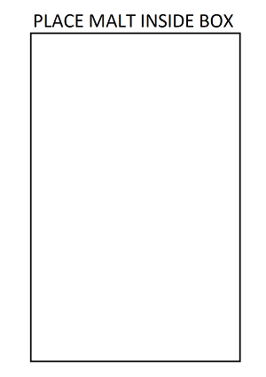

# Testing Display Whitepoint

This topic provides instructions on how to test display whitepoint by using the MALT (Microsoft Ambient Light Tool) tool.

## Test requirements

1. **Fully-assembled MALT.** The ["how to" guide](testing-MALT-building-a-light-testing-tool.md) provides instructions on how to build a MALT or make an existing test apparatus MALT compatible.

2. **Fully Calibrated MALT.** The ["Getting Started" page](testing-MALT-getting-started.md) provides instructions on hardware setup and calibration for the MALT.

2. **Windows device equipped with an ambient light sensor.** The MALT (or compatible) is designed to test screen brightness. The system under test (SUT) must have adjustable brightness. [SensorExplorer](testing-sensor-explorer.md) can be used to determine sensors recognized by Windows.

3. **Windows device equipped with the Adaptive Color feature.** The MALT (or compatible) is designed to test screen color. The system under test (SUT) must have adjustable color.

## Setup Instructions

1. **Plug the MALT into a USB port on the SUT.**

2. **Install SensorExplorer on SUT.** See [Testing with SensorExplorer](testing-sensor-explorer.md)

    > [!Note]
    > If you would like to do manual brightness testing, download MALTUtil from [GitHub](https://github.com/Microsoft/busiotools/tree/master/sensors/Tools/MALT). Tools can also be found in the HLK.

3. **Configure background color and sleep for SUT.**  The configuration script [MALT_SUT_Setup.bat](https://github.com/Microsoft/busiotools/tree/master/sensors/Tools/MALT/Code/Scripts) will properly setup your device for testing.  From an elevated command prompt run `MALT_SUT_Setup.bat` and follow the script instructions.

## MALT sensor placement

The following is a list of tips on MALT sensor placement.

- Place the MALT's screen sensors onto the SUT's screen, facing it.
- The MALT ambient sensors must face towards the light source and away from the SUT's screen.
- Do not block the SUT's ALS sensor.  The onboard sensor must not be occluded by the MALT or any other obstruction.
- Place the light enclosure over the SUT such that the light aperture is facing upwards. For best results, the screen should be parallel to the light aperture and facing the light aperture.
- No light should be leaking into or out of the bottom of the enclosure.  Double check to make sure the sensors are still in place.
- Mount the light source either inside or on top of the light enclosure.  If the light source is mounted on top of the light enclosure, the panel should be placed on top of the box on the aperture such that the light will shine down into the enclosure.
- No light should be leaking out from the top of the box. You should not be able to see inside the box at all.

Refer to [this white paper](/windows-hardware/design/whitepapers/integrating-ambient-light-sensors-with-computers-running-windows-10-creators-update) for Microsoft's full guidance on integrating light sensors and ambient light response curves.

## Running the Display Whitepoint Test

**Using the [SensorExplorer](testing-sensor-explorer.md) app (Recommended)**

1. Open SensorExplorer and click **MALT** on the left-hand side menu bar. Click the correct Vid/Pid in the "Select an Arduino Device pane" and then click "Connect to Device".

    

2. Click on the "Test Display Whitpoint" on the home tab of the MALT screen in SensorExplorer.

    

3. This test will output Ambient Whitepoint, Mapped Whitepoint, and Screen Whitepoint values to a csv file. Choose where to save this csv file.

4. Specify the wait time between ambient light changes. This is meant to give you time to change the lighting conditions for the SUT and MALT.

5. Specify the number of times you will change the lighting conditions.

6. Place the MALT on the screen of the SUT when and where directed.

    

7. After the test completes, the output will be saved automatically to `Whitepoint.csv`.

## Open the results in Microsoft Excel

1. Open `Whitepoint.csv` in Microsoft Excel. This guide assumes you are using Microsoft Excel. If you are using something, you may need to adjust these steps.
2. Click **File** > **Export** > **Change file type**. Change the file type to .xlsx and click Save As. This will allow you to create and save visualizations of your data.
3. In your document, you will see six columns:

| Ambient Whitepoint X | Ambient Whitepoint Y  | Mapped Whitepoint X | Mapped Whitepoint Y | Screen Whitepoint X | Screen Whitepoint Y |
|-----|----|----|----|----|----|
| The x chromaticity of the whitepoint value read by the MALT's sensor for the environmental lighting condition | The y chromaticity of the whitepoint value read by the MALT's sensor for the environmental lighting condition | The x chromaticity or the whitepoint value set by Windows, this value may be clamped to a certain range | The y chromaticity or the whitepoint value set by Windows, this value may be clamped to a certain range |  The x chromaticity of the whitepoint value read by the MALT's sensor for the screen whitepoint, ideally this should be the same as the mapped whitepoint | The y chromaticity of the whitepoint value read by the MALT's sensor for the screen whitepoint, ideally this should be the same as the mapped whitepoint |

4. The number of rows in your document will correspond to the number of times you told the test you would be changing the lighting conditions.

### Visualize the results

These steps may vary if you are using a program other than Microsoft Excel.

1. In your Microsoft Excel .xlsx file, select the two columns with data: "Ambient Whitepoint X" and "Ambient Whitepoint Y".
2. Click **Insert** > **Insert Scatter (X, Y) or Bubble Chart** > **Scatter with straight lines and markers**

3. Repeat step 1 and step 2 with each X and Y set. You should end up with three graphs in your document.

4. Combine three graphs into one graph by copying and pasting the graph itself into one of the other graphs. To do this, select one graph to past all of the data into. We will call this the **Main Graph**. Select a secondary graph by clicking on it, press **CTRL+C**, select the Main Graph and press **CTRL+V**. Delete the secondary graphs as they are no longer needed. (Do not delete the data in the columns.) Your final product should appear similar to below.

## Interpret the results

You must manually inspect the results yourself or with your engineering team in charge of the auto brightness curve. Here are some things to consider:

1. Does the screen result measured by the MALT match the mapped output of the Adaptive Color Algorithm?
