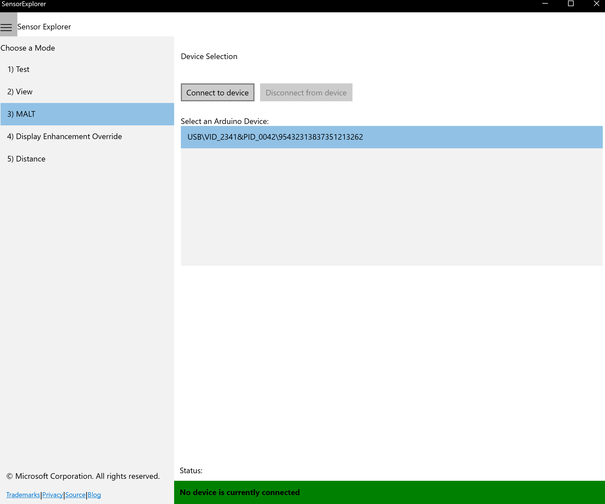
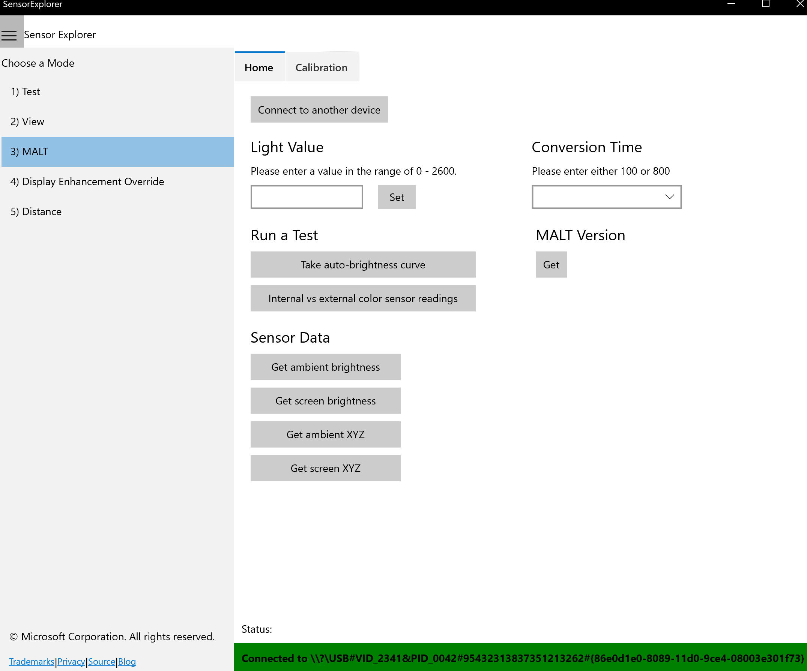

# Getting Started with MALT

This topic defines how to upload firmware to the MALT as well as how to calibrate the sensors using Sensor Explorer. We recommended that the PC controlling the microcontroller is also the system or device under test (SUT/DUT).  

## Setting up the Hardware


1. Connect an **Arduino Mega** to your device using a [USB 2.0 cable Type A/B](https://store.arduino.cc/usa/usb-2-0-cable-type-a-b).

2. Connect the MALT Controller Board to the back pin of the Arduino Mega using the rainboe ribbon cable.

3. Connect the MALT Controller Board to the MALT Sensor Board using a CAT5(x) or CAT6(x) cable. (Ex. CAT5, CAT5e, CAT6, etc.)

4. Press the reset button on the Arduino Mega.

## Acquiring the Necessary Files

1. Create a folder named `MALT` on your computer's C drive. The filepath should be `C:\MALT`. We will place all of the necessary files and cloned repositories here.

2. Clone the [busiotools repository](https://github.com/microsoft/busiotools) to your `MALT` folder. The filepath should be `C:\MALT\busiotools`.

3. Clone the [SerialCommand](https://github.com/kroimon/Arduino-SerialCommand) and [SoftI2CMaster](https://github.com/sastorer/SoftI2CMaster) repositories to your `MALT` folder. The filepaths should be `C:\MALT\Arduino-SerialCommand` and `C:\MALT\SoftI2CMaster` respectively.


## Updating the MALT Firmware

The MALT is run by an Arduino which requres firmware to set up and interact with the sensors on the MALT board.

1. Acquire and setup the Arduino command line interface.
    1. Download the latest version of the [arduino-cli](https://arduino.github.io/arduino-cli/latest/installation/#download) and save it to your computer.
    2. If not done already, add the arduino-cli to your [PATH variable](https://docs.microsoft.com/windows-server/administration/windows-commands/path).
    3. Run the following from a command prompt:

        ```console
        arduino-cli config init
        arduino-cli core update-index
        arduino-cli core install arduino:avr
        ```

2. Add necessary libraries from the Arduino library manager by running the following from a command prompt:

    ```console
    arduino-cli lib install MatrixMath
    arduino-cli lib install AsyncDelay
    ```

3. Identify the COM port assigned to the Arduino by running the following from a command prompt:

    ```console
    arduino-cli board list
    ```

4. Upload the firmware to the Arduino by running the following from a command prompt, and replacing the X in COMX to the COM port number identified in the previous step:

    ```console
    arduino-cli compile --fqbn arduino:avr:mega --port COMX --upload --library C:\MALT\Arduino-SerialCommand --library C:\MALT\SoftI2CMaster C:\MALT\busiotools\sensors\tools\MALT\Code\malt
    ```
    The expected output is below:
    
    

## Calibrating the MALT Color Sensors

The MALT's color sensors do not come factory calibrated for real world colors. Below is the process for calibration to ensure you get an accurate reading. **Calibration for the MALT must be done for the ambient color sensor AND the screen color sensor.** This process only needs to be done once per sensor board ad the memory chips on the PCB will save the setting. To refresh the setting press the reset button on the arduino.

1. Plug the MALT into a USB port on the SUT.

2. Open [SensorExplorer](testing-sensor-explorer.md) and navigate to the MALT tab on the left (#3). Click the correct Vid/Pid in the "Select an Arduino Device pane" and then click "Connect to Device".

    

3. Navigate to the Calibration tab by clicking "Calibration" at the top of the window.

    

4. Known color values are the key to any calibration process and come from a sensor that has already been calibrated and has correct values. Here, we will gather these values by using a hand-held externally calibrated device like the i1Display Pro to capture XYZ values and three colored light sources representing red, green, and blue (use the colored boxes below if desired). Any device with verifiably correct values (such as an existing calibrated PC) can be used to find these numbers. These XYZ values should be around the 0-100 range to be the most effective. Do this for a red display, a blue display, and a green display.

          

    Put the observed values into the "Known Values" 3x3 matrix using the pattern below:
    
    ```console
    ┌                                                            ┐
    │Known RED X Value | Known BLUE X Value | Known GREEN X Value│
    │Known RED Y Value | Known BLUE Y Value | Known GREEN Y Value│
    |Known RED Z Value | Known BLUE Z Value | Known GREEN Z Value│
    └                                                            ┘
    ```
    

5. Raw or uncalibrated values are the values that come out of the currently uncalibrated MALT color sensor before any math or calibration is applied. Gather these values by pointing the MALT at the same display colors you gathered your known values from. This step is important and makes the equation reliable. Decide whether you are calibrating the screen facing sensor or the ambient facing sensor. This decision will determine which UI button to press when collecting the data.

    Point the desired sensor at the below color blocks in order and select *either* "Read Screen" *or* "Read Ambient" (determined by the sensor you are calibrating) for each color. This will fill in the "Raw Uncalibrated Values" 3x3 matrix and should look similarly to what is pictured below.

          

    

6. Once the Known Values and Raw Uncalibrated Values martices are populated, click the "Calculate" button at the bottom of the screen. The "Calibrated Values" 3x3 matrix should populate similarly to what is pictured below.

    

    Once these numbers have been generated, click *either* "Calibrate Top" *or* "Calibrate Bottom" (determined by the sensor you are calibrating)


## Testing the MALT Calibration

Once you have correctly calibrated **BOTH the screen color sensor AND the ambient color sensor**, return to the home page of the MALT section by clicking "Home" at the top of the window.


On the Home tab, you should be able to click any button under the "Sensor Data" heading and get non-negative numbers back.