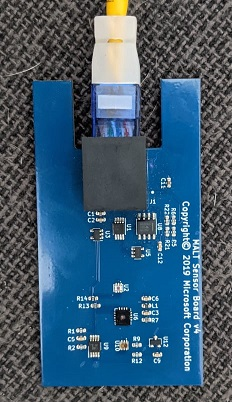
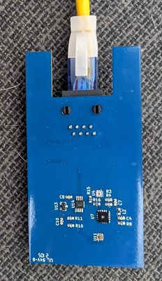
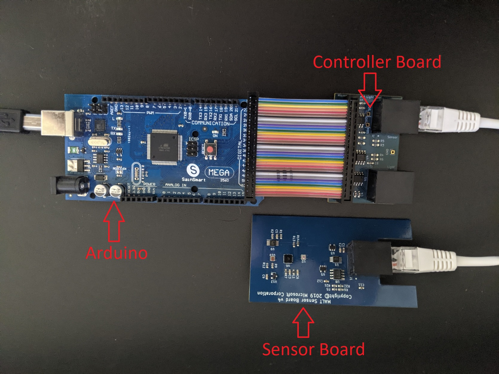

# Getting started with MALT

This topic defines how to upload firmware to the MALT as well as how to calibrate the sensors using SensorExplorer. We recommended that the PC controlling the microcontroller is also the system or device under test (SUT/DUT).

## Orienting the MALT

| Front of the MALT (AMBIENT FACING) | Back of the MALT (SCREEN FACING) |
|----|----|
|  |  |

## Setting up the hardware



1. Connect an **Arduino Mega** to your device using a [USB 2.0 cable Type A/B](https://store.arduino.cc/usa/usb-2-0-cable-type-a-b).

1. Connect the MALT Controller Board to the back pins of the Arduino Mega using the rainbow ribbon cable.

1. Connect the MALT Controller Board to the MALT Sensor Board using a CAT5(x) or CAT6(x) cable. (Ex. CAT5, CAT5e, CAT6, etc.)

    > [!NOTE]
    >  The ethernet cable used to connect the MALT Controller Board with the MALT Sensor Board must have all 8 wires and those wires must not cross.

1. Press the reset button on the Arduino Mega.

    

## Acquiring the necessary files

1. Create a folder named *MALT* on your computer's C drive. The filepath should be *C:\MALT*. We will place all of the necessary files and cloned repositories here.

1. Clone the [busiotools repository](https://github.com/microsoft/busiotools) to your *MALT* folder. The filepath should be *C:\MALT\busiotools*.

1. Clone the [SerialCommand](https://github.com/kroimon/Arduino-SerialCommand) and [SoftI2CMaster](https://github.com/sastorer/SoftI2CMaster) repositories to your *MALT* folder. The filepaths should be *C:\MALT\Arduino-SerialCommand* and *C:\MALT\SoftI2CMaster* respectively.

## Updating the MALT firmware

The MALT is run by an Arduino which requires firmware to set up and interact with the sensors on the MALT board.

1. Acquire and setup the Arduino command line interface.
    1. Download the latest version of the [arduino-cli](https://arduino.github.io/arduino-cli/latest/installation/#download) and save it to your computer.

    1. Add the arduino-cli to your [PATH variable](/windows-server/administration/windows-commands/path), if you haven't already.

        > [!NOTE]
        > Please ensure you close your command prompt and open a new command prompt after adding arduino-cli to your PATH variable!

    1. Run the following from an elevated command prompt:

        ```console
        arduino-cli config init
        arduino-cli core update-index
        arduino-cli core install arduino:avr
        ```

1. Add necessary libraries from the Arduino library manager by running the following from an elevated command prompt:

    ```console
    arduino-cli lib install MatrixMath
    arduino-cli lib install AsyncDelay
    ```

1. Identify the COM port assigned to the Arduino by running the following from an elevated command prompt:

    ```console
    arduino-cli board list
    ```

1. Upload the firmware to the Arduino by running the following from an elevated command prompt, and replacing the X in COMX to the COM port number identified in the previous step:

    ```console
    arduino-cli compile --fqbn arduino:avr:mega --port COMX --upload --library C:\MALT\Arduino-SerialCommand --library C:\MALT\SoftI2CMaster C:\MALT\busiotools\sensors\tools\MALT\Code\malt
    ```

    The expected output is below:

    :::image type="content" source="images/expectedoutput.png" alt-text="Screenshot of the expected output from the compilation and upload process.":::

## Calibrating the MALT color sensors

The MALT's color sensors do not come factory calibrated for real world colors. Below is the process for calibration to ensure you get an accurate reading. **Calibration for the MALT must be done for the ambient color sensor AND the screen color sensor.** This process only needs to be done once per sensor board and the memory chips on the PCB will save the setting. To refresh the setting press the reset button on the arduino.

1. Plug the MALT into a USB port on the SUT.

1. Open [SensorExplorer](testing-sensor-explorer.md) and navigate to the MALT tab on the left (#3). Select the correct Vid/Pid in the **Device Selection** pane" and then select **Connect to device**.

    :::image type="content" source="images/connectdevice.png" alt-text="Screenshot of SensorExplorer showing how to connect a serial device.":::

1. Select the **Calibration** tab at the top of the window.

    :::image type="content" source="images/calibrationtab.png" alt-text="Screenshot of SensorExplorer showing how to navigate to the calibration tab.":::

1. Known color values are the key to any calibration process and come from a sensor that has already been calibrated and has correct values. Gather these values by using a hand-held externally calibrated device like the i1Display Pro to capture XYZ values and three colored light sources representing red, green, and blue. You can use the colored boxes below to calibrate the hand-held device. Any device with verifiably correct values, such as an existing calibrated PC, can be used to find these numbers. These XYZ values should be around the 0-100 range to be the most effective. Do this for a red display, a blue display, and a green display.

          

    Put the observed values into the **Known Values** 3x3 matrix using the following pattern:

    ```console
    ┌                                                            ┐
    │Known RED X value | Known BLUE X value | Known GREEN X value│
    │Known RED Y value | Known BLUE Y value | Known GREEN Y value│
    |Known RED Z value | Known BLUE Z value | Known GREEN Z value│
    └                                                            ┘
    ```

    :::image type="content" source="images/KnownValues.png" alt-text="Screenshot of the known values 3x3 matrix.":::

1. Raw or uncalibrated values are the values that come out of the currently uncalibrated MALT color sensor before any math or calibration is applied. Gather these values by pointing the MALT at the same display colors you gathered your known values from. This step is important and makes the equation reliable. Decide whether you are calibrating the screen facing sensor or the ambient facing sensor. This decision will determine which UI button to press when collecting the data.

    Point the desired sensor at the color blocks below in order and select *either* **Read Screen** *or* **Read Ambient** for each color as determined by the sensor you are calibrating.

          

    This will fill in the Raw Uncalibrated Values 3x3 matrix and should look similar to the following picture.

    :::image type="content" source="images/RawValues.png" alt-text="Screenshot of a raw values matrix.":::

1. Once the Known Values and Raw Uncalibrated Values martices are populated, select the **Calculate** button at the bottom of the screen. The Calibrated Values 3x3 matrix should populate similar to the following screenshot.

    :::image type="content" source="images/CalibratedValues.png" alt-text="Screenshot of the Calibrated Values Matrix.":::

    Once these numbers have been generated, select *either* **Calibrate Top** *or* **Calibrate Bottom** as determined by the sensor you are calibrating.

## Testing the MALT calibration

Once you have correctly calibrated both the screen color sensor and the ambient color sensor, return to the home tab of the MALT section by selecting **Home** at the top of the window.

:::image type="content" source="images/calibrationtab.png" alt-text="Screenshot of SensorExplorer showing how to navigate to the home tab.":::

On the Home tab, you should be able to select any button under the **Sensor Data** heading and get non-negative numbers back.

## Troubleshooting

1. When calibrating, your raw values are the same whether you press **Read Screen RED**, **Read Screen GREEN**, or **Read Screen BLUE** (similarly true with **Read Ambient**).

    - Ensure the MALT sensor board is connected via an ethernet cable.

    - Next, check that the cable you're using can support Power Over Ethernet (POE). All CAT5 or better cables support this.

    - Finally, try pressing the reset button on the Arduino Mega if you are sure that your cable suppports POE.

1. When calibrating, your calibration matrix contains "NaN" in one of the squares after pressing the **Calculate** button.

    - Ensure that your raw values are giving different numbers for RED, GREEN, and BLUE.

    - Ensure that you are holding the MALT sensor over red when pressing **RED**, green when pressing **GREEN**, and blue when pressing **BLUE**.

    - If your raw values are still not differing, check #1 above.

1. Once calibration is done (i.e. you have selected calibrate top or calibrate bottom) your sensor reads unreasonable values on the home screen.

    - Ensure you actually did select the **Calibrate Top** or **Calibrate Bottom** buttons.

    - If you are sure you appropriately calibrated the top and the bottom sensors given the above instructions, email sensortools@microsoft.com.

If this troubleshooting section doesn't address your issues, please email sensortools@microsoft.com.
