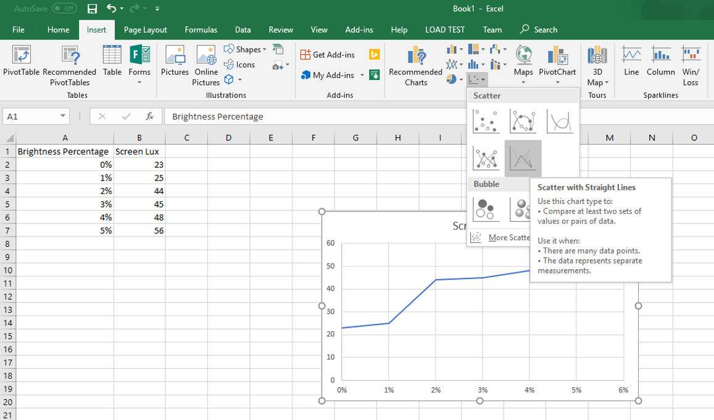

# Testing Manual Brightness

This topic describes how to test manual brightness by using the MALT (Microsoft Ambient Light Tool) tool. Manual brightness refers to screen brightness set *manually* by the user.

## Set up

Read through the topic [Building a Light Testing Tool (MALT)](testing-MALT-building-a-light-testing-tool.md) to ensure that you have met the requirements for the tests.

### Configuring the SUT manually

We highly recommended you use [MALT_SUT_Setup.bat](https://github.com/Microsoft/busiotools/tree/master/sensors/Tools/MALT/Code/Scripts) to setup MALT and the system under test (SUT). The following instructions for manual setup of MALT and SUT are provided for transparency and legacy purposes only.

1. If you are using a machine with an ambient light sensor, you need to turn off adaptive brightness in order to test manual brightness. To find out if your PC supports this, in **Display settings**, under **Brightness and color**, look for the **"Change brightness automatically when lighting changes"** check box, and then uncheck it to turn off this feature. If the check box is not present, then no further action is required.
2. Make sure the screen will not turn off during the test. To adjust sleep settings in Windows 10, go to **Start** and select **Settings**  > **System** > **Power & sleep**. Under **Screen**, change **On battery power, turn off after** to **Never** and **When plugged in, turn off after** to **Never**.
3. Make sure your device will not go to sleep during the test. To adjust sleep settings in Windows 10, go to **Start** and select **Settings**  > **System** > **Power & sleep**. Under **Sleep**, change **On battery power, PC goes to sleep after** to **Never** and **When plugged in, PC goes to sleep after** to **Never**.
4. To reduce test variability, set the screen background of the SUT to solid white before testing. Select **Settings > Personalization > Background**, and then change the Background dropdown to **"Solid color"**. Click **Custom color > More** and change the color hex value to `FFFFFF`. This will change your desktop background to solid white.
5. Make sure the volume is turned up on the SUT. The application will play a sound when long-running tests complete to notify you that it has completed.

## Manual brightness test procedures

### Test rig placement

1. Place the MALT screen light sensor on the screen in a solid white area. You may need to place the PC sideways or otherwise affix the MALT screen light sensor to the screen.

> [!NOTE] 
> The light enclosure, light panel, and MALT ambient light sensor are not required for this test.

### Get manual light curve

**Using MALTUtil.exe**

1. On the SUT, run `MALTUtil.exe /manualLux 30` in cmd. 30 refers to a 30 second wait before the test starts. This is meant to give you time to place the sensor on the system. If you need longer (or shorter) than 30 seconds to move anything in your setup around before the test begins, adjust the number accordingly.
2. Wait. This will take approximately 2 minutes. The test is adjusting the screen brightness on the SUT from 0 to 100% and reading the screen brightness.
3. After the test completes, the output will be saved automatically to `manualBrightness.csv` and a sound will be played to notify you that the test has completed.

### Open the results in Microsoft Excel

1. Open `manualBrightness.csv` in Microsoft Excel. This guide assumes you are using Microsoft Excel 2016. If you are using a different version, you may need to adjust these steps. 
2. Click **File** > **Export** > **Change file type**. Change the file type to .xlsx. This will allow you to create and save visualizations of your data.
3. In your document, you will see two columns: 

| Brightness Percentage | Screen Lux       |
|----|-----|
| 0%  | screen lux value measured by the MALT screen light sensor |
| 100%  | screen lux value measured by the MALT screen light sensor |

### Visualize the results

These steps may vary if you are using a program other than Microsoft Excel 2016.

1. In your Microsoft Excel .xlsx file, Select the two columns with data: "Brightness Percentage" and "Screen Lux".
2. Click **Insert** > **Insert Scatter (X, Y) or Bubble Chart** > **Scatter with straight lines** 

Now you have a visual representation of the manual brightness response curve measured by the MALT.

### Interpret the results

You must manually inspect the results yourself or with your engineering team in charge of the manual brightness curve. Here are some things to consider: 

1. Does the result measured by the MALT match the expected definition of the manual brightness curve in the BIOS?
2. Are there enough steps in the manual brightness curve? A curve with few points will be noticeable to a user as they adjust the brightness.
3. Are the steps at the lower end of the curve smaller than at the higher end of the curve? Brightness changes are more perceptible at lower brightness. Consider adding more frequent curve points with smaller steps at lower brightness percentages.

Refer to [this white paper](/windows-hardware/design/whitepapers/integrating-ambient-light-sensors-with-computers-running-windows-10-creators-update) for Microsoft's full guidance on integrating light sensors and ambient light response curves.
