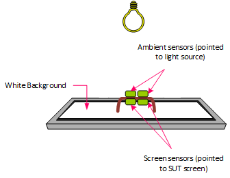

# Testing System Brightness Response

This topic provides instructions on how to test system brightness response by using the MALT (Microsoft Ambient Light Tool) tool.

## Test requirements

1. **Fully-assembled MALT.**   The ["how to" guide](testing-MALT-building-a-light-testing-tool.md) provides instructions on how to build a MALT or make an existing test apparatus MALT compatible.

2. **Windows device equipped with an ambient light sensor.** The MALT (or compatible) is designed to test screen brightness. The system under test (SUT) must have adjustable brightness. [SensorExplorer](testing-sensor-explorer.md) can be used to determine sensors recognized by Windows.

## SensorExplorer

Use [SensorExplorer](testing-sensor-explorer.md) to confirm the presence of an ambient light sensor.

1. **Plug the MALT into a USB port on the SUT and upload the Arduino program to the microcontroller.** The Arduino program for MALT can be found on [GitHub](https://github.com/Microsoft/busiotools/tree/master/sensors/Tools/MALT) (also in the HLK). Upload it to the microcontroller. You may open **Arduino** > **Tools** > **Serial Monitor**, and verify that the [microcontroller commands](testing-MALT-auto-brightness.md) work as expected. Then, close the Serial Monitor so that it does not keep the COM port busy.

2. **Install SensorExplorer on SUT.** See [Testing with SensorExplorer](testing-sensor-explorer.md)

    > [!Note]
    > If you would like to do manual brightness testing, download MALTUtil from [GitHub](https://github.com/Microsoft/busiotools/tree/master/sensors/Tools/MALT). Tools can also be found in the HLK.

3. **Configure background color and sleep for SUT.**  The configuration script [MALT_SUT_Setup.bat](https://github.com/Microsoft/busiotools/tree/master/sensors/Tools/MALT/Code/Scripts) will properly setup your device for testing.  From an elevated command prompt run ``MALT_SUT_Setup.bat`` and follow the script instructions.

## Test areas to consider

The following is a list of other test areas to consider.

- Functional
  - [Testing Auto Brightness](testing-MALT-auto-brightness.md)
  - [Testing Manual Brightness](testing-MALT-manual-brightness.md)

- Stress
  - [Testing System Scenarios](testing-MALT-system-scenarios.md)

## MALT sensor placement

The following is a list of tips on MALT sensor placement.

- Place the MALT's screen sensors onto the SUT's screen, facing it.
- The MALT ambient sensors must face towards the light source and away from the SUT's screen.
- Do not block the SUT's ALS sensor.  The onboard sensor must not be occluded by the MALT or any other obstruction.
- Place the light enclosure over the SUT such that the light aperture is facing upwards. For best results, the screen should be parallel to the light aperture and facing the light aperture.
- No light should be leaking into or out of the bottom of the enclosure.  Double check to make sure the sensors are still in place.
- Mount the light source either inside or on top of the light enclosure.  If the light source is mounted on top of the light enclosure, the panel should be placed on top of the box on the aperture such that the light will shine down into the enclosure.
- No light should be leaking out from the top of the box. You should not be able to see inside the box at all.

Refer to [this white paper](/windows-hardware/design/whitepapers/integrating-ambient-light-sensors-with-computers-running-windows-10-creators-update) for Microsoft's full guidance on integrating light sensors and ambient light response curves.
