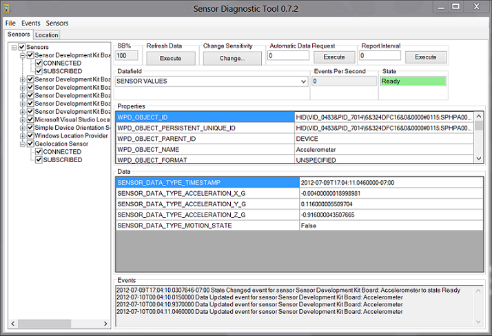

# Testing Sensor Events

The Sensor Diagnostic Tool lets you test support for events in your driver and firmware.
 

## Configuring the Sensor Diagnostic Tool to Capture Event Data

The following procedure describes how to configure the diagnostic tool to capture events for an accelerometer.

1.  Expand the node for the accelerometer in the left Sensors pane and make sure both the **CONNECTED** and **SUBSCRIBED** boxes are checked.
2.  In the **Events** menu, verify that **Show Events** is checked.
3.  Select the Accelerometer node in the left pane.
4.  Rotate the device and view the event data in the right pane.

The following illustration shows the tool after it begins capturing accelerometer events.

## Logging Event Data to an XML File

There are instances where you'll want to log your device's event data to a file rather than the tool's data pane. If this is necessary, follow these steps.

1.  Configure the Sensor Diagnostic Tool to capture event data (See the first section in this topic.)
2.  In the **Events** menu, choose the **Log Events** menu option.
3.  In the dialog that appears, specify the name of the log file and its location.
4.  Begin testing your device. For example, if it's an accelerometer, begin rotating, or moving, the sensor.

Your data will be logged to the file that you specified in step 3. XML logging is only supported for events, while CSV logging is enabled for both events and data retrieval.

## Logging Event Data to a CSV File

In addition to logging sensor data as XML, you can also log it in CSV files. If this is necessary, follow these steps. 

> [!NOTE]
> You may need to run the program as an administrator for this to work properly.

1.  Configure the Sensor Diagnostic Tool to capture event data (See the first section in this topic.)
2.  In the **Sensors** menu, choose the **Enable CSV Logging** menu option.
3.  Begin testing your device. For example, if it's an accelerometer, begin rotating, or moving, the sensor.
4.  Once your tests are complete, uncheck the **Enable CSV Logging** menu option. This will stop logging and save your data to the output file. The files are placed into the same directory as the executable.

Your data will be logged to one or more CSV files. The tool creates a file for each connected sensor if a collection exists. CSV logging is supported for both events and data retrieval, while XML logging is only supported for events.

## Related topics
[Testing Sensor Functionality](testing-sensor-functionality.md)  
[Testing Sensor Data Retrieval](testing-sensor-properties.md)  
[Testing Sensor Property Support](testing-and-logging-sensor-data.md)  

