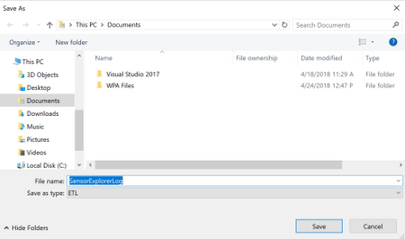

# SensorExplorer Overview

SensorExplorer is an app available on the [Microsoft Store](https://www.microsoft.com/p/sensorexplorer/9pgl3xpq1tpx?activetab=pivot:overviewtab) and the app package can be accessed through [GitHub](https://github.com/microsoft/busiotools/tree/master/sensors/Tools/SensorExplorer). SensorExplorer offers tests to quickly verify the installation of supported sensors such as orientation sensors (accelerometer, simple orientation sensors, etc.) and provide detailed tables and plots that enable monitoring different sensors. SensorExplorer also provides logging that can be reviewed for debugging.

There are three modes available via the menu bar on the left-hand side in SensorExplorer:

- **Test:** Used for manual testing of supported sensors. The orientation test verifies orientation sensors are installed in the correct position and the sensor data is as expected. Other tests such as frequency, offset and jitter, are also available. The sensor data is read using the [UWP Sensors API](/uwp/api/Windows.Devices.Sensors).

- **View:** Used for viewing sensor data and properties. In this mode the app displays a data visualization from a variety of sensors such as accelerometer, compass, gyrometer, inclinometer, light sensor, and orientation sensor and shows detailed sensor information in tabular format. This provides monitoring of any abnormal behaviors of the sensors, and can also be used to set the report interval of sensors.

- **MALT:** Used for connecting to and controlling a [MALT (Microsoft Ambient Light Tool)](./testing-malt-building-a-light-testing-tool.md), a simple low-cost light testing apparatus. The tool combines a microcontroller, light sensors, and a controllable light panel to calibrate light sensors and visually measure a panel's light curve.

## How to test your sensors with SensorExplorer

Tests available for each sensor can be explored by scrolling the top menu bar, highlighted in the screen shot below as a red box.

### SensorExplorer orientation test

This test asks you to orient the device in different directions and then checks the sensor reading accordingly. A pass/fail result will be displayed at the end of the test.

#### Before beginning orientation tests

Under the test mode, if the display rotates when the device is rotated then turn off auto-rotation on the device (Search “Rotation Lock” in Settings and turn it on). Otherwise, auto-rotation does not need to be turned off. For more information on orientation and reference frame, refer to the [Device Reference Frame section](/windows-hardware/design/whitepapers/integrating-motion-and-orientation-sensors).

#### Starting the tests

Click the "Start" button to begin the tests. For each test you have 10 seconds to orient the device so that the arrow on the screen is pointing down toward the ground.

Note:

- You may click the icon (highlighted in the screen shot below as a red box) to hide the menu bar during the test.

- The menu bar is disabled during the test and will be enabled once the test finishes.

- For the Simple Orientation Sensor the four directions tested are face up, face down, left, and right. For all other sensors, the four directions tested are up, down, left and right.

Once the sensor data reflects that your device is indeed in the desired orientation, a green checkmark will be displayed. And you will automatically move on to the next test.

Otherwise, after 10 sec, a red x will be displayed as this round of tests has failed.

#### After the tests

Click the "Save Log" button to save the log file(data for all rounds of tests will be saved), or click the “Restart” button to start another test.

### Frequency Test

Calculates the number of sensor readings received/60 seconds. A numeric value will be displayed at the end of the test.

### Offset Test

Calculates the average error in sensor readings compared with the expected value. A numeric value will be displayed at the end of the test.

### Jitter Test

Calculates the maximum difference in sensor readings during a period of time, compared with the initial reading. A numeric value will be displayed at the end of the test.

## How to monitor your sensors

The **View** mode automatically detects any sensors that are attached to or embedded in the platform and displays the information read from the sensors. Scroll the top menu bar (highlighted in the screen shot below as a red box) to change the sensor being displayed. For each sensor the current data and properties are shown in a table and plotted as moving waveforms. The report interval of a specific sensor can be changed here.

## Additional information on logging

The “Save Log” button will prompt for the name and location of the ETL (Event Trace Log) file, with the default name “SensorExplorerLog”. To view the ETL file use the [tracerpt command](/windows-server/administration/windows-commands/tracerpt_1).

The following will be logged:

- Properties of the selected sensor
- Information about each test
- For orientation test:
  - The sensor reading when you pass a test
  - The last sensor reading before the countdown ends, in the case you fail the test
- For other tests:
  - All sensor readings collected during the test
  - The final result