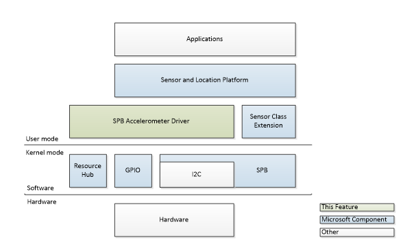

# The driver I/O model

The sample driver and the accelerometer communicate over the simple peripheral bus, the system GPIO pins, and the resource hub.

The following illustration depicts the organization of the components running in: user mode, kernel mode, and the actual hardware.

## Simple peripheral bus (SPB)

Windows 8.1 supports an SPB component in the form of a class extension that simplifies the development and implementation for SPB controller drivers. In general, the component offers the following:

-   Handles all communication with the Resource Hub including registration and setting retrieval.
-   Implements tiered queue structure to manage simultaneous targets and bus-locking requests
-   Translates buffers from user-mode to kernel-mode

## General-purpose input/output (GPIO)

Windows 8.1 supports a GPIO class extension that resides at the same level as the kernel-mode SPB component. The GPIO class extension allows for flexibility in the underlying hardware connections and GPIO locations while offering a standard interface for client drivers.

On SoC platforms GPIO pins are spread across the chip as well as exposed on other components like a SPI-connected modem.

## Resource hub

Windows 8.1 supports a resource hub which manages the connections among all devices and bus controllers. The hub guarantees that the necessary start and stop ordering is maintained.

The hub is a component specifically aimed at SoC platforms and their flat device tree. Buses on these systems differ from PCs in the following ways:

-   Connections are typically non-discoverable; they are statically defined in ACPI
-   Hardware components often have multiple dependencies spanning multiple buses, rather than strict parent-child relationships

## Related topics
[SpbAccelerometer driver sample](spbaccelerometer-driver-sample.md)  
[Using the sensor class extension](using-the-sensor-class-extension.md)  

