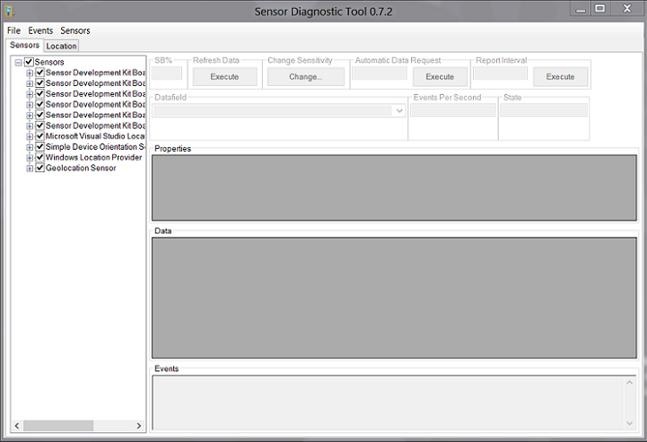

# Testing sensor functionality with the Sensor Diagnostic Tool

Use the Sensor Diagnostic Tool to test your driver, firmware, and hardware functionality.

The tool invokes the Sensor and Location API to test:

-   Data Retrieval
-   Event handling
-   Report intervals
-   Change sensitivity
-   Property retrieval

Instead of writing an application to perform these tests, you can use the Sensor Diagnostic Tool, which ships as part of the Windows Driver Kit (WDK).

For example, if your driver development computer is an x64-based machine, and you installed the WDK to the default location, then you will find the sensor diagnostic tool in the following folder:

*C:\\Program Files (x86)\\Windows Kits\\10\\Tools\\x64\\sensordiagnostictool.exe*
Once your sensor or location driver is installed and your hardware is attached to your PC, the tool immediately recognizes and records your device in the list of available sensors.

The following image shows the Sensor Diagnostic Tool startup screen when several sensors are connected to a PC. The sensors available on the PC are shown in the left pane.

In this case, the Sensor Diagnostic Tool detected the presence of a collection of HID sensors as well as a simple device orientation sensor, the Windows Location provider, and a Geolocation Sensor which is supported by the Geolocation driver sample.

## Support for Ambient Light Sensors

The Sensor Diagnostic Tool includes support for ambient light sensors (ALS). The current display brightness is reported in the SB% box in the tool's upper left corner.

However, it's important to note that when the tool retrieves ALS values, it returns these values as (LUX, Offset) pairs. This ordering differs from the Advanced Configuration and Power Interface (ACPI) standard of (Offset, LUX) pairs.

## Related topics
[Testing Sensor Functionality](testing-sensor-functionality.md)  
[Testing Location Functionality](testing-location-functionality.md)  

