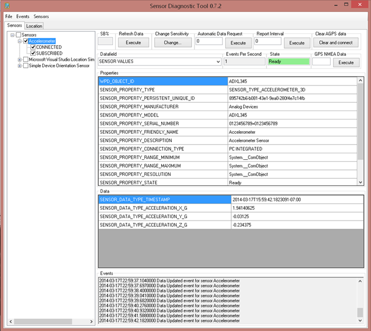

# Use the Sensors Diagnostic Tool to test your driver and device

The Sensor Diagnostic Tool (SDT) is included with the Windows Driver Kit, and you can use this tool to test your driver, firmware, and hardware functionality.

>[!NOTE]
> The Sensor Diagnostic Tool is now deprecated for Windows 10. Please use the SensorInfo App from the Microsoft Store, for all sensor testing and diagnostics.

 

After your device and driver are running, you can use this tool to test:

-   Data retrieval
-   Event handling
-   Report intervals
-   Change sensitivity
-   Property retrieval
-   Property setting

This screenshot shows the SDT running after the SpbAccelerometer sample driver and ADXL345 sensor were installed:

For more information about using the SDT, see to the [Sensor Driver Documentation](https://docs.microsoft.com/windows-hardware/drivers/sensors/).

 

 

--------------------
[Send comments about this topic to Microsoft](mailto:wsddocfb@microsoft.com?subject=Documentation%20feedback%20%5Bsensors/sensors%5D:%20Use%20the%20Sensors%20Diagnostic%20Tool%20to%20test%20your%20driver%20and%20device%20%20RELEASE:%20%281/12/2017%29&body=%0A%0APRIVACY%20STATEMENT%0A%0AWe%20use%20your%20feedback%20to%20improve%20the%20documentation.%20We%20don't%20use%20your%20email%20address%20for%20any%20other%20purpose,%20and%20we'll%20remove%20your%20email%20address%20from%20our%20system%20after%20the%20issue%20that%20you're%20reporting%20is%20fixed.%20While%20we're%20working%20to%20fix%20this%20issue,%20we%20might%20send%20you%20an%20email%20message%20to%20ask%20for%20more%20info.%20Later,%20we%20might%20also%20send%20you%20an%20email%20message%20to%20let%20you%20know%20that%20we've%20addressed%20your%20feedback.%0A%0AFor%20more%20info%20about%20Microsoft's%20privacy%20policy,%20see%20http://privacy.microsoft.com/default.aspx. "Send comments about this topic to Microsoft")

