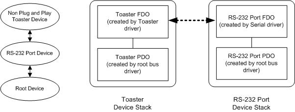

# Configuration of Non-Plug and Play Serial Device Connected to an RS-232 Port

This topic describes the typical configuration of hardware, drivers, and device stacks for legacy serial devices that are connected to an RS-232 port.

The following diagram shows the typical configuration for a non-Plug and Play Toaster device.

Serenum is not used to install a non-Plug and Play serial device. The installation of the Toaster device stack is device-specific. To communicate with the Toaster device, the Toaster driver opens the [COM port](configuration-of-com-ports.md) that is associated with the RS-232 port.

 

 

