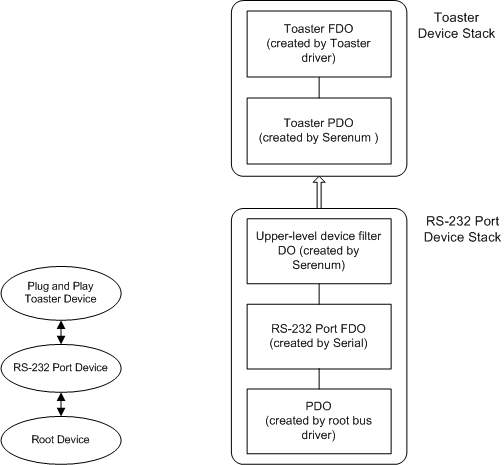

# Configuration of Plug and Play Serial Device Connected to an RS-232 Port

This section describes the typical configuration of hardware, drivers, and device stacks for Plug and Play serial devices and legacy pointer devices that are connected to an RS-232 port. This configuration can be used to support serial devices, such as mouse devices, pointing devices, graphic tablets, modems, and digital cameras.

The following diagram shows the typical configuration for a Plug and Play Toaster device.

Serial and Serenum are used in the previous configurations. Serial creates and attaches a function device object (FDO) to the RS-232 port stack, and Serenum creates and attaches an upper-level filter device object (DO) to the RS-232 port stack. Serenum enumerates the device attached to the RS-232 port after the Plug and Play manager sends an IRP\_MN\_QUERY\_RELATIONS request of type **BusRelations** to the RS-232 device stack.

After Serenum detects a supported device, it creates a physical device object (PDO) and reports the device to the Plug and Play manager. The configuration manager uses the INF file and installers for the Toaster device to complete the Toaster device installation. A Toaster driver creates an FDO and attaches it to the Toaster device stack. Filter DOs can also be added to the Toaster device stack.

 

 

