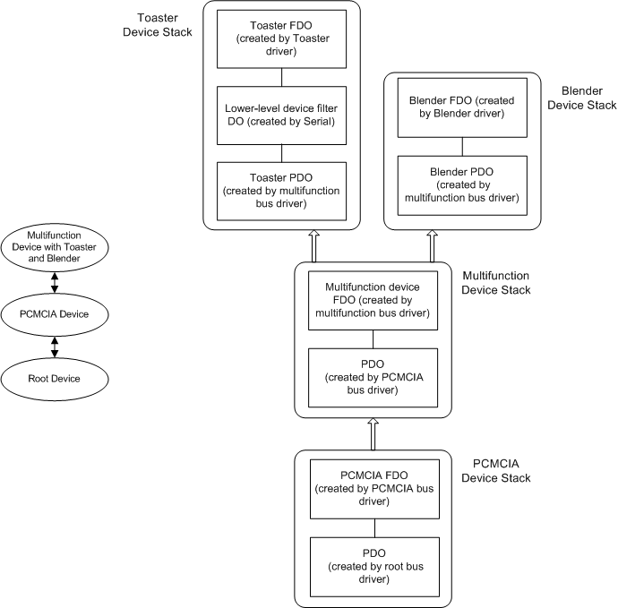

# Configuration of Plug and Play Serial Device on a Multifunction Device that Requires a 16550 UART-Compatible Interface

This section describes the configuration of hardware, drivers, and device stacks for multifunction serial devices that:

-   Support Plug and Play.

-   Require a 16550 UART-compatible interface.

-   Are not connected to an RS-232 port.

A specific example is a PCMCIA card that has a modem and a LAN adapter.

The following diagram shows the typical configuration for a sample toaster device and a sample blender device that require a 16550 UART-compatible interface

In these configurations, the Toaster device is a child device on the multifunction device, and the multifunction device is a child device on a PCMCIA bus.

The INF file and installers for the Toaster device install the Serial driver as lower-level device filter driver to provide a 16550 UART-compatible interface for the Toaster device. The Toaster driver creates and attaches an FDO to the Serial driver filter DO.

 

 

