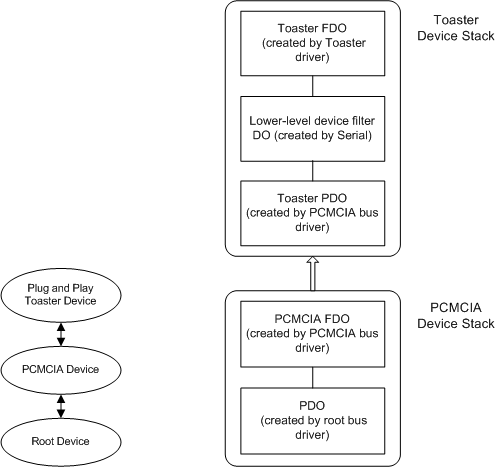

# Configuration of Plug and Play Serial Device that Requires a 16550 UART-Compatible Interface

This section describes the typical configuration of hardware, drivers, and device stacks that is used for serial devices that:

-   Support Plug and Play.

-   Require a 16550 UART-compatible interface.

-   Are not connected to an RS-232 port.

An example is a PCMCIA card with a modem.

The following diagram shows the typical configuration for a sample toaster device and a sample blender device that require a 16550 UART-compatible interface.

In these configurations, the Toaster device is a child device on a PCMCIA bus. The PCMCIA bus driver creates a PDO for the Toaster device when it enumerates the PCMCIA card. The INF file for the Toaster device specifies Serial as a lower-level device filter driver. Serial provides a 16550 UART-compatible interface to the hardware device. The Toaster driver creates and attaches an FDO to the Toaster device stack.

 

 

