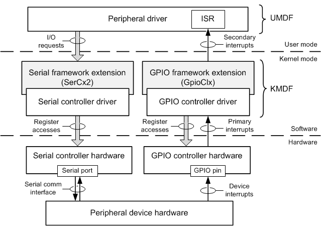

# Peripheral Drivers for Devices on SerCx2-Managed Serial Ports

Typically, a serial port managed by SerCx2 is permanently connected to a peripheral device. This device is controlled by a peripheral driver that sends I/O requests to the serial port. These requests transfer data to and from the device, and configure the state of the serial port. I/O requests sent by the peripheral driver are jointly handled by SerCx2 and an associated serial controller driver.

Frequently, serial controllers are contained in System on a Chip (SoC) integrated circuits. Examples of peripheral devices that might be connected to the serial port of a serial controller on a SoC chip include GPS, wireless LAN, camera, and Bluetooth devices.

The peripheral driver for the serially connected peripheral device is typically a [Kernel-Mode Driver Framework](https://msdn.microsoft.com/library/windows/hardware/ff544296) (KMDF) or [User-Mode Driver Framework](https://msdn.microsoft.com/library/windows/hardware/ff560442) (UMDF) driver. To communicate with this device, the peripheral driver must first open a logical connection to the serial controller and receive a file handle to which the driver can send I/O requests. For more information, see [Opening a SerCx2-Managed Serial Port](opening-a-sercx2-managed-serial-port.md).

**On this page**

-   [Serial driver architecture](#serial-driver-architecture)
-   [I/O request path](#i-o-request-path)
-   [Interrupt path](#interrupt-path)

## Serial driver architecture

The following block diagram shows the layers of software and hardware that form the communication paths between a peripheral device (at the bottom of the diagram) and this device's peripheral driver (at the top of the diagram). In this example, the peripheral device is connected to the port on the serial controller and to an interrupt pin on the GPIO controller.

The peripheral driver in this example is a UMDF driver that sends I/O requests to the peripheral device. These requests move through the communication path shown on the left side of the diagram. The requests are handled by SerCx2 and the serial controller driver. The peripheral driver can request I/O operations that set the hardware configuration of the serial port (for example, change the baud rate), and that transfer data to and from the peripheral device through the serial port. For more information, see [I/O request path](#i-o-request-path).

Interrupts from the peripheral device travel upward through the communication path on the right side of the preceding diagram. As shown in the lower-right corner of this diagram, the interrupt pin from the peripheral device is connected to a pin on a general-purpose I/O (GPIO) controller. This GPIO pin is configured to receive interrupt signals from the peripheral device. In a SoC-based hardware platform, a GPIO controller frequently plays the role of programmable interrupt controller. For more information, see [Interrupt path](#interrupt-path).

The two blocks shown in gray in the diagram are system-supplied modules. The GPIO framework extension (GpioClx) is available starting with Windows 8. Like SerCx2, GpioClx is an extension to KMDF. GpioClx performs functions that are common to a variety of GPIO controllers. GpioClx works with a GPIO controller driver that manages all hardware-specific operations in the GPIO controller. For more information, see [GPIO Driver Support Overview](https://msdn.microsoft.com/library/windows/hardware/hh439512).

## I/O request path

To transmit data to the peripheral device, the peripheral driver sends a write ([**IRP\_MJ\_WRITE**](https://msdn.microsoft.com/library/windows/hardware/ff546904)) request to the serial controller. To receive data from the peripheral device, the peripheral driver sends a read ([**IRP\_MJ\_READ**](https://msdn.microsoft.com/library/windows/hardware/ff546883)) request to the serial controller.

In addition, Windows defines a set of device I/O control requests (IOCTLs) that the peripheral driver can use to perform various I/O control operations that are specific to serial controllers. The following are examples of I/O control operations that the peripheral driver can request:

-   Set the baud rate at which the serial port transmits and receives data.
-   Set the time-out intervals for read and write requests.
-   Specify a set of hardware events at the serial port for which the peripheral driver receives notifications.

SerCx2 supports many of the same serial IOCTLs as the inbox serial driver, Serial.sys, and version 1 of the serial framework extension (SerCx). For more information:

-   See the table in [Serial I/O Request Interface](serial-i-o-request-interface.md) to determine whether SerCx2 supports a particular serial IOCTL.
-   See [Serial Device Control Requests](https://msdn.microsoft.com/library/windows/hardware/ff547466) for detailed descriptions of all the serial IOCTLs that are defined by the Windows serial I/O request interface.
-   See [Serial Controller Drivers Overview](serial-drivers-overview.md) for a brief introduction to Serial.sys, SerCx, and SerCx2.

## Interrupt path

As shown in the [Serial driver architecture](#serial-driver-architecture) diagram, the peripheral device uses the GPIO pin to send device interrupts to the peripheral driver. In response to an interrupt signal from the peripheral device, the GPIO controller signals a hardware interrupt (called the *primary* interrupt) to the processor. The operating system directs this interrupt to GpioClx's ISR. Next, GpioClx identifies which GPIO pin caused the interrupt, and looks up the global system interrupt (GSI) identifier for the virtual interrupt (called the *secondary* interrupt) from the peripheral device. GpioClx supplies the GSI to the HAL, and the HAL calls the peripheral driver's ISR. To handle the interrupt, the peripheral driver typically sends one or more I/O requests to the peripheral device by way of SerCx2 and the serial controller driver. For more information about primary and secondary interrupts, see [GPIO Interrupts](https://msdn.microsoft.com/library/windows/hardware/hh406467).

GPIO interrupts are only one way for the peripheral driver to receive notifications of hardware events in the peripheral device. Another way is for the peripheral driver to request notifications from SerCx2 and the serial controller driver when certain types of hardware events occur at the serial port. For example, the peripheral driver can ask to be notified when the serial controller receives serial data from the peripheral device. To request these notifications, the peripheral driver sends an [**IOCTL\_SERIAL\_SET\_WAIT\_MASK**](https://msdn.microsoft.com/library/windows/hardware/ff546780) request to the peripheral device to specify a set of events to monitor, and then sends an [**IOCTL\_SERIAL\_WAIT\_ON\_MASK**](https://msdn.microsoft.com/library/windows/hardware/ff546805) request to start listening for these events. These requests are handled by SerCx2, with help from the serial controller driver. For more information about the types of events the peripheral driver can monitor, see [**SERIAL\_EV\_*XXX***](https://msdn.microsoft.com/library/windows/hardware/hh439605).

However, the serial controller can detect hardware events only when it is in the D0 device power state. If the serial controller is in a low-power state, the peripheral driver cannot rely on notifications from the serial controller to know when, for example, the peripheral device has new data for the driver to read. In this case, the peripheral device must send an interrupt signal (or, perhaps, a wake signal) through a GPIO pin. A GPIO controller consumes very little power and typically remains active after most other devices have entered low-power states.

 

 

