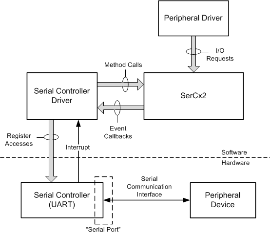

# SerCx2 Architectural Overview

SerCx2 works together with a serial controller driver to enable communication between a peripheral driver and a serially connected peripheral device. Typically, the serial controller is integrated into a System on a Chip (SoC) chip to provide low-pin-count communication with a peripheral device that is external to the SoC chip but is soldered to the same printed circuit board.

The following diagram shows the communication path between a serially connected peripheral device and the driver for this device. This peripheral driver runs in either kernel mode or user mode, and sends I/O requests to the serial port to which the peripheral device is connected.

SerCx2 and the serial controller driver both run in kernel mode, and communicate with each other through the SerCx2 device-driver interface (DDI). The serial controller driver calls driver-support methods that are implemented by SerCx2. SerCx2 calls event callback functions that are implemented by the serial controller driver.

Typically, the hardware registers of the serial controller are memory-mapped. The serial controller driver directly accesses these registers to configure the serial port, and to transfer data to and from the peripheral device that is connected to the serial port. For longer data transfers, SerCx2 typically uses DMA transfers (not shown in the preceding diagram).

The information that the peripheral driver needs to open a logical connection to the peripheral device is encapsulated in a special type of hardware resource that is called a *connection ID*. For more information, see [Connection IDs for Serially Connected Peripheral Devices](connection-ids-for-serially-connected-peripheral-devices.md).

Typically, only drivers send I/O requests directly to a serial controller. When a user-mode application needs to communicate with a serially connected peripheral device, the peripheral driver for the device acts as intermediary between the application and the device. If the application needs to transfer data to or from the peripheral device, the application sends a write ([**IRP\_MJ\_WRITE**](https://msdn.microsoft.com/library/windows/hardware/ff546904)) request or read ([**IRP\_MJ\_READ**](https://msdn.microsoft.com/library/windows/hardware/ff546883)) request to the peripheral driver, and the peripheral driver responds by sending a corresponding write or read request to the serial controller. In addition, the peripheral driver can send device I/O control requests (IOCTLs) to configure the serial port. For a list of IOCTLs supported by SerCx2, see [Serial I/O Request Interface](serial-i-o-request-interface.md).

The peripheral driver that sends I/O requests to the serial controller is either a kernel-mode driver that uses the [Kernel-Mode Driver Framework](https://msdn.microsoft.com/library/windows/hardware/ff544296) (KMDF), or a user-mode driver that uses the [User-Mode Driver Framework](https://msdn.microsoft.com/library/windows/hardware/ff560442) (UMDF). SerCx2 manages the queues of I/O requests sent to the serial controller by the peripheral driver.

In response to a read or write request, SerCx2 initiates one or more I/O transactions to move data between the serial controller and the data buffer in the request. Each I/O transaction uses either programmed I/O (PIO) or DMA to transfer data between the serial controller and the data buffer in the request. The types of I/O transactions supported by a serial controller driver depend on the hardware capabilities of the serial controller. For more information, see [Overview of SerCx2 I/O Transactions](overview-of-sercx2-i-o-transactions.md).

 

 

