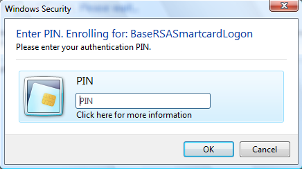

# Card PIN Operations


The term PIN was inherited from the banking industry because of its first use on the numeric keypad of ATM machines. Some other industry documentation use the term card holder verification (CHV). It is understood that the data format is not just numeric but can be anything that the user can provide given the means at his or her disposal. The value that is passed as PIN data is constrained by interoperability considerations to the ANSI single-byte character set.

Authentication of the user differs greatly from authentication of the administrator in that the user is normally not privileged to possess the administrative authentication secret. This has many implications about what kind of data can be used for this and how it is to be handled. If the administrative secret is used on the client computer to do something like unblock a user’s card with assistance from a central authority, this data must be either securely transmitted to the card without any possibility of disclosure or else be completely ephemeral so that it has no value outside the current transaction. The difficulty of arranging secure transmission to the card is why use of a PIN to authenticate the administrator is discouraged.

An authentication is valid only within a transaction, to prevent another application from hijacking an authenticated session. Deauthentication occurs automatically upon ending a transaction.

Changing the PIN must invalidate secure token.

## <span id="General_Definitions"></span><span id="general_definitions"></span><span id="GENERAL_DEFINITIONS"></span>General Definitions


Two data types are defined for PINs: one for describing individual PINs that are associated with roles and PIN\_SET that is used for a bit-mask with PIN identifiers. Also, we discontinued having strings for user names and introduce role numbers that translate to PIN identifiers. We also define two flags for the PIN change operation that are explained later in this specification.

```ManagedCPlusPlus
typedef     DWORD                      PIN_ID, *PPIN_ID;
typedef     DWORD                      PIN_SET, *PPIN_SET;

#define     MAX_PINS                   8

#define     ROLE_EVERYONE              0
#define     ROLE_USER                  1
#define     ROLE_ADMIN                 2

#define     PIN_SET_ALL_ROLES          0xFF
#define     CREATE_PIN_SET(PinId)      (1 << PinId)
#define     SET_PIN(PinSet, PinId)     PinSet |= CREATE_PIN_SET(PinId)
#define     IS_PIN_SET(PinSet, PinId)  (0 != (PinSet & CREATE_PIN_SET(PinId)))
#define     CLEAR_PIN(PinSet, PinId)   PinSet &= ~CREATE_PIN_SET(PinId)

#define     PIN_CHANGE_FLAG_UNBLOCK    0x01
#define     PIN_CHANGE_FLAG_CHANGEPIN  0x02
```

To be functionally equivalent to current card minidriver cards, all cards must be provisioned with at least three roles: ROLE\_EVERYONE, ROLE\_USER, and ROLE\_ADMIN. Each role is equivalent to one PIN\_ID on the card. There is only one true administrator role for a card, but there can be multiple roles that can unblock other roles. However, only one role should control access to perform administrator-level operations such as deleting the file system, and this is ROLE\_ADMIN. Additionally, ROLE\_ADMIN must be able to unblock ROLE\_USER. There is also only one user role that gives access to the file system for a card. The additional roles 3 through 7 are optional and can be associated only with key containers.

For special considerations that can apply to read only-cards, see “Read-Only Cards” later in this specification.

## <span id="SECRET_TYPE"></span><span id="secret_type"></span>SECRET\_TYPE


The following enumeration describes the type of PIN.

```ManagedCPlusPlus
typedef enum
{
    AlphaNumericPinType = 0,    // Regular PIN
    ExternalPinType,            // External PIN
    ChallengeResponsePinType,   // Challenge/Response PIN
    EmptyPinType                // No PIN
} SECRET_TYPE;
```

**Note**  When encountering PIN **SECRET\_TYPEEmptyPinType**, Windows does not prompt for PIN nor does it call **CardAuthenticatePin** or **CardAuthenticatePinEx**. This setting is useful when an unconditional access to material on the card is desired.


## <span id="SECRET_PURPOSE"></span><span id="secret_purpose"></span>SECRET\_PURPOSE


The following enumeration is used by the **PIN\_INFO** data structure to describe the purpose of the PIN for user information purpose.

```ManagedCPlusPlus
typedef enum
{
    AuthenticationPin,      // Authentication PIN
    DigitalSignaturePin,    // Digital Signature PIN
    EncryptionPin,          // Encryption PIN
    NonRepudiationPin,      // Non Repudiation PIN
    AdministratorPin,       // Administrator PIN
    PrimaryCardPin,
    UnblockOnlyPin          // Unblocking other PINs
} SECRET_PURPOSE;
```

Windows uses the enumeration value to display an appropriate message to the user that describes which card PIN is currently requested. The minidriver completely controls which SECRET\_TYPE to use. The following is an illustration of a PIN prompt dialog box that includes sample context strings.



The first string in the figure (“Enter PIN. Enrolling for: BaseRSASmartcardLogon”) is provided by the calling application to provide application context. If no application context string exists, the dialog box displays a standard text.

The second string (“Please enter your authentication PIN”) is driven by **SECRET\_PURPOSE** in one of the following ways:

-   Default context strings

    By default, the Base CSP displays the following predefined strings, which are localized appropriately.

    |                     |                                                  |
    |---------------------|--------------------------------------------------|
    | AuthenticationPin   | “Please enter your authentication PIN.”          |
    | DigitalSignaturePin | “Please enter your digital signature PIN.”       |
    | EncryptionPin       | “Please enter your encryption PIN.”              |
    | NonRepudiationPin   | “Please enter your non repudiation PIN.”         |
    | AdministratorPin    | “Please enter your administrator PIN.”           |
    | PrimaryCardPin      | “Please enter your PIN.”                         |
    | UnblockOnlyPin      | “Please enter your PIN to unblock the user PIN.” |


-   Custom strings

    Developers can override the default context strings by setting custom strings in the following registry values of the minidriver’s registry key (HKLM\\Software\\SOFTWARE\\Microsoft\\Cryptography\\Calais\\SmartCards\\XYZ, where XYZ is the name of the card minidriver).

    To override a predefined context string, add a registry string value to the minidriver’s registry key with the custom string. The name of the key sets which **SECRET\_PURPOSE** predefined context string is being overridden, with 0x80000100 that corresponds to the first member of **SECRET\_TYPE** and onward. It is not possible to override just one string, some, or all context strings.

    The value of the string should follow the following format:

    ``` syntax
    “LangID,xxxx;LangID,xxxxx”
    ```

    **Note**  Quotation marks around the custom string are not handled properly and should not be relied on to prevent parsing special characters within the string.


**Note**  Including two different custom strings for the same locale results in the first custom string being picked up.


The third string in the dialog box (“Digital Signature PIN”) is a predefined string that is determined by the **SECRET\_PURPOSE** value in the **PIN\_INFO** data structure.

For **UnblockOnlyPin**, the intended purpose is to unblock the user PIN. This PIN must not be used for any other purpose.

## <span id="_PIN_CACHE_POLICY_TYPE"></span><span id="_pin_cache_policy_type"></span> PIN\_CACHE\_POLICY\_TYPE


The following enumeration describes the PIN caching policy that is to be associated with this PIN.

```ManagedCPlusPlus
typedef enum
{
    PinCacheNormal = 0,
    PinCacheTimed,
    PinCacheNone,
    PinCacheAlwaysPrompt
} PIN_CACHE_POLICY_TYPE;
```

The following table describes how the Base CSP acts upon the three different cache modes.

| Cache mode               | Description                                                                                                                                                                                                                                                                                                                                                                                                                                                                                                                                                               |
|--------------------------|---------------------------------------------------------------------------------------------------------------------------------------------------------------------------------------------------------------------------------------------------------------------------------------------------------------------------------------------------------------------------------------------------------------------------------------------------------------------------------------------------------------------------------------------------------------------------|
| **PinCacheNormal**       | For this mode, the PIN is cached by the Base CSP per process per logon ID.                                                                                                                                                                                                                                                                                                                                                                                                                                                                                                |
| **PinCacheTimed**        | For this mode, the PIN is invalidated after an indicated period of time (value is given in seconds). This was implemented by recording the timestamp when the PIN is added to the cache and then verifying this timestamp versus the time when the PIN is accessed. This means that the PIN potentially lives in the cache longer than the specified timestamp, but is not used after it has expired. The PIN is encrypted in memory to keep it protected.                                                                                                                |
| **PinCacheNone**         | When the PIN cannot be cached, Base CSP never adds the PIN to the cache. When the Base CSP/KSP is called with [**CryptSetProvParam**](https://msdn.microsoft.com/library/windows/desktop/aa380276) to set a PIN, the PIN is submitted to the card for verification but not cached. This means that any subsequent operations must occur before the Base CSP transaction time-out expires.                                                                                                                                                                                                                  |
| **PinCacheAlwaysPrompt** | Unlike **PinCacheNone**, when this cache mode is set, the Base CSP transaction time-out is not applicable. The PIN is collected from the user and then submitted to the card for verification before each call that requires authentication. Calls to [**CryptSetProvParam**](https://msdn.microsoft.com/library/windows/desktop/aa380276) and [**NcryptSetProperty**](https://msdn.microsoft.com/library/windows/desktop/aa376292) for setting the PIN return ERROR\_SUCCESS without verifying and caching the PIN. This implies that calls from applications that use silent contexts will fail if the call requires authentication. |


**Note**  Windows logon may not work properly if a PIN is not cached. This behavior is by design. Therefore, careful consideration should be given when setting a PIN cache mode to any value other than **PinCacheNormal**.


## <span id="_PIN_CACHE_POLICY"></span><span id="_pin_cache_policy"></span> PIN\_CACHE\_POLICY


The PIN cache policy structure contains information that describes the PIN cache policy. It describes the PIN cache type, in addition to associated information with this PIN cache policy. An example of this associated information would be a time-out value for the PIN cache when the policy indicates **PinCacheTimed**.

```ManagedCPlusPlus
#define      PIN_CACHE_POLICY_CURRENT_VERSION   6

typedef struct _PIN_CACHE_POLICY
{
    DWORD                   dwVersion;
    PIN_CACHE_POLICY_TYPE   PinCachePolicyType;
    DWORD                   dwPinCachePolicyInfo;
} PIN_CACHE_POLICY, *PPIN_CACHE_POLICY;
```

## <span id="PIN_INFO"></span><span id="pin_info"></span>PIN\_INFO


The PIN object structure contains information that describes the PIN. It describes the PIN type, which PIN is allowed to unblock this target PIN, and the PIN caching policy. After a PIN information structure is obtained by the Base CSP/KSP, it should be cached in the data cache similar to how data files are cached.

```ManagedCPlusPlus
#define      PIN_INFO_REQUIRE_SECURE_ENTRY       1

typedef struct _PIN_INFO
{
    DWORD                   dwVersion;
    SECRET_TYPE             PinType;
    SECRET_PURPOSE          PinPurpose;
    PIN_SET                 dwChangePermission;
    PIN_SET                 dwUnblockPermission;
    PIN_CACHE_POLICY        PinCachePolicy;
    DWORD                   dwFlags;
} PIN_INFO, *PPIN_INFO;
```

The **dwUnblockPermission** member is a bit-mask that describes which PINs have permission to unblock the PIN. The permission is based on a bitwise ‘or’ of the specified PINs. For an unblock operation, the card minidriver should ignore any self-reference. The ROLE\_USER would have an update permission bitmask of 0x00000100. This means that it can be unblocked by ROLE\_ADMIN. ROLE\_ADMIN, which has an update permission of 0x00000000. This means that it cannot be unblocked.

The **dwFlags** member contains PIN flags. Currently, only one flag is defined: PIN\_INFO\_REQUIRE\_SECURE\_ENTRY. This flag indicates to the Base CSP/KSP whether a secure desktop is required for PIN entry.

**Note**  It is possible by using this structure to give ROLE\_EVERYONE permission to change or unblock a PIN. We do not recommend this, and no mechanism is provided in the minidriver API to allow ROLE\_EVERYONE to change or unblock a PIN.


