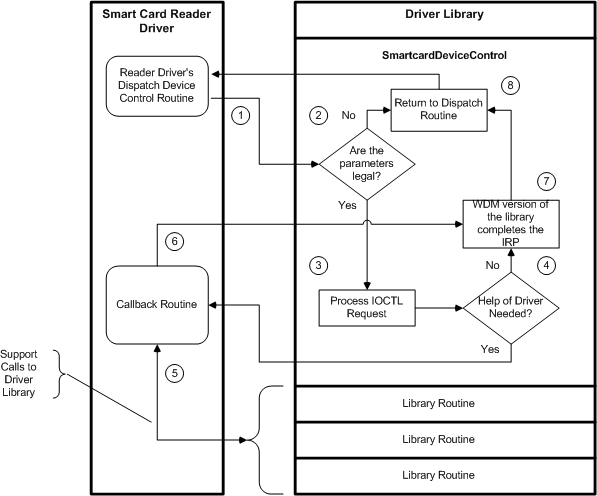

# Interaction with the Smart Card Driver Library

## 

The following figure shows how a reader driver interacts with the smart card driver library in order to process IOCTL requests that it receives from the resource manager:

The following numbers correspond with the numbers in the previous figure. Starting with the number 1, the figure shows the steps that a reader driver must complete (together with the system-supplied driver library) to process an IOCTL request:

1.  The reader driver passes all IOCTL requests to the [**SmartcardDeviceControl (WDM)**](https://msdn.microsoft.com/library/windows/hardware/ff548939) driver library routine.

2.  If the parameters that the reader driver passes to [**SmartcardDeviceControl**](https://msdn.microsoft.com/library/windows/hardware/ff548939) are incorrect, **SmartcardDeviceControl** returns with an error message. **SmartcardDeviceControl** returns without completing the IOCTL request. In this situation, the reader driver must complete the IOCTL request.

3.  If the parameters are valid, [**SmartcardDeviceControl**](https://msdn.microsoft.com/library/windows/hardware/ff548939) processes the IOCTL request if it can.

4.  [**SmartcardDeviceControl**](https://msdn.microsoft.com/library/windows/hardware/ff548939) checks whether the reader driver has a callback routine defined for the IOCTL request that it is processing. If the callback exists, **SmartcardDeviceControl** calls it.

5.  The callback routine calls all the driver library routines that are required to complete the processing of the IOCTL request.

6.  After processing the IOCTL request, the callback routine returns to [**SmartcardDeviceControl**](https://msdn.microsoft.com/library/windows/hardware/ff548939).

7.  [**SmartcardDeviceControl**](https://msdn.microsoft.com/library/windows/hardware/ff548939) completes the IRP that carried the IOCTL.

8.  [**SmartcardDeviceControl**](https://msdn.microsoft.com/library/windows/hardware/ff548939) returns control to the reader-driver dispatch routine.

The smart card library synchronizes access to the reader driver. No two callback functions will be called at the same time. However, the event handling for card insertion and removal must be processed asynchronously.

 

 

