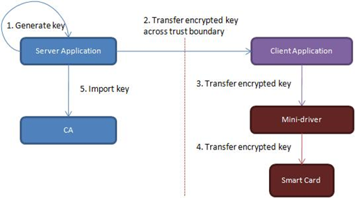
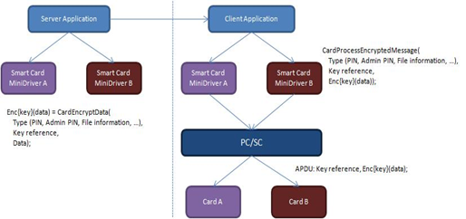
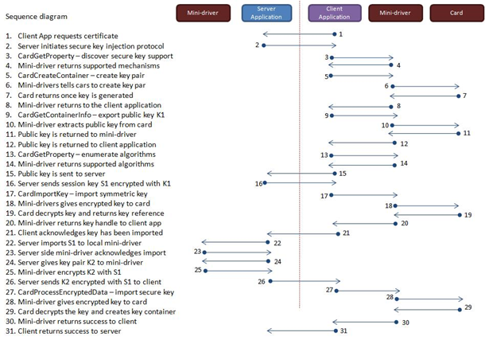

# Secure Key Injection


Secure Key Injection provides support for the encrypted transfer of sensitive material from a server application to a smart card through an untrusted client. For Secure Key Injection to work properly, the following steps must occur:

1.  Establishment of encryption keys:

    1.  Use shared symmetric keys between the server and the smart card on the client.
    2.  Generate a temporary symmetric session key on the server and import it to the smart card. The session key must be encrypted by a public key that has the corresponding private key generated on the smart card .
    3.  Derive a session key from a shared symmetric key. For more information, see [**CardGetSharedKeyHandle**](https://msdn.microsoft.com/library/windows/hardware/dn468730).
    4.  Use DH key derivation.

2.  Encryption of data on the server:

    1.  Data could be authentication data such as a PIN.
    2.  Data could be an asymmetric key pair such as RSA/ECC.

3.  Decryption of data in the smart card on the client.

The following diagram shows a server application that generates a key and then securely transfers the key across a trust boundary to the client. After the key is received, the client imports it to the smart card. As the final step, the key is imported into the CA for archival. An encrypted channel should exist between the server application and the smart card, and the client application/minidriver should be unable to access the encrypted data.



To encrypt the key in step 2, the server and the smart card require a shared symmetric key.

To accommodate existing cards that use a proprietary format when they perform secure key injection, the minidriver can be loaded on the server-side without the card being present. The minidriver formats the message and then finally encrypts it, which allows the same minidriver that runs on the client to decrypt the message.

The next diagram provides an overview of server/client key archival with minidrivers.



## <span id="Card_Key_Handle"></span><span id="card_key_handle"></span><span id="CARD_KEY_HANDLE"></span>Card Key Handle


When dealing with symmetric keys, CARD\_KEY\_HANDLE should be used to pass around the key handle.

``` syntax
typedef ULONG_PTR  CARD_KEY_HANDLE;
```

## <span id="_No_Card_Mode"></span><span id="_no_card_mode"></span><span id="_NO_CARD_MODE"></span> No Card Mode


To facilitate server applications that format and encrypt data by using the same minidriver that is installed on the untrusted client, [**CardAcquireContext**](https://msdn.microsoft.com/library/windows/hardware/dn468701) can be called in a mode that does not require the card to be present. This mode is enabled by setting the following flag in the *dwFlags* parameter of **CardAcquireContext** .

``` syntax
#define CARD_SECURE_KEY_INJECTION_NO_CARD_MODE  0x1
```

This setting instructs [**CardAcquireContext**](https://msdn.microsoft.com/library/windows/hardware/dn468701) not to expect any card to be in the reader. This means that the ATR fields in the [**CARD\_DATA**](https://msdn.microsoft.com/library/windows/hardware/dn468748) are not filled and **hSCard** and **hSCardCtx** are set to zero.

When this flag is set, the minidriver can accept only the following function calls:

-   [**MDImportSessionKey**](https://msdn.microsoft.com/library/windows/hardware/dn468757)
-   [**MDEncryptData**](https://msdn.microsoft.com/library/windows/hardware/dn468756)
-   [**CardGetSharedKeyHandle**](https://msdn.microsoft.com/library/windows/hardware/dn468730)
-   [**CardGetAlgorithmProperty**](https://msdn.microsoft.com/library/windows/hardware/dn468722)
-   [**CardDestroyKey**](https://msdn.microsoft.com/library/windows/hardware/dn468720)
-   [**CardGetKeyProperty**](https://msdn.microsoft.com/library/windows/hardware/dn468728)
-   [**CardSetKeyProperty**](https://msdn.microsoft.com/library/windows/hardware/dn468739)
-   [**CardProcessEncryptedData**](https://msdn.microsoft.com/library/windows/hardware/dn468732)

## <span id="Use_Case_Scenario_for_Secure_Key_Injection"></span><span id="use_case_scenario_for_secure_key_injection"></span><span id="USE_CASE_SCENARIO_FOR_SECURE_KEY_INJECTION"></span>Use Case Scenario for Secure Key Injection


In this example scenario, a client application requests that a certificate be issued from the CA application that is running on a server on behalf of the smart card owner. The CA also requires key archival. Please refer to the footnote in section Secure Key Injection for guidance on using asymmetric keypair to establish temporary symmetric session keys.

The user key is generated on the server-side, archived and then injected into the user’s smart card by using Secure Key Injection functions. The following figure illustrates the process.



This scenario is based on importing a symmetric session key that is encrypted with an asymmetric key, and then using this symmetric key for subsequent key wrapping.

The following steps describes the process as shown in the previous figure:

1.  The client applications request a new certificate from a CA application that is running on the server.
2.  When it receives the client’s request, the server application detects that the certificate template has been configured for key recovery. As a result, the server application initiates the secure key injection protocol.
3.  The client application calls [**CardGetProperty**](https://msdn.microsoft.com/library/windows/hardware/dn468729) for CP\_KEY\_IMPORT\_SUPPORT to discover the following:

    -   Whether the card supports secure key injection.
    -   Which method of symmetric key import is supported.
    -   What algorithms are supported.

4.  The minidriver indicates to the client application that it supports key injection through the asymmetric mechanism (CARD\_KEY\_IMPORT\_ASYMMETRIC\_KEYEST).
5.  The client application looks through the container map file of the smart card to see if any containers are useful for key import. If none is found, the client application calls [**CardCreateContainer**](https://msdn.microsoft.com/library/windows/hardware/dn468708) to generate a new key pair.
6.  The minidriver instructs the smart card to create a key pair.
7.  The smart card returns the key to the minidriver after the key is created.
8.  The minidriver returns an indication to the client application that the key was generated.
9.  The client application now calls [**CardGetContainerInfo**](https://msdn.microsoft.com/library/windows/hardware/dn468725) to export the public key of the key pair that was created in step 6.
10. The card minidriver instructs the card to return the public key.
11. The card extracts the public key (K1)from the card and returns it to the minidriver.
12. The minidriver returns K1 to the client application.
13. The client application calls [**CardGetProperty**](https://msdn.microsoft.com/library/windows/hardware/dn468729) to enumerate the symmetric algorithms that the card supports, as well as enumerate the padding schemes that can be used with K1.
14. The minidriver returns the algorithms and padding modes that are supported.
15. The client application sends K1 back to the server application, along with the information that describes the symmetric key algorithms and padding modes that the card supports.
16. By using one of the algorithms that the card supports, the server application generates a symmetric key (S1). The symmetric key S1 is encrypted with K1 and returned to the client application. The server application also returns information about the encryption algorithm and the type of padding that was used to encrypt S1.
17. The client application calls [**CardImportSessionKey**](https://msdn.microsoft.com/library/windows/hardware/dn468731) with an encrypted key data BLOB along with the reference to K1 and any padding information to be used to decrypt the BLOB.

    For more information about key data BLOBs, see [**BCRYPT\_KEY\_DATA\_BLOB\_HEADER**](https://msdn.microsoft.com/library/windows/desktop/aa375524).

18. The minidriver passes the encrypted BLOB data to the smart card for decryption.
19. After the symmetric key is decrypted, the smart card returns a reference to the symmetric key to the minidriver.
20. The minidriver returns a key handle to the client application for the symmetric key.
21. The client application sends an acknowledgment to the server application that the symmetric key has been imported.
22. The server application imports S1 to the server-side minidriver by calling [**MDImportSessionKey**](https://msdn.microsoft.com/library/windows/hardware/dn468757).
23. The server-side minidriver returns success to indicate that S1 was successfully imported.
24. The server application generates the asymmetric key pair (K2). K2 is sent to the server-side minidriver by calling [**MDEncryptData**](https://msdn.microsoft.com/library/windows/hardware/dn468756). The server application generates the IV and Chaining mode, and set this info to the server-side minidriver by calling [**CardSetKeyProperty**](https://msdn.microsoft.com/library/windows/hardware/dn468739).
25. The server-side minidriver encrypts K2 by using S1, and returns the encrypted K2 to the server application.
26. The server application sends the encryptedK2 to the client application, along with any information that pertains to the encryption. This includes the IV and Chaining mode information.
27. The client application calls [**CardSetKeyProperty**](https://msdn.microsoft.com/library/windows/hardware/dn468739) to instruct the minidriver what IV and chaining mode to use with the S1. The client application then calls [**CardProcessEncryptedData**](https://msdn.microsoft.com/library/windows/hardware/dn468732) with the following data:

    -   The encrypted key data BLOB that contains K2.
    -   The key reference to S1 so that the card can decrypt the data and create the key.

28. The minidriver performs the necessary steps to prepare a new key container and gives the encrypted key data BLOB to the smart card.
29. The smart card decrypts K2 using S1 and generates a new key container for K2. The card returns success to indicate that the key has been imported.
30. The minidriver returns success from [**CardProcessEncryptedData**](https://msdn.microsoft.com/library/windows/hardware/dn468732).
31. The client application returns success and the process is complete.

 

 


