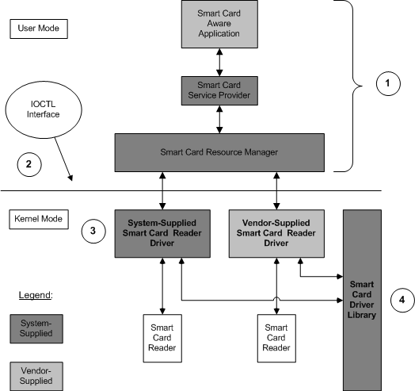

# Smart Card Driver Environment

## 

The following figure shows the standard environment for the smart card reader driver.

In addition, the figure shows the following components of the smart card environment:

-   Applications communicate with a smart card reader driver by means of the smart card resource manager. The reader driver resides in kernel space, and the smart card resource manager resides in user space.

-   The resource manager communicates with the reader driver by means of I/O controls that are dispatched using the [DeviceIoControl](http://go.microsoft.com/fwlink/p/?linkid=94613) system call. For information about how to use the [DeviceIoControl](http://go.microsoft.com/fwlink/p/?linkid=94613) system call, refer to the [DeviceIoControl](http://go.microsoft.com/fwlink/p/?linkid=94613) topic in the Microsoft Windows SDK.

    Likewise, smart card-aware applications can send instructions to a smart card reader driver by means of [DeviceIoControl](http://go.microsoft.com/fwlink/p/?linkid=94613), and the operating system will forward the indicated IOCTL to the reader driver. If the reader driver is a WDM driver, the operating system will forward the request by means of an I/O request packet (IRP).

-   Microsoft supplies one reader driver sample, *pscr.sys*, which is a driver for a PCMCIA smart card reader. The source code for this driver is available in the collection of WDK samples. For further information, see [PCMCIA Smart Card Driver](https://github.com/Microsoft/Windows-driver-samples/tree/master/smartcrd). Vendors of smart card reader devices must supply drivers that are designed to work with the system-supplied resource manager and smart card driver library.

-   Both native and vendor-supplied reader drivers must use the smart card driver library to perform many of their key operations, as explained in the section, [Smart Card Driver Library](smart-card-driver-library.md).

 

 

