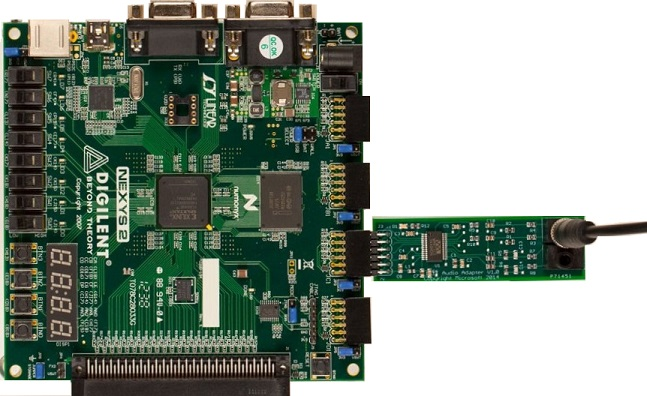

# Audio playback fidelity tests in MITT

**Last updated**

-   January, 2015

**Applies to:**

-   Windows 8.1

The audio module on the MITT board is used to detect errors that occur at the transport level of the audio device by detecting sine wave frequency accuracy (at zero cross) and counting instances where the frequency or offset is incorrect. Lack of a signal or missed packets results in a shifted waveform that is audible and detectable automatically via this mechanism.

## Before you begin...

-   Get a MITT board and an audio adapter. See [Buy hardware for using MITT](buses.multi_interface_test_tool__mitt__).
-   [Download the MITT software package](buses.mitt_software_package). Install it on the system under test.
-   Install MITT firmware on the MITT board. See [Get started with MITT](buses.get_started_with_mitt___).

## Hardware setup

1.  Connect the audio adapter to **JC1** on the MITT board.
2.  LineIn has the input from line out of the audio device on the system under test by using a 1/8” to 1/8” male to male cable. Other audio sources may be connected up with appropriate cabling.

## Audio playback automation tests

1.  Create a folder on the system under test.
2.  Copy AudiounitsimpleIO.dll from the MITT software package to the folder.
3.  Run all tests by using this command:

    te.exe audiounitSimpleIO.dll

4.  Run as a Simple IO plugin, use the included script SimpleIO\_MITT\_Audio\_Sample.vbs
5.  To disable the Audio SimpleIO tests from running, set the following registry entry:
    -   **HKEY\_CURRENT\_USER\\Software\\Microsoft\\MITT\\AudioUnit** \\**** = RunAudioTest

           Data type  
           REG\_DWORD

           Description  
           Set to 0.

This will play a series of test tones, from 500hz to 18khz and report the number of glitches detected. If a high number of glitches, such as 10000+, is detected, verify that the cable is connected correctly and that the volume is not muted. Any interrupted signal is detected with a glitch per expected crossing so the number can be very high.

If the tests all pass, your device is connected correctly and operating as expected.

 

 

[Send comments about this topic to Microsoft](mailto:wsddocfb@microsoft.com?subject=Documentation%20feedback%20%5BSPB\buses%5D:%20Audio%20playback%20fidelity%20tests%20in%20MITT%20%20RELEASE:%20%286/1/2016%29&body=%0A%0APRIVACY%20STATEMENT%0A%0AWe%20use%20your%20feedback%20to%20improve%20the%20documentation.%20We%20don't%20use%20your%20email%20address%20for%20any%20other%20purpose,%20and%20we'll%20remove%20your%20email%20address%20from%20our%20system%20after%20the%20issue%20that%20you're%20reporting%20is%20fixed.%20While%20we're%20working%20to%20fix%20this%20issue,%20we%20might%20send%20you%20an%20email%20message%20to%20ask%20for%20more%20info.%20Later,%20we%20might%20also%20send%20you%20an%20email%20message%20to%20let%20you%20know%20that%20we've%20addressed%20your%20feedback.%0A%0AFor%20more%20info%20about%20Microsoft's%20privacy%20policy,%20see%20http://privacy.microsoft.com/en-us/default.aspx. "Send comments about this topic to Microsoft")

