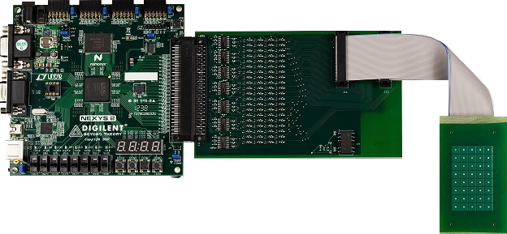
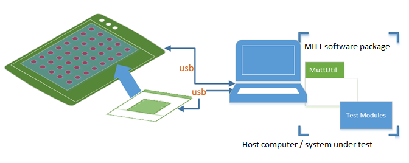
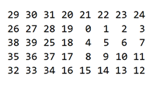

# Capacitive touch tests in MITT


**Last updated**

-   January, 2015

**Applies to:**

-   Windows 8.1

Capacitive touch tests in the MITT software package require MCATT (Microsoft Capacitive Applications Test Tool). It's an automation tool for validating capacitive based touch hardware (touchpads and touchscreens). MCATT includes a simple interface for programming the MCATT device and automated tests. You can use the tests to detect ghost points or determine the time table for the first touch input to propagate after system wake.

You can use MCATT for these test cases:

-   Stress testing
-   Targeted latency measurements
-   SimpleIo/Device Fundamentals scenarios such as power transitions while performing input on the pad.

## Before you begin...


-   Get a MITT board. See [Buy hardware for using MITT](https://msdn.microsoft.com/library/windows/hardware/dn919811).
-   Get a touch simulator pad and a band cable to connect to the adapter.
-   Get an MCATT expansion board that has a 40-pin adapter to connect the MITT board to the touch simulator pad.
-   [Download the MITT software package](https://msdn.microsoft.com/library/windows/hardware/dn919810).
-   Install MITT firmware on the MITT board. See [Get started with MITT](https://msdn.microsoft.com/library/windows/hardware/dn919779).

## Hardware setup




1.  Connect the MITT board to the 40-pin adapter.
2.  Connect the touch simulator pad to the adapter.
3.  Connect the MITT board to the host computer by using a USB cable.
4.  Connect the system under test to the host system by using a USB cable. This can be an A-to-A USB cable or a wire that connects ground from the system under test to the device under test.

    

## MCATT manual tests


To run MCATT tests manually, perform these tasks:

1.  Copy mittsimpleioaction.dll to: \[WDTF directory\]\\Actions\\SimpleIO
2.  Run \[WDTF directory\]\\UnRegisterWDTF.exe
3.  Run \[WDTF directory\]\\RegisterWDTF.exe

## Example: Sending input sequence


The board can be programmed to run in a loop a specified sequence of touch points.

At any given time the script controls which touch points provide simulation. The script can describe frame-by-frame the set of touch points to emulate user gestures such as taps, pans (slow drag) or flicks (accelerated pans).

Here is an example for generating a simple pan gesture that is included in the test module. This example test works with the 5x8 board that has this numbering convention.



Run these commands:

**Muttutil.exe -SetChannel 00**

**Muttutil.exe -WriteData 0000**

**Muttutill.exe –SetChannel 02**

**Muttutil.exe –WriteDataFromFile Example.txt**

**Muttutil.exe –SetChannel 00**

**Muttutil.exe –Writedata 0004**

-   **SetChannel** with 00 indicates that the control channel will receive data.
-   **WriteData** with 0000 pauses all test modules.
-   **SetChannel** option by specifying 02 to select the MCATT module.
-   **WriteDataFromFile** with the name of file to send the contents of the example input file to the MCATT module.
-   **SetChannel** with 00 to switch back to the control channel will receive the data.
-   **Writedata** with 0004 to run the MCATT sequence in the file. If you want the sequence to loop, use 000C instead of 0004.

Here is the example pattern:

``` syntax
'h00028480
'b1100000000001100000000000000000000000000
'b1000000000001000000000000000000000000000
'b1000000000011010000000000000000000000000
'b0000000000010010000000000000000000000000
'b0000000000010010000011000000000000000000
'b0000000000000000000011000000000000000000
'b0000000000000000000011000000000000010001
'b0000000000000000000000000000000000010001
'b0000000000000000000000000000000000110011
'b0000000000000000000000000000000000100010
'b0000000000000000000000000000000001100110
'b0000000000000000000000000000000001000100
'b0000000000000000000000000000000011001100
'b0000000000000000000000000000000010001000
'b0000000000000000000000000000000000000000
'b0000000000000000000000000000000000000000
```

In the preceding example, the first line sets the pattern rate to 0x00028480, or 164,992 microseconds per line. The remaining lines are used to indicate the pads that are connected to ground and the pads that are floating. There are 40 pads, so each line is 40 bits long with bit 39 on the left side of the line and bit 0 at the right side of the line. This pattern starts by pressing down on pads 26, 27, 38, and 39, by setting those bits to a "1" and then moving the press from the left of the board to the right of the board
To create patterns use the example pattern as a starting point. You can create and edit an MCATT pattern file by using the [MCATT Pattern Editor](https://msdn.microsoft.com/library/windows/hardware/dn919809).

## Related topics
[Testing with Multi Interface Test Tool (MITT)](https://msdn.microsoft.com/library/windows/hardware/dn919874)  


