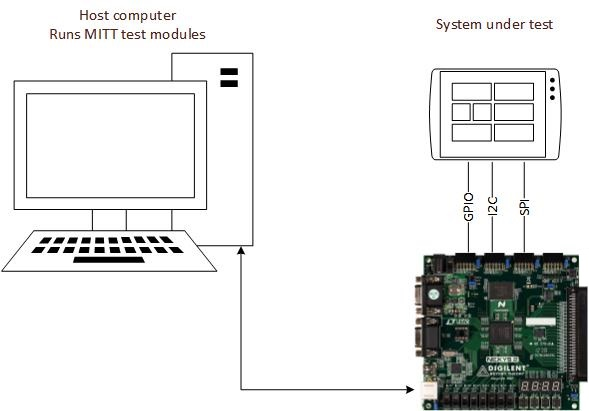
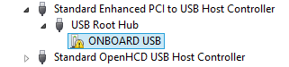
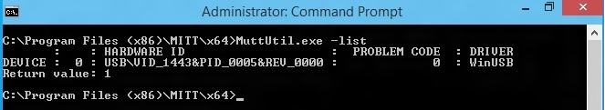
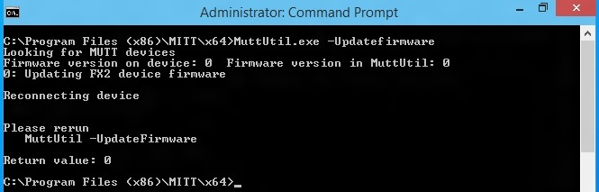
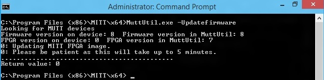

# Get started with MITT

**Last updated**

-   January, 2015

**Applies to:**

-   Windows 8.1

To run MITT tests, you must install the MITT firmware on a new MITT board. These steps describe how to update the MITT firmware and prepare the host machine for running MITT tests.

## Before you begin...

-   [Download the MITT software package](https://msdn.microsoft.com/library/windows/hardware/dn919810).
-   [Buy hardware for using MITT](https://msdn.microsoft.com/library/windows/hardware/dn919811)
-   Know how to run Windows command shell with elevated privilege. Installation of the test tools requires an elevated command window. For that window, you can open a Command Prompt window by using the **Run as administrator** option.

## Computer setup for running MITT tests

To run MITT tests, you need a computer that will run as the host and system under test (SUT).

-   The computer must be running Windows 8.1 version of the operating system.
-   The computer must have the MITT software package installed.
-   The computer must be connected as a target to a kernel debugger running on a separate machine. For more information about how to get Windbg, see [Windows Debugging](https://msdn.microsoft.com/library/windows/hardware/ff551063.aspx).
    **Note**  Windbg can be installed as a standalone tool set.

     

-   

**Note**  If your SUT is a phone, then the host computer, SUT, and MITT board must be configured as shown in this image.

## Install WDTF Runtime Library

To run the MITT tests, you need Windows Driver Test Framework (WDTF). When you install the Windows Driver Kit (WDK), the runtime is installed automatically. For complete installation instructions, follow the steps described in [WDTF Runtime Library](https://msdn.microsoft.com/library/windows/hardware/hh831856).

**Download location**: [WDK and WinDbg downloads](https://go.microsoft.com/fwlink/p/?LinkId=733614)

The runtime is installed here %ProgramFiles(x86)%\\Windows Kits\\8.1\\Testing\\Runtimes\\TAEF

The system under test must be connected to a kernel debugger. Debugging tools are installed with the WDK. For more information, see [Debugging Tools for Windows (WinDbg, KD, CDB, NTSD)](https://msdn.microsoft.com/library/windows/hardware/ff551063) and [Windows Debugging](https://msdn.microsoft.com/library/windows/hardware/ff558823).

## Install MITT firmware

1.  Connect the MITT board to a USB 2.0 port on the host computer. We recommend that you use root hub ports and avoid controllers with embedded hubs.
2.  Make sure that the board power switch (next to the audio jack) is turned on. The red Power LED should be on.
3.  In Device Manager, locate the device node.

    

4.  Right-click on the node and choose **Update Driver Software...**.
5.  Select **Browse my computer for driver software** in the **Update Driver Software** dialog.
6.  Select **Let me pick from a list of device drivers on my computer**.
7.  Select **Show All Devices** and click **Next** in the **Select your device’s type from the list below** page.
8.  Click on **Have Disk...** on the **Select the device driver you want to install for this hardware** page.
9.  Browse to the MITT installation directory (Program Files\\MITT\\*&lt;architecture&gt;* or Program Files (x86)\\MITT\\*&lt;architecture&gt;*) in the **Install From Disk dialog** and click **Ok**.
10. Under **Manufacturer** select **Microsoft**. Under **Model** select **USB MUTT DEFAULT** from the list and click **Next**.
11. Click **Yes** and install the driver. Ignore the warning about the driver might be compatible with the hardware. Close the final page.
12. In a command prompt from Program Files\\MITT\\*&lt;architecture&gt;*, run this command:

    **MuttUtil.exe -List**

    

    The preceding output shows that the WinUSB loaded as the device driver for the board.

13. There are two separate chips that require firmware on the MITT board. For this task, use [MuttUtil](https://msdn.microsoft.com/library/windows/hardware/dn376874). Run this command:

    **MuttUtil.exe –UpdateFirmware**

    If you are using the FPGA development board, the EEPROM can take up to 5 minutes to program. MuttUtil compares the version of the firmware on the board with the firmware version contained within MuttUtil. The firmware is updated only if MuttUtil has newer firmware.

    

    The preceding output shows a successful installation of the first firmware image.

14. Run **MuttUtil.exe –UpdateFirmware** again for the second chip, after the first firmware update is complete. The second chip’s firmware cannot be updated until the first chip is installed.

    

    The preceding output shows a successful installation of the second MITT firmware image. Notice the seven segment on the MITT board. You must see 000X where X is the current version of the MITT firmware.

**Note**  The **UpdateFirmware** option cannot restore the factory firmware image installed on the MITT board.

 

If MuttUtil returns an error while updating or installing the firmware,

-   Check whether the power switch on the MITT board is on. If the board is powered, unplug and plug the USB cable from the board and run the command again.
-   If the commands succeed but the seven segment does not show the firmware version, restart the MITT board by pressing the reset button or unplugging and plugging the USB and power cables. If the seven segment still does not show the version, run the command again.

## Known issues and workaround

-   Connecting MITT directly to xHCI root hub on host computer is not recommended. Test may hang randomly with that setup. As a workaround, add a powered USB 2.0 hub between the xHCI port and MITT board.

## Related topics
[Testing with Multi Interface Test Tool (MITT)](https://msdn.microsoft.com/library/windows/hardware/dn919874)  

