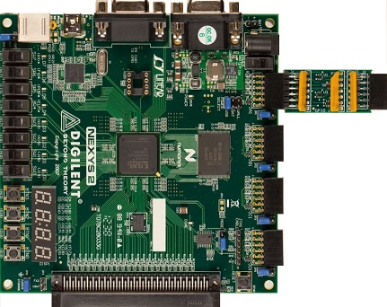
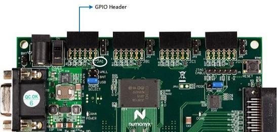
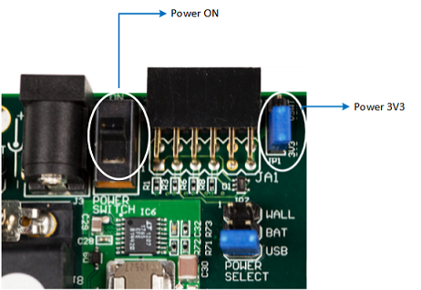
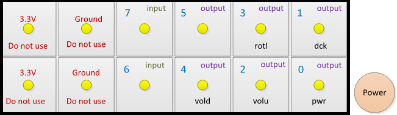
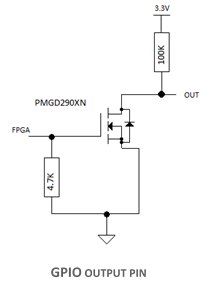
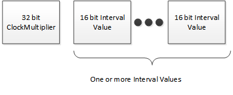
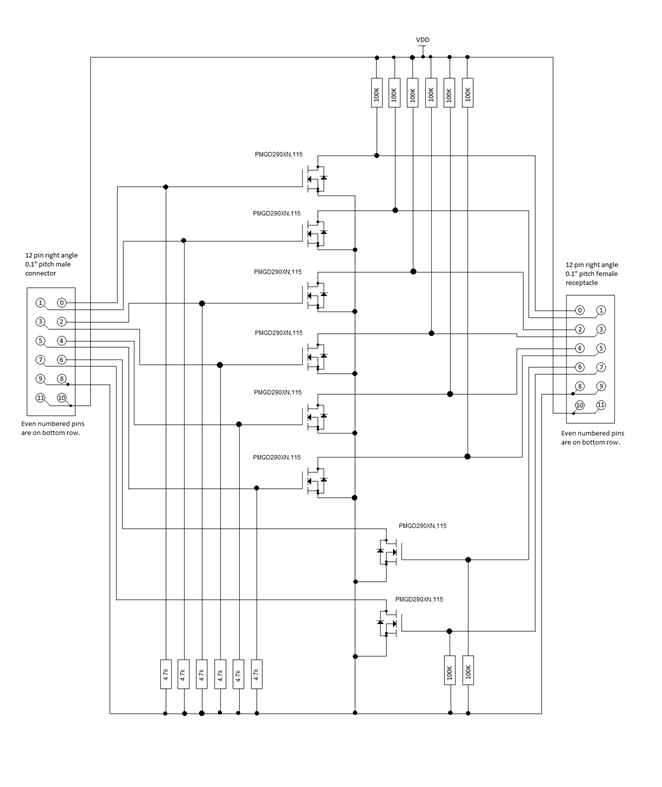

# GPIO tests in MITT


**Last updated**

-   January, 2015

**Applies to:**

-   Windows 8.1

GPIO test modules that are included in the MITT software package can be used to test the following buttons volume up, volume down, power, and rotation lock. You can use these tests to detect issues with the GPIO drivers and microcontrollers and determine if the systems response to a short or long push is the desired response. The lines attached to the buttons are physically pulled low by the MITT board.

## Before you begin...


-   Get a MITT board and a GPIO adapter board. See [Buy hardware for using MITT](https://msdn.microsoft.com/library/windows/hardware/dn919811).
-   [Download the MITT software package](https://msdn.microsoft.com/library/windows/hardware/dn919810). Install it on the system under test.
-   Install MITT firmware on the MITT board. See [Get started with MITT](https://msdn.microsoft.com/library/windows/hardware/dn919779).

## Hardware setup




<table>
<colgroup>
<col width="25%" />
<col width="25%" />
<col width="25%" />
<col width="25%" />
</colgroup>
<thead>
<tr class="header">
<th>Bus interface</th>
<th>Pin-out</th>
<th>ACPI and schematics</th>
<th>Connection solution</th>
</tr>
</thead>
<tbody>
<tr class="odd">
<td>GPIO buttons</td>
<td>Button and indicator lines: Volume up/down, Power, rotation lock, laptop/slate indicator, dock indicator</td>
<td>Schematics</td>
<td>Simple male block (on debug board)</td>
</tr>
<tr class="even">
<td>GPIO controller</td>
<td>GPIO controller pin-out and index used</td>
<td><ul>
<li>ACPI name of the GPIO controller used for pinout.</li>
<li>Interrupt triggering type in the controller (level or edge-based)</li>
<li>Description (including its PNP ID) of the device (if any) using the GPIO pin to disabling it during the test pass</li>
</ul></td>
<td>Simple male block (on debug board)</td>
</tr>
</tbody>
</table>

 

1.  On the MITT board, identify the GPIO connector. It uses the left most 12-pin header, labeled **JA1**, as shown in this image.

    

2.  Connect the GPIO adapter board to the **JA1** header.
3.  Connect the power jumper on the MITT board to 3V3.
4.  Push the slider up on the switch next to the GPIO header to power the board.

    

5.  Connect the volume up (volu), volume down (vold), dock/undock (dock), and slate/laptop (mode) lines from the GPIO adapter board (connected to the MITT) to the corresponding pins on the system under test.

    The 12-pin header is wired to individual GPIO lines as shown in this image.

    

    Schematic of an output pin on the GPIO board. The pin must be placed in parallel with a switch so that the FET can pull the line low, as if the switch is pushed.

    

6.  Optional. If you want to run the MITT GPIO tests on volume or indicators but not both, you can skip the related tests in GPIO automation by setting these registry entries. Each entry is a DWORD and the value of 1 enables the test; 0 disables it.
    -   Volume

        **HKEY\_CURRENT\_USER\\Software\\Microsoft\\MITT\\GPIO\\RunVolumeTest**

    -   Indicators

        **HKEY\_CURRENT\_USER\\Software\\Microsoft\\MITT\\GPIO\\RunIndicatorsTest**

## Run GPIO automation tests


To run GPIO tests manually by using WDTF, perform these tasks:

1.  Copy mittsimpleioaction.dll from the MITT software package to %ProgramFiles(x86)%\\Windows Kits\\8.1\\Testing\\Runtimes\\WDTF\\RunTime\\Actions\\SimpleIO
2.  Run **%ProgramFiles(x86)%\\Windows Kits\\8.1\\Testing\\Runtimes\\WDTF\\RunTime\\UnRegisterWDTF.exe**.
3.  Run **%ProgramFiles(x86)%\\Windows Kits\\8.1\\Testing\\Runtimes\\WDTF\\RunTime\\Actions ..\\RegisterWDTF.exe /nogacinstall**
4.  Start GPIO automation tests by running SimpleIO\_MITT\_ GPIO \_Sample.vbs included in the MITT software package.

## Example: Custom GPIO input injection


This example uses a file, Example.txt, which contains the sequence to press the power button for two seconds and then release the button. Here are the contents of the file:

``` syntax
‘h001E8480
‘b0000000000011111
‘b0000000100011111
‘b0000000000011111
```

Run these commands:

**Muttutil.exe -SetChannel 00**

**Muttutil.exe -WriteData 0000**

**Muttutill.exe –SetChannel 01**

**Muttutil.exe –WriteDataFromFile Example.txt**

**Muttutil.exe –SetChannel 00**

**Muttutil.exe –Writedata 0001**

-   **SetChannel** with 00 indicates that the control channel will receive data.
-   **WriteData** with 0000 pauses all test modules.
-   **SetChannel** option by specifying 01 to indicate that the GPIO channel will receive data.
-   **WriteDataFromFile** with the name of file to send the contents of the example input file to the GPIO module.
-   **SetChannel** with 00 to switch back to the control channel will receive the data.
-   **WriteData** with 0001 to the control channel to activate the GPIO sequencer. The GPIO module will begin sequencing.

## Generate input sequences


To generate a sequence, you need these values:

-   Interval Value

    The interval value is a bit mask that indicates which button is pressed during the interval. A zero value in the bit mask indicates the button is not pressed during the time interval. Here are the possible values bit index values:

    | Bit index in 16 bit value | Usage on the system under test                      |
    |---------------------------|-----------------------------------------------------|
    | 0                         | Power button enable ("1" enables the output)        |
    | 1                         | Dock indicator enable ("1" enables the output)      |
    | 2                         | Volume up enable ("1" enables the output)           |
    | 3                         | Rotation lock enable ("1" enables the output)       |
    | 4                         | Volume down enable ("1" enables the output)         |
    | 5                         | Slate/Laptop toggle enable ("1" enables the output) |
    | 6-7                       | Not used                                            |
    | 8                         | Power button value ("1" presses the switch)         |
    | 9                         | Dock indicator value ("1" presses the switch)       |
    | 10                        | Volume up value ("1" presses the switch)            |
    | 11                        | Rotation lock value ("1" presses the switch)        |
    | 12                        | Volume down value ("1" presses the switch)          |
    | 13                        | Slate/Laptop toggle value ("1" presses the switch)  |
    | 14-15                     | Not used                                            |

     

-   Clock Multiplier

    The clock multiplier is the hold time of the button (in one microsecond increments) for each data pattern before moving to the next data pattern. The GPIO test module holds the last data pattern until the circuit is reset.

    There is a tradeoff for using a small versus a large clock multiplier. Smaller values for the multiplier allows more precision, which requires you to create more lines in the data patterns to cover a timespan. You will need to decide the right balance between data packets needed and the clock multiplier value when you create the data pattern files.

    By using the preceding example you can create input injection files. To generate input sequences, you need the communication protocol. Data sent from the MITT board to the system under test is arranged in this pattern:

    

    There is no protocol-level error checking in the GPIO test circuit. If there is a protocol error, the MITT displays an unknown error.

## GPIO adapter schematic




## Related topics
[Testing with Multi Interface Test Tool (MITT)](https://msdn.microsoft.com/library/windows/hardware/dn919874)  


