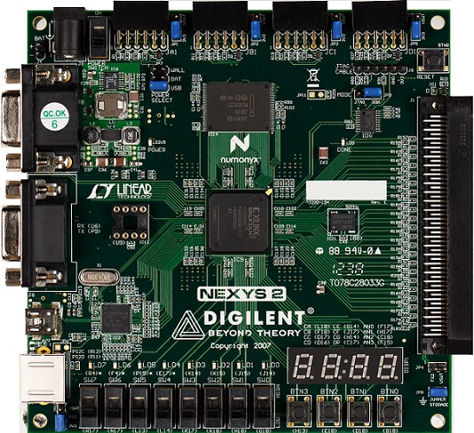
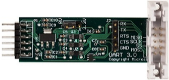
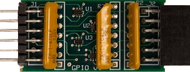
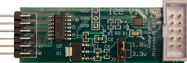
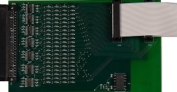
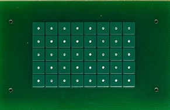

# Buy hardware for using MITT

To you use Multiple Interface Test Tool (MITT), order you need a MITT board and bus-specific adapter boards that plug into ports on the MITT board. The type of adapter board depends on the bus you want to test.

-   **MITT board**

    For example, FPGA development board (Nexys2). See [FPGA board from Digilent](http://www.digilentinc.com/nexys2).

    

-   **UART/SPI adapter board**

    See [UART/SPI adapter board from JJG Technologies.](http://www.jjgtechnologies.com/UART-SPI.md)

    

-   **GPIO adapter board**

    See [GPIO adapter board from JJG Technologies.](http://www.jjgtechnologies.com/GPIO.md)

    

-   **I2C adapter board**

    See [I2C adapter board from JJG Technologies.](http://www.jjgtechnologies.com/I2C.md)

    

-   **MCATT expansion board**

    See [MCATT expansion board from JJG Technologies.](http://www.jjgtechnologies.com/mcatt.md)

    

-   **Touch simulator pad**

    Touch simulator pad and a band cable to connect to the adapter. MCATT tool is able to stimulate a capacitive touch device by stimulating the precise points that come in contact with the board. The boards can be customized to have various sized and contact point resolutions.

    

    These pad is customized for the device to test.

    -   Specific size
    -   Number of touch points
    -   Distance between the touch points

## Related topics
[Testing with Multi Interface Test Tool (MITT)](https://msdn.microsoft.com/library/windows/hardware/dn919874)  

