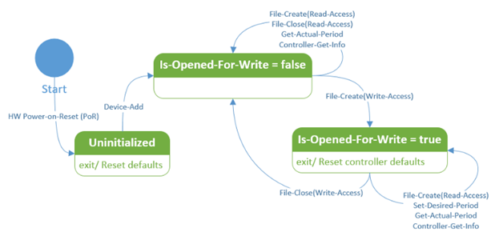
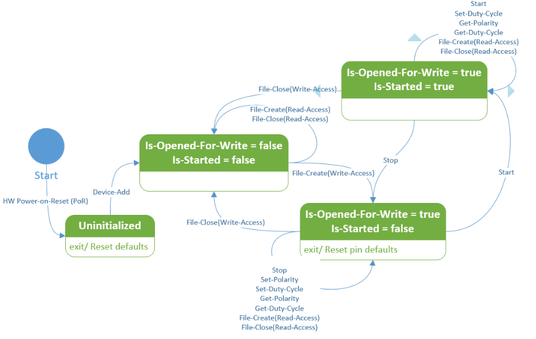

# PWM driver for an on-SoC PWM module
To provide access to a Pulse width modulation (PWM) controller that is part of the SoC and memory-mapped to the SoC address space, you need to writer a kernel-mode driver. The driver must register the device class interface of the PWM controller so that UWP apps can access the system exposed PWM devices through the PWM WinRT APIs defined in Windows.Devices.Pwm namespace. 

**Note**    If you have an add-on PWM module over I<sup>2</sup>C, SPI, or a UART controller, you can access the module from a UWP app by using the APIs defined in the [**Windows.Devices.Pwm**](https://docs.microsoft.com/uwp/api/windows.devices.pwm) and [**Windows.Devices.Pwm.Provider**](https://docs.microsoft.com/uwp/api/windows.devices.pwm.provider) namespace. 

A PWM device is abstracted into a single controller and one or more pins. Controlling either the controller or the pins is done through the PWM-defined IOCTLs. For example, an LCD display driver sends such requests to  the PWM driver to control the LCD backlight level. 

Multi-controller and multi-channel PWM signal generation with configurable period, polarity, and duty cycle which enables the following tasks: 

-   Drive a servo motor. 
-   Drive a load like LED or DC brushed motor. 
-   Generate an analog signal. 
-   Generate a precise clock. 

This topic describes, 

-   How to enable UWP access to the system-exposed PWM devices. 

-   How to handle PWM IOCTL requests sent by a Win32 application or a 3rd party kernel-mode driver.

**Intended audience**

-   OEMs and IHVs developing a system with an on-SoC PWM controller. 

**Last Updated**

-   August 2017

**Windows version**

-   Windows 10 version

**Important APIs**

-   [PWM IOCTLs](https://msdn.microsoft.com/library/windows/desktop/mt826481)

## About PWM
PWM describes the basic technique for generating a rectangular pulse wave with modulated pulse width resulting in the variation of the average value of the waveform.  

A PWM waveform can be categorized by 2 parameters: waveform period (T) and duty cycle. Waveform frequency (f) is  the reciprocal of the waveform period f=1/T. Duty cycle describes the proportion of the 'on' or 'Active' time with respect to the regular interval or 'Period' of time; a low duty cycle corresponds to an average of low output power, because the power is off for most of the time. Duty cycle is expressed in percent where 100% being fully on, 0% being fully off, 50% being 'Active' 50% of the time.


## Accessing the system-exposed PWM controller and pins

The PWM driver must register  
GUID_DEVINTERFACE_PWM_CONTROLLER as the device interface GUID for exposing and accessing PWM devices. 

```cpp
// {60824B4C-EED1-4C9C-B49C-1B961461A819} 

DEFINE_GUID(GUID_DEVINTERFACE_PWM_CONTROLLER, 0x60824b4c, 0xeed1, 0x4c9c, 0xb4, 0x9c, 0x1b, 0x96, 0x14, 0x61, 0xa8, 0x19); 

#define GUID_DEVINTERFACE_PWM_CONTROLLER_WSZ L"{60824B4C-EED1-4C9C-B49C-1B961461A819}" 
```

To register the device inteface GUID, the driver must call WdfDeviceCreateDeviceInterface in the driver's implementation of the EVT_WDF_DRIVER_DEVICE_ADD callback function. 
After registration, the system assigns a symbolic link to the controller and the pins.

An application or another driver can control either the controller or the pins through the PWM defined IOCTLs. Before sending the IOCTLs,the sender application or driver must open a file handle to the controller and the pin by specifying its symbolic link. This requires the driver to register for file create and close events. See (link) 


Here is an example of the symbolic path for the controller:
```cpp
\??\ACPI#FSCL000E#1#{60824b4c-eed1-4c9c-b49c-1b961461a819}  
```
Similarly, the format of the pins is as follows:
The format of the path is as follows:

```cpp
<DeviceInterfaceSymbolicLinkName>\<PinNumber>
```
where <PinNumber> is the 0-based index of the pin to open. 

Here is an example of the symbolic path for pins:
```cpp
\??\ACPI#FSCL000E#1#{60824b4c-eed1-4c9c-b49c-1b961461a819}\0 ; Opens pin 0 

\??\ACPI#FSCL000E#1#{60824b4c-eed1-4c9c-b49c-1b961461a819}\0001 ; Opens pin 1 with the leading 0s have no effect.
```

To open the file handle, the application must call the Configuration Manager APIs (CM_Get_Device_Interface_*). 

After the file handle is opened, the application can send these requests by calling DeviceIoControl function. See the PWM section.


The driver should use the provided PWM support routine PwmParsePinPath to parse and validate pin paths and extract the pin number. 

## Setting device interface properties

To use PWM WinRT APIs from UWP apps, these [device interface properties](https://msdn.microsoft.com/library/windows/hardware/ff541409(v=vs.85).aspx) must be set.

-   [DEVPKEY_DeviceInterface_Restricted](https://msdn.microsoft.com/library/windows/hardware/hh406291(v=vs.85).aspx) 

    As per the current UWP device access model, setting Restricted device interface property to FALSE is required to give UWP apps access to the PWM device interface.   

-   DEVPKEY_DeviceInterface_SchematicName (link???)

    Assigning a schematic name to the PWM device interface of statically connected PWM devices is required for using the PwmController.GetDeviceSelector(FriendlyName) factory method. The schematic name is the name given to the PWM device in the system design schematics e.g (PWM0, PWM_1, et..). Schematic names are assumed to be unique across the system, but that is not enforced. At least, there shouldn’t be 2 PWM devices having the same schematic name, otherwise the WinRT PWM PwmController.GetDeviceSelector(FriendlyName) behavior will be non-deterministic. 

The properties can be set in one of two ways:

1. Using the INF file for the PWM driver

   Use the **AddProperty** directive to set device properties. The INF file should be allow setting different values for the same property on one or subset of the PWM device instances. Here is an example of setting DEVPKEY_DeviceInterface_Restricted.
    ```cpp
    ;***************************************** 
    ; Device interface installation 
    ;***************************************** 

    [PWM_Device.NT.Interfaces] 
    AddInterface={60824B4C-EED1-4C9C-B49C-1B961461A819},,PWM_Interface 

    [PWM_Interface] 
    AddProperty=PWM_Interface_AddProperty 

    ; Set DEVPKEY_DeviceInterface_Restricted property to false to allow UWP access 
    ; to the device interface without the need to be bound with device metadata. 
    ; If Restricted property is set to true, then only applications which are bound 
    ; with device metadata would be allowed access to the device interface. 

    [PWM_Interface_AddProperty] 
    {026e516e-b814-414b-83cd-856d6fef4822},6,0x11,,0 
    ```
    Not all designs have the same policy for exposing the PWM device to UWP. For example, the policy might be to allow UWP access to a subset of the PWM device instances. Exposing a subset of the PWM devices or assigning a different property value to one or a subset of the PWM device instances requires having different Hardware ID for each PWM device instance and match INF sections selectively based on the policy.

    Consider a SoC-based design where there are four identical PWM device instances (IP Blocks) named PWM0,…,PWM3 where their ACPI assigned Hardware ID (_HID) is FSCL00E0 and their Unique ID (_UID) is 0,…,3. Exposing all the PWM devices to UWP will require the INF sections that sets the DEVPKEY_DeviceInterface_Restricted to match on the Hardware ID ACPI\FSCL00E0. 

    This way of setting properties does not require any change in the driver code. This is an easier option as servicing an INF file is easier than a driver binary. The trade off is that this approach requires a tailored INF file to each design. 


2.  Programmatically in the PWM driver 

    A PWM driver can call IoSetDeviceInterfacePropertyData to set device interface properties in their EVT_WDF_DRIVER_DEVICE_ADD implementation after it creates and publishes the PWM device interface. The driver is responsible for deciding the value to assign and the device property. That information is usually stored in the system ACPI for SoC-based designs. The value of each device interface property can be specified in each ACPI device node _DSD method as Device Properties. The driver must query the _DSD from ACPI, parse the Device Properties data, extract the value of each property, and assign it device interface. 

    Programmatically setting the properties makes the driver and its INF file portable across designs and hence BSPs where the only change would be in the ACPI DSDT defining each PWM device node. However, reading and parsing ACPI binary blocks is a tedious and requires a lot of code which can be prone to errors and vulnerabilities resulting in a bigger error surface. 

## Handling file open/close events

A PWM driver needs to register for file create and close events by implementing EVT_WDF_DEVICE_FILE_CREATE and EVT_WDF_FILE_CLEANUP/EVT_WDF_FILE_CLOSE callback functions. In the implementation, the driver must perform these tasks:

1.  Determine whether the create request is for a controller or a pin. 
2.  If the request is for a pin, the driver must parse and validate the pin path for create pin requests and make sure that the requested pin number is within controller bounds. 
3.  Grant or deny access to controller and pins create requests. 
4.  Maintain controllers and pins state integrity per a well-defined state machine. 

In the preceding set of tasks, the second task of validation can be performed in EVT_WDF_DEVICE_FILE_CREATE, as follows:

1. If the filename associated with the request file object is null, then complete the request with STATUS_INVALID_DEVICE_REQUEST. 

2. If the filename associated with the request file object is an empty string, then this is a controller create request, otherwise it is a pin create request. 

3. If this is a pin create request, then: 

    1. Parse the pin path based on the format \<DecimalName> and extract the pin number by calling PwmParsePinPath. 

    2. If parsing and validating the pin path failed, complete the request with STATUS_NO_SUCH_FILE. 

    3. If the pin number is greater than or equal the controller pin count, then complete the request with STATUS_NO_SUCH_FILE. Note that pin number is a zero-based index. 

    4. Else, continue processing EVT_WDF_DEVICE_FILE_CREATE. 

Here is a sample code the implements the previously mentioned validation steps for an EVT_WDF_DEVICE_FILE_CREATE handler: 

```cpp
EVT_WDF_DEVICE_FILE_CREATE PwmEvtDeviceFileCreate;

VOID 

PwmEvtDeviceFileCreate ( 
    WDFDEVICE WdfDevice, 
    WDFREQUEST WdfRequest, 
    WDFFILEOBJECT WdfFileObject 
    ) 
{ 

    UNICODE_STRING* filenamePtr = WdfFileObjectGetFileName(WdfFileObject); 
    IMXPWM_DEVICE_CONTEXT* deviceContextPtr = PwmGetDeviceContext(WdfDevice); 
    NTSTATUS status; 
    ULONG pinNumber; 

    // 
    // Parse and validate the filename associated with the file object 
    // 

    bool isPinInterface; 

    if (filenamePtr == nullptr) { 

        WdfRequestComplete(WdfRequest, STATUS_INVALID_DEVICE_REQUEST); 

        return; 

    } else if (filenamePtr->Length > 0) { 

        // 
        // A non-empty filename means to open a pin under the controller namespace 
        // 

        status = PwmParsePinPath(filenamePtr, &pinNumber); 

        if (!NT_SUCCESS(status)) { 

            WdfRequestComplete(WdfRequest, status); 

            return; 

        } 


        if (pinNumber >= deviceContextPtr->ControllerInfo.PinCount) { 

            WdfRequestComplete(WdfRequest, STATUS_NO_SUCH_FILE); 

            return; 

        } 


        isPinInterface = true; 

    } else { 

        // 
        // An empty filename means that the create is against the root controller 
        // 

        isPinInterface = false; 
    } 

    // 
    // Continue request processing here 
    // 
} 
```
### Controller and pin Sharing 

The sharing model for controller and pins follows the multiple readers, single writer pattern. A controller/pin can be opened for read by multiple callers, but only one caller can open that controller/pin for write at a time. 

That model can be implemented by using a combination of Desired Access and Share Access flags when opening a file handle. The DDI sharing model opts for a simpler sharing semantics where only Desired Access specification is used to control access. The Share Access specification does not play any role in the sharing model and is not be honored if specified when opening a controller or pin.  

In EVT_WDF_DEVICE_FILE_CREATE, the create request Desired Access and Share Access should be extracted and validated based on the controller/pin state or as follows: 

1. If  Share Access is not 0, then deny access, and complete request with STATUS_SHARING_VIOLATION. 

2. If Desired Access is for read-only, then grant access and continue processing EVT_WDF_DEVICE_FILE_CREATE. 

3. If Desired Access is for write, then: 

If the controller/pin is already opened for write, then deny access, and complete the request with STATUS_SHARING_VIOLATION, else grant access, mark the controller or pin as opened for write and continue processing EVT_WDF_DEVICE_FILE_CREATE. 

Here is an example shows how to extract Desired Access and Share Access from a create request: 

```cpp
void 
PwmCreateRequestGetAccess( 
    _In_ WDFREQUEST WdfRequest, 
    _Out_ ACCESS_MASK* DesiredAccessPtr, 
    _Out_ ULONG* ShareAccessPtr 
    ) 
{ 

    NT_ASSERT(ARGUMENT_PRESENT(DesiredAccessPtr)); 

    NT_ASSERT(ARGUMENT_PRESENT(ShareAccessPtr)); 


    WDF_REQUEST_PARAMETERS wdfRequestParameters; 

    WDF_REQUEST_PARAMETERS_INIT(&wdfRequestParameters); 

    WdfRequestGetParameters(WdfRequest, &wdfRequestParameters); 


    NT_ASSERTMSG( 

        "Expected create request", 
        wdfRequestParameters.Type == WdfRequestTypeCreate); 


    *DesiredAccessPtr = 
        wdfRequestParameters.Parameters.Create.SecurityContext->DesiredAccess; 

    *ShareAccessPtr = wdfRequestParameters.Parameters.Create.ShareAccess; 
} 
```

### Controller and pin independence

Controller and pin have parent-child relatioship. In order to open a pin, you must first open its parent controller. Another way is to look at pins is as independent entities where its parent controller provides only one service to the pin which is setting the global PWM period for all pins contained on that controller. 

Here are some example scenarios: 

- Single-process access: 

    -   Process A can open the pin, set its duty cycle, start it using the controller default period and later open the controller and set its period on demand. It may never need to open the controller if the default period is OK for the application. 

    -   A process can have multiple threads where each one controlling a different pin under the same controller. 

- Multi-process access: 

    -   A command-line utility can open the controller with read-only access for the purposes to showing information to the console. At the same time a background UWP task can open the controller for write and is controlling some LED with a single pin. 

    -   A kernel-mode display driver controlling the LCD backlight through Pin0 while holding the controller for write and locking the PWM period. At the same time, a Win32 service uses the PWM period set by the display driver and is using Pin1 to dim some LED to communicate some status to the user. 

Note that there are some important implications to opening and closing a controller independently from its pins. For more information, see the section of state machines. 

## Controller and pin state machines

**Controller state definition**

|State feature|Default value|Description|
|---|---|--|
|Is-Opened-For-Write|False| False indicates that the controller is either closed or is opened for read; True indicates that it is opened for write.|
|Desired-Period| MinimumPeriod| |



The controller state machine below is centered around the Is-Opened-For-Write state only. The desired period value is also left out because it does not affect the kind of operation that can be done on the controller. Note that whenever a controller that is opened for write gets closed by the caller that opened it for write, the controller get reset to its defaults (default desired period).

**Pin state defintion**


|    State feature    | Default value |                                                   Description                                                    |
|---------------------|---------------|------------------------------------------------------------------------------------------------------------------|
| Is-Opened-For-Write |     False     | False indicates that the pin is either closed or is opened for read; True indicates that it is opened for write. |
|  Active-Duty-Cycle  |       0       |                                                                                                                  |
|     Is-Started      |     False     |                                 False indicates stopped; True indicates started.                                 |



The pin state machine is centered around the combination of the 2 states Is-Opened-For-Write and Is-Started. Other pin states like polarity and active duty cycles are left out because their values don’t affect the kind of operations that can be performed on the pin. Note that whenever a pin that is opened for write get closed by the caller that opened it for write, the pin get rest to its defaults (stopped, default polarity, and active duty cycle). Also note that Set-Polarity transition on a state with Is-Started = true is left out because it is invalid in that state.

Any transition that is not mentioned for a given state implies that such transition is either invalid or not-possible and the corresponding request should be completed with the appropriate error status. 

### Implementation considerations for state transitions

- In EVT_WDF_DEVICE_FILE_CREATE, the driver should grant or deny access based on the create request desired access and the controller or pin Is-Opened-For-Write state as follows:

    If the request has write desired access and the controller/pin is already opened for write, then complete the request with STATUS_SHARING_VIOLATION, else mark the controller/pin as opened for write (Is-Opened-For-Write = true), grant access and continue processing.

    This example implements the previously mentioned access validation steps for an EVT_WDF_DEVICE_FILE_CREATE handler where the necessary locking logic to handle concurrent file create requests is omitted: 
    ```cpp
    //
    // Verify request desired access
    //

    const bool hasWriteAccess = desiredAccess & FILE_WRITE_DATA;

    if (isPinInterface) {
        PWM_PIN_STATE* pinPtr = deviceContextPtr->Pins + pinNumber;
        if (hasWriteAccess) {
            if (pinPtr->IsOpenForReadWrite) {
                PWM_LOG_TRACE("Pin%lu access denied.", pinNumber);
                WdfRequestComplete(WdfRequest, STATUS_SHARING_VIOLATION);
                return;
            }
            pinPtr->IsOpenForReadWrite = true;
        }
        PWM_LOG_TRACE(
            "Pin%lu Opened. (IsOpenForReadWrite = %lu)",
            pinNumber,
            (pinPtr->IsOpenForReadWrite ? 1 : 0));

    } else {
        if (hasWriteAccess) {
            if (deviceContextPtr->IsControllerOpenForReadWrite) {
                PWM_LOG_TRACE("Controller access denied.");
                WdfRequestComplete(WdfRequest, STATUS_SHARING_VIOLATION);
                return;
            }
            deviceContextPtr->IsControllerOpenForReadWrite = true;
        }
        PWM_LOG_TRACE(
            "Controller Opened. (IsControllerOpenForReadWrite = %lu)",
            (deviceContextPtr->IsControllerOpenForReadWrite ? 1 : 0));
    }

    //
    // Allocate and fill a file object context
    //
    IMXPWM_FILE_OBJECT_CONTEXT* fileObjectContextPtr;
    {
        WDF_OBJECT_ATTRIBUTES wdfObjectAttributes;
        WDF_OBJECT_ATTRIBUTES_INIT_CONTEXT_TYPE(
            &wdfObjectAttributes,
            IMXPWM_FILE_OBJECT_CONTEXT);

        void* contextPtr;
        NTSTATUS status = WdfObjectAllocateContext(
                WdfFileObject,
                &wdfObjectAttributes,
                &contextPtr);
        if (!NT_SUCCESS(status)) {
            IMXPWM_LOG_ERROR(
                "WdfObjectAllocateContext(...) failed. (status = %!STATUS!)",
                status);
            WdfRequestComplete(WdfRequest, status);
            return;
        }

        fileObjectContextPtr =
            static_cast<IMXPWM_FILE_OBJECT_CONTEXT*>(contextPtr);

        NT_ASSERT(fileObjectContextPtr != nullptr);
        fileObjectContextPtr->IsPinInterface = isPinInterface;
        fileObjectContextPtr->IsOpenForWrite = hasWriteAccess;
        fileObjectContextPtr->PinNumber = pinNumber;
    }
    ```

- In EVT_WDF_FILE_CLOSE/ EVT_WDF_FILE_CLEANUP, the driver should maintain the controller/pin state integrity. 

  If the file object belongs to a controller/pin which opened that controller/pin for write, then reset the controller/pin to the default state and unmark that controller/pin from being opened for write (Is-Opened-For-Write = false).

  This example implements the previously mentioned access validation steps for an EVT_WDF_DEVICE_FILE_CLOSE handler where the necessary locking logic to handle concurrent file close requests is omitted.
  ```cpp
  EVT_WDF_DEVICE_FILE_CLOSE PwmEvtFileClose;

  VOID
  PwmEvtFileClose (
      WDFFILEOBJECT WdfFileObject
      )
  {
      WDFDEVICE wdfDevice = WdfFileObjectGetDevice(WdfFileObject);
      PWM_DEVICE_CONTEXT* deviceContextPtr = PwmGetDeviceContext(wdfDevice);
      PWM_FILE_OBJECT_CONTEXT* fileObjectContextPtr = PwmGetFileObjectContext(WdfFileObject);

      if (fileObjectContextPtr->IsPinInterface) {
          if (fileObjectContextPtr->IsOpenForReadWrite) {
              const ULONG pinNumber = fileObjectContextPtr->PinNumber;

              NTSTATUS status = PwmResetPinDefaults(deviceContextPtr, pinNumber);
              if (!NT_SUCCESS(status)) {
                  PWM_LOG_ERROR(
                      "PwmResetPinDefaults(...) failed. "
                      "(pinNumber = %lu, status = %!STATUS!)",
                      pinNumber,
                      status);
                  //
                  // HW Error Recovery
                  //
              }

              NT_ASSERT(deviceContextPtr->Pins[pinNumber].IsOpenForReadWrite);
              deviceContextPtr->Pins[pinNumber].IsOpenForReadWrite = false;
          }

          PWM_LOG_TRACE("Pin%lu Closed.", fileObjectContextPtr->PinNumber);

      } else {
          if (fileObjectContextPtr->IsOpenForReadWrite) {
              NTSTATUS status = PwmResetControllerDefaults(deviceContextPtr);
              if (!NT_SUCCESS(status)) {
                  IMXPWM_LOG_ERROR(
                      "PwmResetControllerDefaults(...) failed. (status = %!STATUS!)",
                      status);
                  //
                  // HW Error Recovery
                  //  
              }

              NT_ASSERT(deviceContextPtr->IsControllerOpenForReadWrite);
              deviceContextPtr->IsControllerOpenForReadWrite = false;
          }

          PWM_LOG_TRACE("Controller Closed.");
      }
  }
  ```
  ## PWM IOCTL requests

PWM IOCTL requests are sent by an application or another driver and are targeted for a controller or a specific pin.

**Controller IOCTLs**

-    [**IOCTL_PWM_CONTROLLER_GET_ACTUAL_PERIOD**](https://msdn.microsoft.com/library/windows/desktop/mt826475) 
-    [**IOCTL_PWM_CONTROLLER_GET_INFO**](https://msdn.microsoft.com/library/windows/desktop/mt826476) 
-    [**IOCTL_PWM_CONTROLLER_SET_DESIRED_PERIOD**](https://msdn.microsoft.com/library/windows/desktop/mt826478)


**Pin IOCTLs**

-    [**IOCTL_PWM_PIN_GET_ACTIVE_DUTY_CYCLE_PERCENTAGE**](https://msdn.microsoft.com/library/windows/desktop/mt843915)
-    [**IOCTL_PWM_PIN_SET_ACTIVE_DUTY_CYCLE_PERCENTAGE**](https://msdn.microsoft.com/library/windows/desktop/mt843918)
-    [**IOCTL_PWM_PIN_GET_POLARITY**](https://msdn.microsoft.com/library/windows/desktop/mt843916)
-    [**IOCTL_PWM_PIN_SET_POLARITY**](https://msdn.microsoft.com/library/windows/desktop/mt843919)
-    [**IOCTL_PWM_PIN_START**](https://msdn.microsoft.com/library/windows/desktop/mt843920)
-    [**IOCTL_PWM_PIN_STOP**](https://msdn.microsoft.com/library/windows/desktop/mt843921)
-    [**IOCTL_PWM_PIN_IS_STARTED**](https://msdn.microsoft.com/library/windows/desktop/mt843917)    

For each IOCTL request, the PWM drivr must verify the following: 

1. The requested operation (IOCTL code) is valid for the request associated file object. 

2. Request input and output buffers and make sure they are at least of the minimum expected size. 

3. The validity of the requested operation in the current controller/pin state. 

4. The validity of the individual input parameters. For example: a desired period of zero is an invalid parameter for IOCTL_PWM_CONTROLLER_SET_DESIRED_PERIOD. 

### IOCTL completion status codes 

The PWM driver must complete the IOCTL request with the appropriate status code. Here are the common completion status codes. In general, an IOCTL that sets a property with value that is already set should always succeed. Foe example, setting exact same period that is already set, stopping a pin that is already stopped, setting polarity that is already set, and so on. 

**STATUS_NOT_SUPPORTED** 

The requested IOCTL operation is not implemented or supported. For example, some controllers may not support setting the output signal polarity, in such case IOCTL_PWM_PIN_SET_POLARITY should be implemented but fail with STATUS_NOT_SUPPORTED for the non-default polarity. 

**STATUS_INVALID_DEVICE_REQUEST** 

The IOCTL request was sent to the wrong target. For example, a controller IOCTL request was sent using a pin file handle. 

**STATUS_BUFFER_TOO_SMALL** 

The input or output buffer size is less than the minimum required buffer size for processing the request. A WDF driver that uses WdfRequestRetrieveInputBuffer or WdfRequestRetrieveOutputBuffer to retrieve and validate the input and output buffers can return their corresponding error status as is. All IOCTLs with input and/or output buffers defined for them have a corresponding struct that describes that buffer, where the input and output struct names have *INPUT and _OUTPUT postfix respectively. The input buffer minimum size is sizeof(PWM*<em>*INPUT) while the output buffer minimum size is sizeof(PWM*</em>_OUTPUT). 

IOCTL code | Description|
---|---|
|IOCTL_PWM_CONTROLLER_GET_ACTUAL_PERIOD | Retrieves the effective output signal period of the Pulse Width Modulation (PWM) controller as it would be measured on its output channels. Returns a PWM_CONTROLLER_GET_ACTUAL_PERIOD_OUTPUT value. Irp->IoStatus.Status is set to one of the values in the following list. <ul><li>STATUS_SUCCESS</li><li>STATUS_NOT_SUPPORTED</li><li>STATUS_INVALID_DEVICE_REQUEST<li>STATUS_BUFFER_TOO_SMALL</li></ul>|
| IOCTL_PWM_CONTROLLER_GET_INFO| Retrieves information about a Pulse Width Modulation (PWM) controller. This information does not change after the controller is initialized. <p>The caller should pass an output buffer that has exactly the size of the PWM_CONTROLLER_INFO struct. The driver infers the version of the structure from the request output buffer size. </p><p>If the buffer size is less than the size of the lowest structure version, the request is completed by using a IOCTL completion status of STATUS_BUFFER_TOO_SMALL. Otherwise, the driver assumes the highest structure version that can fit into the supplied output buffer and completes the request successfully. </p><p>A newer PWM_CONTROLLER_INFO version has a byte size that is greater than that of the previous version</p>Irp->IoStatus.Status is set to one of the values in the following list. <ul><li>STATUS_SUCCESS</li><li>STATUS_NOT_SUPPORTED</li><li>STATUS_INVALID_DEVICE_REQUEST<li>STATUS_BUFFER_TOO_SMALL</li></ul>|
|IOCTL_PWM_CONTROLLER_SET_DESIRED_PERIOD|Sets the output signal period of a Pulse Width Modulation (PWM) controller to a suggested value. <p>The PWM controller tries to set the period that is as close as possible to the requested value based on its capabilities. The effective period is returned as an IOCTL output. It can later be retrieved by using IOCTL_PWM_CONTROLLER_GET_ACTUAL_PERIOD.</p><p>The desired period must greater than zero (0) and in the controller supported range of periods. That is, it must be in the range of MinimumPeriod and MaximumPeriod, inclusive, which can be retrieved by using IOCTL_PWM_CONTROLLER_GET_INFO. </p>Irp->IoStatus.Status is set to one of the values in the following list. <ul><li>STATUS_SUCCESS</li><li>STATUS_NOT_SUPPORTED</li><li>STATUS_INVALID_DEVICE_REQUEST<li>STATUS_INVALID_PARAMETER</li><li>STATUS_BUFFER_TOO_SMALL</li></ul>|
|IOCTL_PWM_PIN_GET_ACTIVE_DUTY_CYCLE_PERCENTAGE| Retrieves the current duty cycle percentage for a pin or channel. The control code returns the percentage as a PWM_PIN_GET_ACTIVE_DUTY_CYCLE_PERCENTAGE_OUTPUT structure.<p>Irp->IoStatus.Status is set to one of the values in the following list.</p><ul><li>STATUS_SUCCESS</li><li>STATUS_NOT_SUPPORTED</li><li>STATUS_INVALID_DEVICE_REQUEST<li>STATUS_BUFFER_TOO_SMALL</li></ul>|
|IOCTL_PWM_PIN_SET_ACTIVE_DUTY_CYCLE_PERCENTAGE|Set a desired duty cycle percentage value for the controller pin or channel. The control code specifies the percentage as a PWM_PIN_SET_ACTIVE_DUTY_CYCLE_PERCENTAGE_INPUT structure.<p>Irp->IoStatus.Status is set to one of the values in the following list.</p> <ul><li>STATUS_SUCCESS</li><li>STATUS_NOT_SUPPORTED</li><li>STATUS_INVALID_DEVICE_REQUEST<li>STATUS_BUFFER_TOO_SMALL</li></ul>|
|IOCTL_PWM_PIN_GET_POLARITY| Retrieves the current signal polarity of the pin or channel. The control code gets the signal polarity as a PWM_PIN_GET_POLARITY_OUTPUT structure. The signal polarity is either Active High or Active Low, as defined in the PWM_POLARITY enumeration.<p>Irp->IoStatus.Status is set to one of the values in the following list.</p> <ul><li>STATUS_SUCCESS</li><li>STATUS_NOT_SUPPORTED</li><li>STATUS_INVALID_DEVICE_REQUEST<li>STATUS_BUFFER_TOO_SMALL</li></ul>|
|IOCTL_PWM_PIN_SET_POLARITY| Sets the signal polarity of the pin or channel. The control code sets the signal polarity based on a PWM_PIN_SET_POLARITY_INPUT structure. The signal polarity is either Active High or Active Low, as defined in the PWM_POLARITY enum. <p>Changing polarity is only allowed when the pin is stopped. You can tell whether the pin is stopped by using the IOCTL_PWM_PIN_IS_STARTED control code. If the pin is stopped and the requested polarity is different from the current pin polarity, the request is completed with a STATUS_INVALID_DEVICE_STATE value.</p><p>Changing polarity while a pin is started can lead to glitches on some Pulse Width Modulation (PWM) controllers. If you want to change polarity, stop the pin first, change the polarity, and then start the pin.</p><p>Irp->IoStatus.Status is set to one of the values in the following list.</p><ul><li>STATUS_SUCCESS</li><li>STATUS_NOT_SUPPORTED</li><li>STATUS_INVALID_DEVICE_REQUEST<li>STATUS_INVALID_PARAMETER</li><li>STATUS_BUFFER_TOO_SMALL</li></ul>|
|IOCTL_PWM_PIN_START|Starts generation of Pulse Width Modulation (PWM) signal on a pin or channel. To check whether a pin is started, use IOCTL_PWM_PIN_IS_STARTED.<p>Issuing this IOCTL on a pin or channel that is already started has no effect, but does succeed.</p><p>Irp->IoStatus.Status is set to one of the values in the following list.</p>><ul><li>STATUS_SUCCESS</li><li>STATUS_NOT_SUPPORTED</li><li>STATUS_INVALID_DEVICE_REQUEST<li>STATUS_BUFFER_TOO_SMALL</li></ul>|
|IOCTL_PWM_PIN_STOP|Stops generation of Pulse Width Modulation (PWM) signal on a pin or channel. To check whether a pin is started, use IOCTL_PWM_PIN_IS_STARTED.<p>Issuing this IOCTL on a pin or channel that is already stopped has no effect, but does succeed.</p><p>Irp->IoStatus.Status is set to one of the values in the following list.</p><ul><li>STATUS_SUCCESS</li><li>STATUS_NOT_SUPPORTED</li><li>STATUS_INVALID_DEVICE_REQUEST<li>STATUS_BUFFER_TOO_SMALL</li></ul>|
|IOCTL_PWM_PIN_IS_STARTED|Retrieves the state of signal generation for a pin or channel. Each pin has a state of started or stopped as a PWM_PIN_IS_STARTED_OUTPUT structure. The started state has a Boolean value of true. The stopped state is false. <p>By default, a pin is stopped when opened and returns to stopped state when closed it is closed or released.</p><p>Irp->IoStatus.Status is set to one of the values in the following list.</p><ul><li>STATUS_SUCCESS</li><li>STATUS_NOT_SUPPORTED</li><li>STATUS_INVALID_DEVICE_REQUEST<li>STATUS_BUFFER_TOO_SMALL</li></ul>|


