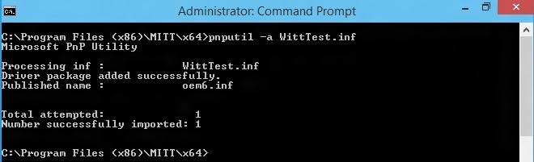

# I2C controller tests in MITT


**Last updated**

-   January, 2015

**Applies to:**

-   Windows 8.1

I²C test modules that are included in the MITT software package can be used to test data transfers for an I²C controller and its driver. The MITT board acts as a client device connected to the I²C bus.

## Before you begin...


-   Get a MITT board and an I²C adapter board. See [Buy hardware for using MITT](https://msdn.microsoft.com/library/windows/hardware/dn919811).
-   [Download the MITT software package](https://msdn.microsoft.com/library/windows/hardware/dn919810). Install it on the system under test.
-   Install MITT firmware on the MITT board. See [Get started with MITT](https://msdn.microsoft.com/library/windows/hardware/dn919779).

## Hardware setup


| Bus interface | Pin-out                             | ACPI and schematics | Connection solution                |
|---------------|-------------------------------------|---------------------|------------------------------------|
| I²C           | All lines needed (SCL, SDA and GND) | ACPI table          | Simple male block (on debug board) |


1.  Connect the I²C adapter to **JB1** on the MITT board.

    

2.  Use the jumper on to the I²C header (above **JB1**) to select the correct I²C voltage between 3.3V and 1.8V. In this image 1.8V is selected.
3.  Connect SCL, SDA, and GND pins on the adapter board to the exposed SCL, SDA, and GND lines on the system under test.

    

4.  Use the jumper on the I2C adapter board to select the correct I2C voltage between 3.3V and 1.8V. In this image the 1.8V is selected.
5.  On the MITT board, set switch **SW0** to the high position. This position enables the default mode for I²C when the MITT is powered.

    

6.  Use the **RESET** button to power cycle the MITT board. If the wire connections to the I²C controller are correct, **LD7** (SDA indicator) and **LD6** (SCL indicator) turn on. If either LED does not turn on, there is a wiring issue because either SDA or, SCL, or both are pulled low.

## Test driver and ACPI configuration


Perform these steps on the system under test that has the I²C controller:

1.  Install WITTTest driver included in the MITT software package by running this command:

    **pnputil –a witttest.inf**

    

    **Note**  PnpUtil.exe is included in %SystemRoot%\\System32.


2.  Modify the system ACPI and include this ASL table. You can use the [Microsoft ASL compiler](https://msdn.microsoft.com/library/windows/hardware/dn551195).

    **Note**  Change "\\\\\_SB\_.I2C2" to ACPI entry name for the I²C controller to test.


``` syntax
//TP1 100Khz Standard Target Device(TP1) 
Device(TP1) {
    Name (_HID, "STK0001") 
    Name (_CID, "WITTTest") 
    Method(_CRS, 0x0, NotSerialized)
    {
      Name (RBUF, ResourceTemplate ()
      {
        I2CSerialBus ( 0x11, ControllerInitiated, 100000,AddressingMode7Bit, "\\_SB_.I2C2",,, , )
      })
      Return(RBUF)
    }
}

//TP2 400Khz  Fast Target
Device(TP2) {
    Name (_HID, "STK0002") 
    Name (_CID, "WITTTest") 
    Method(_CRS, 0x0, NotSerialized)
    {
      Name (RBUF, ResourceTemplate ()
      {
        I2CSerialBus ( 0x12, ControllerInitiated, 400000,AddressingMode7Bit, "\\_SB_.I2C2",,, , )
      })
      Return(RBUF)
    }
}

//TP3 1 Mhz  FastPlus Target
Device(TP3) {
    Name (_HID, "STK0003") 
    Name (_CID, "WITTTest") 
    Method(_CRS, 0x0, NotSerialized)
    {
      Name (RBUF, ResourceTemplate ()
      {
        I2CSerialBus ( 0x13, ControllerInitiated, 1000000,AddressingMode7Bit, "\\_SB_.I2C2",,, , )
      })
      Return(RBUF)
    }
  }
}

//TP4 1.4 Mhz High Speed, optional target
Device(TP4) {
    Name (_HID, "STK0004") 
    Name (_CID, "WITTTest") 
    Method(_CRS, 0x0, NotSerialized)
    {
      Name (RBUF, ResourceTemplate ()
      {
        I2CSerialBus ( 0x14, ControllerInitiated, 1400000,AddressingMode7Bit, "\\_SB_.I2C2",,, , )
      })
      Return(RBUF)
    }
}

//TP5 3.4 Mhz High Speed, optional target
Device(TP5) {
    Name (_HID, "STK0005") 
    Name (_CID, "WITTTest") 
    Method(_CRS, 0x0, NotSerialized)
    {
      Name (RBUF, ResourceTemplate ()
      {
        I2CSerialBus ( 0x15, ControllerInitiated, 3400000,AddressingMode7Bit, "\\_SB_.I2C2",,, , )
      })
      Return(RBUF)
    }
}
```

**Note**  Only TP1-3 are required to run MITT I²C tests. TP4 and TP5 are optional targets.


## I²C automation tests


1.  Create a folder on the system under test.
2.  Copy the TAEF binaries to the folder and then add it to your PATH environment variable. The required TAEF binaries are in %ProgramFiles(x86)%\\Windows Kits\\8.1\\Testing\\Runtimes\\TAEF .
3.  Copy Muttutil.dll and Mitti2ctest.dll from the MITT software package to the folder.
4.  View all MITT I²C tests by using the **/list** option:

    

You are now ready to run I²C tests. You can run a single test, all tests at once, or run tests manually.

- Run a single test by using the **/name:*&lt;test name&gt;*** option. This command runs the BasicIORead test:

  

- Run all tests by using this command:

  

- Run tests manually by using SPBCmd.exe tool included in the MITT software package.

## I²C adapter schematic


## Related topics
[Testing with Multi Interface Test Tool (MITT)](https://msdn.microsoft.com/library/windows/hardware/dn919874)  


