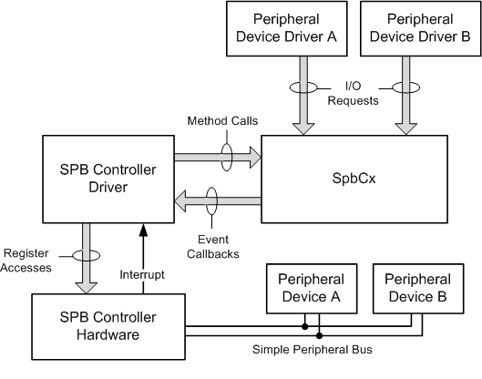

# SPB controller drivers

An SPB controller is a device that controls a [simple peripheral bus](https://msdn.microsoft.com/library/windows/hardware/hh450903) (SPB) and that transfers data to and from the peripheral devices that are connected to the SPB. The hardware vendor for an SPB controller provides an SPB controller driver to manage the hardware functions in the controller.

Starting with Windows 8, the SPB framework extension (SpbCx) simplifies the development of controller drivers for [simple peripheral buses](https://msdn.microsoft.com/library/windows/hardware/hh450903) (SPBs). SpbCx is a system-supplied extension to the [Kernel-Mode Driver Framework](https://msdn.microsoft.com/library/windows/hardware/ff544296) (KMDF). The hardware vendor for the SPB controller device supplies a controller driver to perform all hardware-specific driver operations. This driver communicates with SpbCx to perform operations that are specific to SPB controllers, and communicates directly with KMDF to perform generic driver operations.

For example, an SPB controller driver typically calls the [**WdfDeviceInitSetPnpPowerEventCallbacks**](https://msdn.microsoft.com/library/windows/hardware/ff546135) method in KMDF to register to receive power event callbacks, and calls the [**WdfInterruptCreate**](https://msdn.microsoft.com/library/windows/hardware/ff547345) method to connect the driver's interrupt service routine (ISR) to the interrupt from the SPB controller. To perform SPB-specific operations, the SPB controller communicates with SpbCx through the [SpbCx device driver interface](https://msdn.microsoft.com/library/windows/hardware/hh698219) (DDI).

SpbCx cooperates with the SBP controller driver to handle I/O requests for peripheral devices that are connected to the SPB. SpbCx performs processing tasks that are common to SPB controller drivers. These tasks include managing the I/O request queues for the SPB controller. These queues contain I/O requests from the drivers that manage the peripheral devices that are connected to the bus. The SPB controller driver performs all hardware-specific operations that are required to handle these requests.

The following diagram shows the SPB controller driver and SpbCx.

The SPB controller driver and SpbCx both run in kernel mode, and communicate with each other through the SpbCx DDI. The SPB controller driver calls driver support methods that are implemented by SpbCx. SpbCx calls event callback functions that are implemented by the SPB controller driver.

The drivers that send I/O requests to the SPB controller are either kernel-mode drivers that use the [Kernel-Mode Driver Framework](https://msdn.microsoft.com/library/windows/hardware/ff544296) (KMDF), or user-mode drivers that use the [User-Mode Driver Framework](https://msdn.microsoft.com/library/windows/hardware/ff554928) (UMDF). These drivers can send read and write requests to transfer data to and from SPB-connected peripheral devices. In addition, the drivers can send I/O control (IOCTL) requests to perform SPB-specific operations.

The SPB controller driver directly accesses the hardware registers of the SPB controller device to initiate data transfers to and from peripheral devices that are connected to the SPB. For an SPB such as I²C, these data transfers occur at relatively slow speeds. Although the hardware registers of the SPB controller are likely to be memory mapped, the registers of the peripheral devices must be accessed serially through the SPB.

In response to an I/O request to transfer data to or from an SPB-connected peripheral device, the SPB controller driver initiates the bus transfer, marks the I/O request as pending, and returns without waiting for the transfer to complete. Later, when the SPB controller hardware finishes the transfer, the controller signals an interrupt, and the ISR in the SPB controller driver either completes the pending I/O request or initiates the next transfer in the requested I/O operation.

Only drivers can send I/O requests directly to an SPB controller. When a user-mode application transfers data to or from an SPB-connected peripheral device, the application must rely on the SPB peripheral device driver to send the corresponding read or write requests to the SPB controller.

## In this section

<table>
<colgroup>
<col width="50%" />
<col width="50%" />
</colgroup>
<thead>
<tr class="header">
<th>Topic</th>
<th>Description</th>
</tr>
</thead>
<tbody>
<tr class="odd">
<td>
<a href="https://msdn.microsoft.com/library/windows/hardware/hh406203" data-raw-source="[SPB Framework Extension (SpbCx)](https://msdn.microsoft.com/library/windows/hardware/hh406203)">SPB Framework Extension (SpbCx)</a>
</td>
<td>
Starting with Windows 8, the SPB framework extension (SpbCx) is a system-supplied extension to the <a href="https://msdn.microsoft.com/library/windows/hardware/ff544296" data-raw-source="[Kernel-Mode Driver Framework](https://msdn.microsoft.com/library/windows/hardware/ff544296)">Kernel-Mode Driver Framework</a> (KMDF). SpbCx works together with an <a href="https://msdn.microsoft.com/library/windows/hardware/hh698221" data-raw-source="[SPB controller driver](https://msdn.microsoft.com/library/windows/hardware/hh698221)">SPB controller driver</a> to perform I/O operations on peripheral devices that are connected to a <a href="https://msdn.microsoft.com/library/windows/hardware/hh450903" data-raw-source="[simple peripheral bus](https://msdn.microsoft.com/library/windows/hardware/hh450903)">simple peripheral bus</a> (SPB), such as I²C or SPI.
</td>
</tr>
<tr class="even">
<td>
<a href="https://msdn.microsoft.com/library/windows/hardware/hh450913" data-raw-source="[SpbCx Interfaces](https://msdn.microsoft.com/library/windows/hardware/hh450913)">SpbCx Interfaces</a>
</td>
<td>
The SPB framework extension (SpbCx) has two interfaces. The first is an I/O request interface through which SpbCx accepts I/O requests that clients (peripheral drivers) of the SPB controller send to peripheral devices that are attached to the bus. The second interface is a device driver interface (DDI) through which SpbCx communicates with the SPB controller driver.
</td>
</tr>
<tr class="odd">
<td>
<a href="https://msdn.microsoft.com/library/windows/hardware/hh450890" data-raw-source="[I/O Transfer Sequences](https://msdn.microsoft.com/library/windows/hardware/hh450890)">I/O Transfer Sequences</a>
</td>
<td>
The SPB framework extension (SpbCx) supports I/O transfer sequences. An I/O transfer sequence is an ordered set of bus transfers (read and write operations) that is performed as a single, atomic bus operation. All of the transfers in an I/O transfer sequence access the same target device on the bus.
</td>
</tr>
<tr class="even">
<td>
<a href="https://msdn.microsoft.com/library/windows/hardware/jj191736" data-raw-source="[Handling Client-Implemented Sequences](https://msdn.microsoft.com/library/windows/hardware/jj191736)">Handling Client-Implemented Sequences</a>
</td>
<td>
The optional <a href="https://msdn.microsoft.com/library/windows/hardware/hh450814" data-raw-source="[&lt;em&gt;EvtSpbControllerLock&lt;/em&gt;](https://msdn.microsoft.com/library/windows/hardware/hh450814)"><em>EvtSpbControllerLock</em></a> and <a href="https://msdn.microsoft.com/library/windows/hardware/hh450816" data-raw-source="[&lt;em&gt;EvtSpbControllerUnlock&lt;/em&gt;](https://msdn.microsoft.com/library/windows/hardware/hh450816)"><em>EvtSpbControllerUnlock</em></a> event callback functions perform complementary operations. The <em>EvtSpbControllerLock</em> function is a handler for <a href="https://msdn.microsoft.com/library/windows/hardware/hh450858" data-raw-source="[&lt;strong&gt;IOCTL_SPB_LOCK_CONTROLLER&lt;/strong&gt;](https://msdn.microsoft.com/library/windows/hardware/hh450858)"><strong>IOCTL_SPB_LOCK_CONTROLLER</strong></a> requests. The <em>EvtSpbControllerUnlock</em> function is a handler for <a href="https://msdn.microsoft.com/library/windows/hardware/hh450859" data-raw-source="[&lt;strong&gt;IOCTL_SPB_UNLOCK_CONTROLLER&lt;/strong&gt;](https://msdn.microsoft.com/library/windows/hardware/hh450859)"><strong>IOCTL_SPB_UNLOCK_CONTROLLER</strong></a> requests. A client (that is, the driver for a peripheral device on the bus) sends these requests to start and end <a href="https://msdn.microsoft.com/library/windows/hardware/hh450890" data-raw-source="[I/O transfer sequences](https://msdn.microsoft.com/library/windows/hardware/hh450890)">I/O transfer sequences</a>. Most SPB controller drivers do not support <strong>IOCTL_SPB_LOCK_CONTROLLER</strong> and <strong>IOCTL_SPB_UNLOCK_CONTROLLER</strong> requests and, therefore, do not implement <em>EvtSpbControllerLock</em> and <em>EvtSpbControllerUnlock</em> functions.
</td>
</tr>
<tr class="odd">
<td>
<a href="https://msdn.microsoft.com/library/windows/hardware/hh974776" data-raw-source="[Using the SPB_TRANSFER_LIST Structure for Custom IOCTLs](https://msdn.microsoft.com/library/windows/hardware/hh974776)">Using the SPB_TRANSFER_LIST Structure for Custom IOCTLs</a>
</td>
<td>
If your simple peripheral bus (SPB) controller driver supports one or more custom I/O control (IOCTL) requests, use the <a href="https://msdn.microsoft.com/library/windows/hardware/hh406221" data-raw-source="[&lt;strong&gt;SPB_TRANSFER_LIST&lt;/strong&gt;](https://msdn.microsoft.com/library/windows/hardware/hh406221)"><strong>SPB_TRANSFER_LIST</strong></a> structure to describe the read and write buffers in these requests. This structure provides a uniform way to describe the buffers in a request, and avoids the buffer-copying overhead associated with METHOD_BUFFERED I/O operations.
</td>
</tr>
<tr class="even">
<td>
<a href="https://msdn.microsoft.com/library/windows/hardware/hh974773" data-raw-source="[Handling IOCTL_SPB_FULL_DUPLEX Requests](https://msdn.microsoft.com/library/windows/hardware/hh974773)">Handling IOCTL_SPB_FULL_DUPLEX Requests</a>
</td>
<td>
Some buses, such as SPI, enable read and write transfers to simultaneously occur between the bus controller and a device on the bus. To support these full-duplex transfers, the definition of the simple peripheral bus (SPB) I/O request interface includes, as an option, the <a href="https://msdn.microsoft.com/library/windows/hardware/hh974774" data-raw-source="[&lt;strong&gt;IOCTL_SPB_FULL_DUPLEX&lt;/strong&gt;](https://msdn.microsoft.com/library/windows/hardware/hh974774)"><strong>IOCTL_SPB_FULL_DUPLEX</strong></a> I/O control code (IOCTL). Only SPB controller drivers for bus controllers that implement full-duplex transfers in hardware should support the <strong>IOCTL_SPB_FULL_DUPLEX</strong> IOCTL.
</td>
</tr>
<tr class="odd">
<td>
<a href="https://msdn.microsoft.com/library/windows/hardware/jj938061" data-raw-source="[How to Get the Connection Settings for a Device](https://msdn.microsoft.com/library/windows/hardware/jj938061)">How to Get the Connection Settings for a Device</a>
</td>
<td>
If your SPB controller driver registers an <a href="https://msdn.microsoft.com/library/windows/hardware/hh450818" data-raw-source="[&lt;em&gt;EvtSpbTargetConnect&lt;/em&gt;](https://msdn.microsoft.com/library/windows/hardware/hh450818)"><em>EvtSpbTargetConnect</em></a> callback function, the <a href="https://msdn.microsoft.com/library/windows/hardware/hh406203" data-raw-source="[SPB framework extension](https://msdn.microsoft.com/library/windows/hardware/hh406203)">SPB framework extension</a> (SpbCx) calls this function when a client (peripheral driver) of the controller sends an <a href="https://msdn.microsoft.com/library/windows/hardware/ff550729" data-raw-source="[&lt;strong&gt;IRP_MJ_CREATE&lt;/strong&gt;](https://msdn.microsoft.com/library/windows/hardware/ff550729)"><strong>IRP_MJ_CREATE</strong></a> request to open a logical connection to a target device on the bus. In response to the <em>EvtSpbTargetConnect</em> callback, the SPB controller driver should call the <a href="https://msdn.microsoft.com/library/windows/hardware/hh450926" data-raw-source="[&lt;strong&gt;SpbTargetGetConnectionParameters&lt;/strong&gt;](https://msdn.microsoft.com/library/windows/hardware/hh450926)"><strong>SpbTargetGetConnectionParameters</strong></a> method to get the connection settings for the target device. The SPB controller driver stores these settings and uses them later to access the device in response to I/O requests from the client.
</td>
</tr>
</tbody>
</table>

 

 

 

