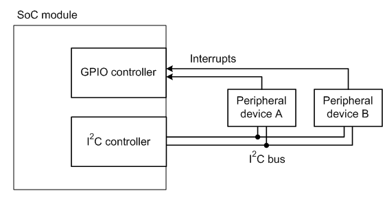
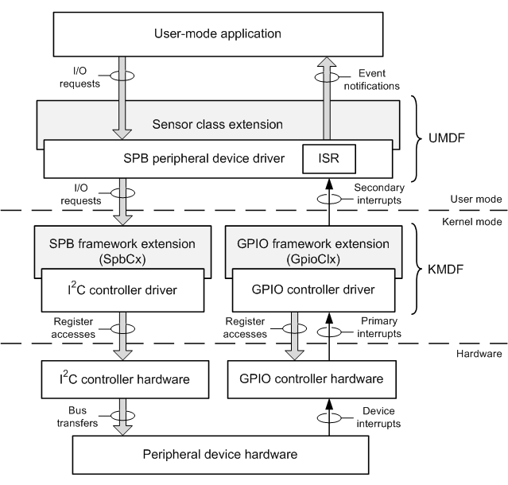

# SPB peripheral device drivers

An SPB peripheral device driver controls a peripheral device that is connected to a [simple peripheral bus](https://msdn.microsoft.com/library/windows/hardware/hh450903) (SPB). The hardware registers of this device are available only through the SPB. To read from or write to the device, the driver must send I/O requests to the SPB controller. Only this controller can initiate data transfers to and from the device over the SPB.

Starting with Windows 8, Windows provides driver support for peripheral devices on [simple peripheral buses](https://msdn.microsoft.com/library/windows/hardware/hh450903) (SPBs). SPBs, such as I²C and SPI, are widely used to connect to low-speed sensor devices, such as accelerometers, GPS devices, and battery-level monitors. This overview describes how an SPB peripheral device driver, in cooperation with other system components, controls an SPB-connected peripheral device.

An SPB peripheral device driver can be built to use either the [User-Mode Driver Framework](https://msdn.microsoft.com/library/windows/hardware/ff560442) (UMDF) or the [Kernel-Mode Driver Framework](https://msdn.microsoft.com/library/windows/hardware/ff544296) (KMDF). For more information about developing a UMDF driver, see [Getting Started with UMDF](https://msdn.microsoft.com/library/windows/hardware/ff554928). For more information about developing a KMDF driver, see [Getting Started with Kernel-Mode Driver Framework](https://msdn.microsoft.com/library/windows/hardware/dn265580).

## Device Configuration Information

The hardware registers of an SPB-connected peripheral device are not memory-mapped. The device can be accessed only through the SPB controller, which serially transfers data to and from the device over the SPB. To perform I/O operations, the SPB peripheral device driver sends I/O requests to the device, and the SPB controller performs the data transfers that are required to complete these requests. For more information about the I/O requests that can be sent to peripheral devices on SPBs, see [Using the SPB I/O Request Interface](https://msdn.microsoft.com/library/windows/hardware/hh698227).

The following diagram shows an example hardware configuration in which an SPB—in this case, an I²C bus—connects two peripheral devices to a System on a Chip (SoC) module. The peripheral devices are external to the SoC module and connect to four pins on the module. The SoC module contains the main processor (not shown), plus an I²C controller and a [general-purpose I/O](https://msdn.microsoft.com/library/windows/hardware/hh439512) (GPIO) controller. The processor uses the I²C controller to serially transmit data to and from the two peripheral devices. The interrupt request lines from these devices are connected to two GPIO pins that are configured as interrupt inputs. When a device signals an interrupt request, the GPIO controller relays the interrupt to the processor.

Because the GPIO controller and I²C controller in this example are integrated into the SoC module, their hardware registers are memory-mapped and can be directly accessed by the processor. However, the processor can access the hardware registers of the two peripheral devices only indirectly, through the I²C controller.

An SPB is not a [Plug and Play](https://msdn.microsoft.com/library/windows/hardware/ff547125) (PnP) bus and, therefore, cannot be used to automatically detect and configure new devices that are plugged into the bus. The bus and interrupt connections of an SPB-connected device are frequently permanent. Even if the device can be unplugged from a slot, this slot is typically dedicated to the device. In addition, an SPB does not provide an in-band hardware path for relaying interrupt requests from a peripheral device on the bus to the bus controller. Instead, the hardware path for interrupts is separate from the bus controller.

The vendor for the hardware platform stores the configuration information for an SPB-connected peripheral device in the platform's ACPI firmware. During system startup, the [ACPI driver enumerates](https://msdn.microsoft.com/library/windows/hardware/ff536138) the devices on the bus for the PnP manager. For each enumerated device, ACPI supplies information about the device's bus and interrupt connections. The PnP manager stores this information in a datastore called the *resource hub*.

When the device starts up, the PnP manager supplies the device's driver with a set of [hardware resources](https://msdn.microsoft.com/library/windows/hardware/ff547012) that encapsulate the configuration information that the resource hub stores for the device. These resources include a connection ID and an interrupt number. The connection ID encapsulates bus-connection information, such as the SPB controller, bus address, and bus-clock frequency. Before I/O requests can be sent to the device, the driver must first use the connection ID to open a logical connection to the device. The interrupt number is a Windows interrupt resource to which the driver can connect its interrupt service routine (ISR). The driver can easily be ported from one hardware platform to another because the connection ID and interrupt number are high-level abstractions that hide platform-specific information about the physical bus and interrupt connections.

## Software and Hardware Layers

The following block diagram shows the layers of software and hardware that connect a peripheral device on an SPB to an application program that uses the device. The SPB peripheral device driver in this example is a UMDF driver. The peripheral device (at the bottom of the diagram) is a sensor device (for example, an accelerometer). As in the preceding diagram, the peripheral device is connected to an I²C bus and signals interrupt requests through a pin on a GPIO controller.

The three blocks shown in gray are system-supplied modules. Starting with Windows 7, the [sensor class extension](https://msdn.microsoft.com/library/windows/hardware/ff545398) is available as a sensor-specific extension to the UMDF. Starting with Windows 8, the [SPB framework extension](https://msdn.microsoft.com/library/windows/hardware/hh406203) (SpbCx) and [GPIO framework extension](https://msdn.microsoft.com/library/windows/hardware/hh439512) (GpioClx) are available as extensions to KMDF that perform functions that are specific to SPB controllers and to GPIO controllers, respectively.

At the top of the preceding diagram, the application calls the methods in the [Sensor API](https://msdn.microsoft.com/library/windows/desktop/dd318953) or [Location API](https://msdn.microsoft.com/library/windows/desktop/dd464636) to communicate with the sensor device. Through these calls, the application can send I/O requests to the device, and receive event notifications from the device. For more information about these APIs, see [Introduction to the Sensor and Location Platform in Windows](https://msdn.microsoft.com/library/windows/hardware/ff545493).

When the application calls a method that requires communication with the SPB peripheral device driver, the Sensor API or Location API creates an I/O request and sends it to the SPB peripheral device driver. The sensor class extension module assists the driver in handling these I/O requests. When the driver receives a new I/O request, the driver immediately hands the request to the sensor class extension, which queues the request until the driver is ready to handle it. If an I/O request from the application requires the transfer of data to or from the peripheral device, the SPB peripheral device driver creates an I/O request for this transfer and sends the request to the I²C controller. Such requests are handled jointly by SpbCx and the I²C controller driver.

SpbCx is a system-supplied component that manages the queues of I/O requests for an SPB controller, such as the I²C controller in this example. The I²C controller driver, which is supplied by the hardware vendor for the controller, manages all hardware-specific operations in the I²C controller. For example, the controller driver accesses the memory-mapped hardware registers of the controller to initiate data transfers to and from the peripheral device over the I²C bus.

The peripheral device signals an interrupt request when a hardware event occurs that requires attention from the SPB peripheral device driver or the user-mode application. The interrupt line from the peripheral device is connected to a GPIO pin that is configured to receive interrupt requests. When the device signals an interrupt to the GPIO pin, the GPIO controller signals an interrupt to the processor. In response to this interrupt, the kernel's interrupt trap handler calls GpioClx's ISR. This ISR queries the GPIO controller driver, which then accesses the memory-mapped hardware registers of the GPIO controller to identify the interrupting GPIO pin. To silence the interrupt, the GPIO controller driver either clears (if the interrupt is edge-triggered) or masks (if level-triggered) the interrupt request at the GPIO pin. The interrupt must be silenced to prevent the processor from taking the same interrupt again when the trap handler returns. For a level-triggered interrupt, the ISR in the SPB peripheral device driver must access the hardware registers of the peripheral device to clear the interrupt before the GPIO pin can be unmasked.

Before the kernel's interrupt trap handler returns, it schedules the ISR in the SPB peripheral device driver to run at IRQL = PASSIVE\_LEVEL. Starting with Windows 8, a UMDF driver can connect its ISR to an interrupt that the driver receives as an abstract Windows interrupt resource; for more information, see [Handling Interrupts](https://msdn.microsoft.com/library/windows/hardware/hh439600). To determine which ISR to call, the operating system looks up the virtual interrupt that is assigned to the interrupting GPIO pin and finds the ISR that is connected to the interrupt. This virtual interrupt is labeled as a *secondary* interrupt in the preceding diagram. In contrast, the hardware interrupt from the GPIO controller is labeled as a *primary* interrupt.

Because the ISR in the SPB peripheral device driver runs at passive level, the ISR can use synchronous I/O requests to access the hardware registers in the peripheral device. The ISR can block until these requests complete. The ISR, which runs at a relatively high priority, should return as soon as possible and defer all background processing for an interrupt to a worker routine that runs at a lower priority.

In response to the secondary interrupt, the SPB peripheral device driver posts an event in the sensor class extension, which notifies the user-mode application of the event through the Sensor API or Location API.

## In this section

<table>
<colgroup>
<col width="50%" />
<col width="50%" />
</colgroup>
<thead>
<tr class="header">
<th>Topic</th>
<th>Description</th>
</tr>
</thead>
<tbody>
<tr class="odd">
<td>
<a href="https://msdn.microsoft.com/library/windows/hardware/hh698227" data-raw-source="[Using the SPB I/O Request Interface](https://msdn.microsoft.com/library/windows/hardware/hh698227)">Using the SPB I/O Request Interface</a>
</td>
<td>
Starting with Windows 8, the <a href="https://msdn.microsoft.com/library/windows/hardware/hh406203" data-raw-source="[SPB framework extension](https://msdn.microsoft.com/library/windows/hardware/hh406203)">SPB framework extension</a> (SpbCx) is a system-supplied component that supports the <a href="https://msdn.microsoft.com/library/windows/hardware/hh698224" data-raw-source="[SPB I/O request interface](https://msdn.microsoft.com/library/windows/hardware/hh698224)">SPB I/O request interface</a>. SPB peripheral device drivers use this interface to send I/O requests to devices that are connected to I²C, SPI, and other <a href="https://msdn.microsoft.com/library/windows/hardware/hh450903" data-raw-source="[simple peripheral buses](https://msdn.microsoft.com/library/windows/hardware/hh450903)">simple peripheral buses</a> (SPBs).
</td>
</tr>
<tr class="even">
<td>
<a href="https://msdn.microsoft.com/library/windows/hardware/hh698216" data-raw-source="[Connection IDs for SPB-Connected Peripheral Devices](https://msdn.microsoft.com/library/windows/hardware/hh698216)">Connection IDs for SPB-Connected Peripheral Devices</a>
</td>
<td>
Before a driver can send I/O requests to a peripheral device on a <a href="https://msdn.microsoft.com/library/windows/hardware/hh450903" data-raw-source="[simple peripheral bus](https://msdn.microsoft.com/library/windows/hardware/hh450903)">simple peripheral bus</a> (SPB), the driver must open a logical connection to the device. Through this connection, the driver can send read and write requests to transfer data to and from the device. Additionally, the driver can send I/O control (IOCTL) requests to the device to perform SPB-specific operations.
</td>
</tr>
<tr class="odd">
<td>
<a href="https://msdn.microsoft.com/library/windows/hardware/hh698223" data-raw-source="[SPB Device Stacks](https://msdn.microsoft.com/library/windows/hardware/hh698223)">SPB Device Stacks</a>
</td>
<td>
The Windows Driver Model cleanly separates the driver components that control a peripheral device (for example, a temperature sensor) on a bus from the driver components that manage the bus controller, which transfers data and control information to and from the peripheral device.
</td>
</tr>
<tr class="even">
<td>
<a href="https://msdn.microsoft.com/library/windows/hardware/hh698218" data-raw-source="[Interrupts from SPB-Connected Peripheral Devices](https://msdn.microsoft.com/library/windows/hardware/hh698218)">Interrupts from SPB-Connected Peripheral Devices</a>
</td>
<td>
Unlike a bus such as PCI, a <a href="https://msdn.microsoft.com/library/windows/hardware/hh450903" data-raw-source="[simple peripheral bus](https://msdn.microsoft.com/library/windows/hardware/hh450903)">simple peripheral bus</a> (SPB), such as I²C or SPI, provides no standardized, bus-specific means to convey interrupt requests from peripheral devices to the processor. Instead, an SPB-connected peripheral device signals an interrupt through a separate hardware path that lies outside of both the SPB and the SPB controller.
</td>
</tr>
<tr class="odd">
<td>
<a href="https://msdn.microsoft.com/library/windows/hardware/hh698217" data-raw-source="[Hardware Resources for Kernel-Mode SPB Peripheral Drivers](https://msdn.microsoft.com/library/windows/hardware/hh698217)">Hardware Resources for Kernel-Mode SPB Peripheral Drivers</a>
</td>
<td>
The code examples in this topic show how the <a href="https://msdn.microsoft.com/library/windows/hardware/ff544296" data-raw-source="[Kernel-Mode Driver Framework](https://msdn.microsoft.com/library/windows/hardware/ff544296)">Kernel-Mode Driver Framework</a> (KMDF) driver for a peripheral device on a <a href="https://msdn.microsoft.com/library/windows/hardware/hh450903" data-raw-source="[simple peripheral bus](https://msdn.microsoft.com/library/windows/hardware/hh450903)">simple peripheral bus</a> (SPB) obtains the hardware resources that it requires to operate the device. Included in these resources is the information that the driver uses to establish a logical connection to the device.
</td>
</tr>
<tr class="even">
<td>
<a href="https://msdn.microsoft.com/library/windows/hardware/hh450837" data-raw-source="[Hardware Resources for User-Mode SPB Peripheral Drivers](https://msdn.microsoft.com/library/windows/hardware/hh450837)">Hardware Resources for User-Mode SPB Peripheral Drivers</a>
</td>
<td>
The code examples in this topic show how the <a href="https://msdn.microsoft.com/library/windows/hardware/ff560442" data-raw-source="[User-Mode Driver Framework](https://msdn.microsoft.com/library/windows/hardware/ff560442)">User-Mode Driver Framework</a> (UMDF) driver for a peripheral device on a <a href="https://msdn.microsoft.com/library/windows/hardware/hh450903" data-raw-source="[simple peripheral bus](https://msdn.microsoft.com/library/windows/hardware/hh450903)">simple peripheral bus</a> (SPB) obtains the hardware resources that it requires to operate the device. Included in these resources is the information that the driver uses to establish a logical connection to the device.
</td>
</tr>
<tr class="odd">
<td>
<a href="https://msdn.microsoft.com/library/windows/hardware/hh974772" data-raw-source="[Full-Duplex I/O Requests](https://msdn.microsoft.com/library/windows/hardware/hh974772)">Full-Duplex I/O Requests</a>
</td>
<td>
Some buses, such as SPI, support full-duplex bus transfers. These transfers improve I/O performance by simultaneously writing data to a device and reading data from the same device. To support full-duplex bus transfers, the <a href="https://msdn.microsoft.com/library/windows/hardware/hh450903" data-raw-source="[simple peripheral bus](https://msdn.microsoft.com/library/windows/hardware/hh450903)">simple peripheral bus</a> (SPB) <a href="https://msdn.microsoft.com/library/windows/hardware/hh698224" data-raw-source="[I/O request interface](https://msdn.microsoft.com/library/windows/hardware/hh698224)">I/O request interface</a> defines the <a href="https://msdn.microsoft.com/library/windows/hardware/hh974774" data-raw-source="[&lt;strong&gt;IOCTL_SPB_FULL_DUPLEX&lt;/strong&gt;](https://msdn.microsoft.com/library/windows/hardware/hh974774)"><strong>IOCTL_SPB_FULL_DUPLEX</strong></a> I/O control code (IOCTL).
</td>
</tr>
<tr class="even">
<td>
<a href="https://msdn.microsoft.com/library/windows/hardware/jj850339" data-raw-source="[Atomic Bus Operations](https://msdn.microsoft.com/library/windows/hardware/jj850339)">Atomic Bus Operations</a>
</td>
<td>
To use certain hardware capabilities of an SPB-connected peripheral device, a client of the SPB controller (that is, a peripheral driver) might need to perform a sequence of data transfers to and from the device as an atomic bus operation. The transfer sequence is atomic because no other client can transfer data to or from a device on the bus until the sequence finishes.
</td>
</tr>
<tr class="odd">
<td>
<a href="https://msdn.microsoft.com/library/windows/hardware/jj819326" data-raw-source="[SPB Connection Locks](https://msdn.microsoft.com/library/windows/hardware/jj819326)">SPB Connection Locks</a>
</td>
<td>
Connection locks are useful for enabling two clients to share access to a target peripheral device on a <a href="https://msdn.microsoft.com/library/windows/hardware/hh450903" data-raw-source="[simple peripheral bus](https://msdn.microsoft.com/library/windows/hardware/hh450903)">simple peripheral bus</a> (SPB). Both clients can open logical connections to the same target device and use the connection lock when either client requires exclusive access to the device to perform a series of I/O operations. When one client holds the connection lock, requests by the second client to access the device are automatically deferred until the first client releases the lock.
</td>
</tr>
</tbody>
</table>

 

 

 

