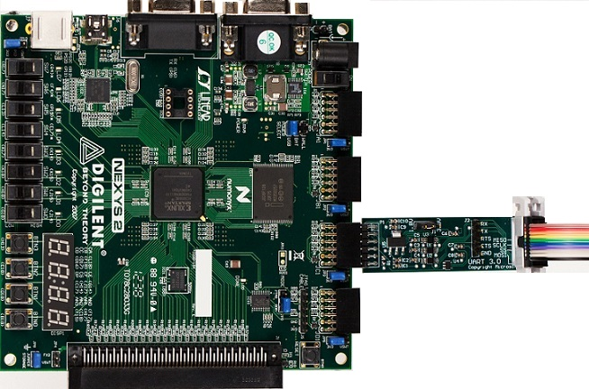
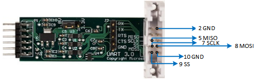
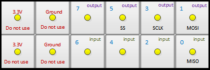
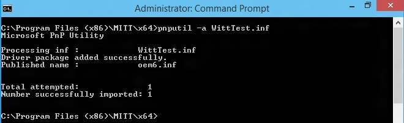

# SPI tests in MITT


**Last updated**

-   January, 2015

**Applies to:**

-   Windows 8.1

SPI test modules that are included in the MITT software package can be used to test data transfers for a SPI controller on the system under test and its driver. The MITT board acts as a client device connected to the SPI bus.

## Before you begin...


-   Get a MITT board and a SPI or UART adapter board. See [Buy hardware for using MITT](https://msdn.microsoft.com/library/windows/hardware/dn919811).
-   [Download the MITT software package](https://msdn.microsoft.com/library/windows/hardware/dn919810). Install it on the system under test.
-   Install MITT firmware on the MITT board. See [Get started with MITT](https://msdn.microsoft.com/library/windows/hardware/dn919779).

## Hardware setup




| Bus interface | Pin-out                                      | ACPI and schematics | Connection solution                  |
|---------------|----------------------------------------------|---------------------|--------------------------------------|
| SPI           | All lines needed (SCLK, MISO, MOSI, SS, GND) | ACPI table          | Simple block header (on debug board) |


1.  Connect the SPI adapter to **JC1** on the MITT board.
2.  Use the jumper on the SPI adapter board to select the correct SPI voltage. The jumper can be used to select between 3.3V and 1.8V.
3.  Connect SCLK, MOSI, MISO, SS, and GND to the system under test.

    

4.  On the MITT board, set switch **SW1** to the high position. This position enables the default mode for SPI when the MITT is powered. You can directly connect the board (without the SPI adapter board) if the signal is at 3.3V.

    

## Test driver and ACPI configuration


Perform these steps on the system under test that has the I²C controller:

1.  Install WITTTest driver included in the MITT software package by running this command:

    **pnputil –a witttest.inf**

    

    **Note**  PnpUtil.exe is included in %SystemRoot%\\System32.


2.  Modify the system ACPI and include this ASL table. You can use the [Microsoft ASL compiler](https://msdn.microsoft.com/library/windows/hardware/dn551195).

    **Note**  Change "\\\\\_SB\_.SPI1" to ACPI entry name for the SPI controller to test as shown here. It defines three test targets with SPI frequency at 1Mhz, 5Mhz, and 20Mhz.


``` syntax
Device(TP1) {
    Name (_HID, "SPT0001") 
    Name (_CID, "WITTTest") 
    Method(_CRS, 0x0, NotSerialized)
    {
      Name (RBUF, ResourceTemplate ()
      {
          SpiSerialBus (0x0000, PolarityLow, FourWireMode, 0x08,ControllerInitiated, 0x000F4240, ClockPolarityLow,ClockPhaseFirst, "\\_SB.SPI1", 0x00, ResourceConsumer, , )
      })
      Return(RBUF)
    }
}
Device(TP2) {
    Name (_HID, "SPT0002") 
    Name (_CID, "WITTTest") 
    Method(_CRS, 0x0, NotSerialized)
    {
      Name (RBUF, ResourceTemplate ()
      {
          SpiSerialBus (0x0000, PolarityLow, FourWireMode, 0x08,ControllerInitiated, 0x004c4b40, ClockPolarityLow,ClockPhaseFirst, "\\_SB.SPI1", 0x00, ResourceConsumer, , )
      })
      Return(RBUF)
    }
}
Device(TP3) {
    Name (_HID, "SPT0003") 
    Name (_CID, "WITTTest") 
    Method(_CRS, 0x0, NotSerialized)
    {
      Name (RBUF, ResourceTemplate ()
      {
          SpiSerialBus (0x0000, PolarityLow, FourWireMode, 0x08,ControllerInitiated, 0x01312d00, ClockPolarityLow,ClockPhaseFirst, "\\_SB.SPI1", 0x00, ResourceConsumer, , )
      })
      Return(RBUF)
    }
}

```


## SPI automation tests


1.  Create a folder on the system under test.
2.  Copy the TAEF binaries to the folder and then add it to your PATH environment variable. The required TAEF binaries are in %ProgramFiles(x86)%\\Windows Kits\\8.1\\Testing\\Runtimes\\TAEF .
3.  Copy Muttutil.dll and Mittspitest.dll from the MITT software package to the folder.
4.  View all MITT SPI tests by using the **/list** option:

You are now ready to run SPI tests. You can run a single test, all tests at once, or run tests manually.

- Run a single test by using the **/name:*&lt;test name&gt;*** option. This command runs the BasicIORead test:
- Run all tests by using this command:
- Run tests manually by using SPBCmd.exe tool included in the MITT software package.

## SPI adapter schematic


