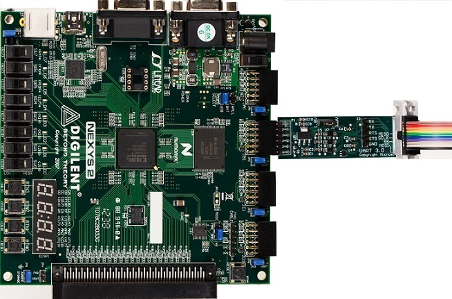
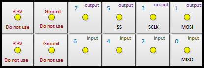
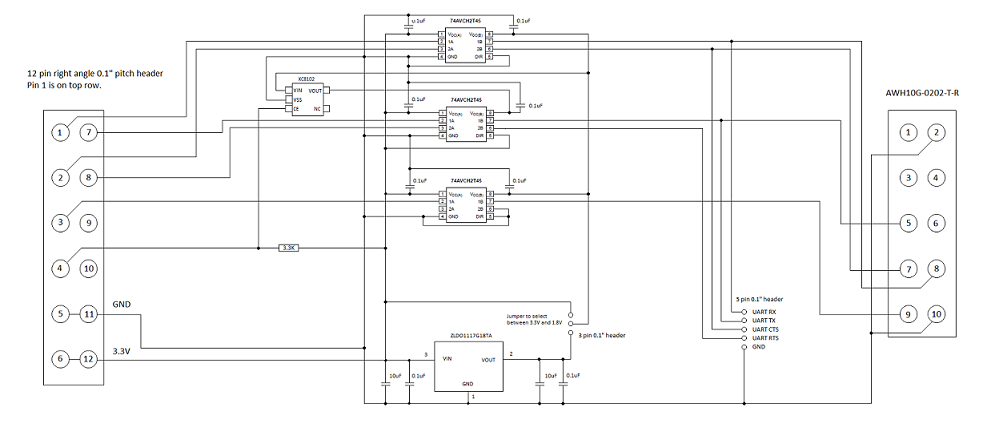

# UART tests in MITT


**Last updated**

-   January, 2015

**Applies to:**

-   Windows 8.1

The MITT software package includes tests for validating data transfers to a UART controller and its driver. The MITT board’s UART interface acts as a UART loopback device.

## Before you begin...


-   Get a MITT board and a UART adapter board. See [Buy hardware for using MITT](https://msdn.microsoft.com/library/windows/hardware/dn919811).
-   [Download the MITT software package](https://msdn.microsoft.com/library/windows/hardware/dn919810). Install it on the system under test.
-   Install MITT firmware on the MITT board. See [Get started with MITT](https://msdn.microsoft.com/library/windows/hardware/dn919779).

## Hardware setup




1.  You need external PIN-outs to connect the UART interface on the MITT board to the UART controller of the system under test. If the UART controller exposes PIN-outs, connect directly to **JB1** of the board.
2.  Connect these lines:

    | UART interface on the MITT board | UART controller on the system under test |
    |----------------------------------|------------------------------------------|
    | TX                               | RX                                       |
    | RTS                              | CTS                                      |
    | RX                               | TX                                       |
    | CTS                              | RTS                                      |

     

3.  The UART adapter board provides a jumper for selecting the correct voltage. Only 3.3V signal is supported for direct connect (without the adapter board).

    

## Test driver and ACPI configuration


To modify the ACPI tables, install Windows Hardware Certification Kit (HCK) 8.1. Perform these steps on the system under test that has the UART controller:

1.  Perform the system changes that are described under the Device.BusController.UART.HCKTestability requirement.
2.  Update the ACPI table for UART test drivers based on the template provided under \\\\&lt;hckcontrollername&gt;\\Tests\\&lt;architecture&gt;\\UART\\Sample-UART.asl or use this example. You can use the [Microsoft ASL compiler](https://msdn.microsoft.com/library/windows/hardware/dn551195).

    ``` syntax
    Device(UART) {
        Name (_HID, "UTK0001")
        Name (_CID, "UARTTest")
        Name (_UID,0)
        Method (_CRS, 0x0, NotSerialized) {
            Name (
                RBUF,
                ResourceTemplate () {
                    UARTSerialBus (
                        115200, // Baud Rate = 115200
                        DataBitsEight,
                        StopBitsOne,
                        0xC0,
                        LittleEndian,
                        ParityTypeNone,
                        FlowControlHardware, 
                        32,
                        32,
                        "\\_SB.UAR4",,,,
                    )
                }
            )
        Return(RBUF)
        }
    }
    ```

3.  Install the UARTTest test peripheral driver from \\\\&lt;hckcontrollername&gt;\\Tests\\&lt;architecture&gt;\\UART by running this command:

    **pnputil –a UARTTest.inf**

## UART automation tests


1.  Perform steps described in Test driver and ACPI configuration.
2.  Create a folder on the system under test.
3.  Copy these files from %ProgramFiles(x86)%\\Windows Kits\\8.1\\Testing\\Runtimes\\TAEF to the folder.
    -   Wex.Common.dll
    -   Wex.Communication.dll
    -   Wex.Logger.dll

4.  Copy UtsSanity.exe and muttutil.dll from the MITT software package.
5.  View all commands available, launch UtsSanity.exe -? and refer to the command line options available:
    **Note**  The **–mitt** option is required to run the tests while the MITT board is connected.

     

Example 1: To run the tests at 115200 bps (default)

**C:\\uart&gt; UtsSanity.exe –mitt**

Example 2: To run the tests at 3Mbps:

**C:\\uart&gt; UtsSanity.exe -mitt –baudRate 3000000**

## UART adapter schematic




 

 


